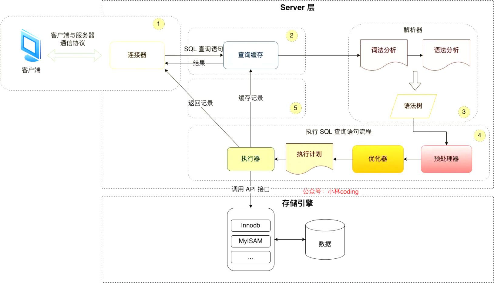

# MySQL 架构

## 架构

MySQL 架构共分为两层：server 层和存储引擎层

## server 层

server 层负责建立连接、分析和执行 SQL。

MySQL大多数核心功能模块都在这实现，主要包括连接器，查询缓存，解析器，预处理器，优化器，执行器等

另外，索引的内置函数（如日期、时间、数学和加密函数等）和索引跨存储引擎的功能（如存储过程、触发器、视图等）都在server层实现

## 存储引擎层

存储引擎层负责数据的存储和提取

支持InnoDB、MyISAM、Memory等多个存储引擎，不同存储引擎共用一个server层

从 MySQL 5.5 版本开始， InnoDB 成为了 MySQL 的默认存储引擎

索引数据结构就是由存储引擎层实现的，不同的存储引擎支持的索引类型也不相同，比如InnoDB支持所有类型是B+树，且是默认使用，也就是说在数据表中创建的主键索引和二级索引默认使用的是B+树索引

## 参考
[https://xiaolincoding.com/mysql/base/how_select.html#mysql-%E6%89%A7%E8%A1%8C%E6%B5%81%E7%A8%8B%E6%98%AF%E6%80%8E%E6%A0%B7%E7%9A%84](https://xiaolincoding.com/mysql/base/how_select.html#mysql-%E6%89%A7%E8%A1%8C%E6%B5%81%E7%A8%8B%E6%98%AF%E6%80%8E%E6%A0%B7%E7%9A%84)