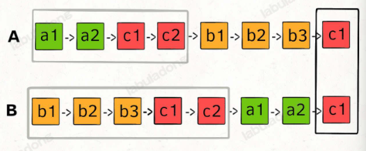

# leetcode总结1

## 链表的指针问题

### 如何初始化链表和它的指针

```python
class ListNode:
    def __init__(self,val=0,next=None):
        self.val=val
        self.next=next

#虚拟头节点
dummy=ListNode(-1)
p=dummy
#中间移动p指针
p.next=xx
p=p.next
# 最后返回
dummy.next()

#题目给一个链表，怎么表示它的指针？
#假设链表是  head:ListNode
p=head
```

### 优先级队列（二叉堆）heapq
最小元素heap[0]
```python
import heapq
pq=[]

heapq.heappush(pq,xxx)

heapq.heappop(pq)

# 如果插入的是个链表
# 需要写一个方法
class ListNode:
    def __init__(self,val=0,next=None):
        self.val=val
        self.next=next
    def __lt__(self,other):
        return self.val<other.val
# 或者这样写__lt__方法：
ListNode.__lt__=lambda a,b:a.val<b.val

heapq.heappush(pq,head)

node=heapq.heappop(pq)
```

堆元素可以是元组

```py
h = []
heappush(h, (5, 'write code'))
heappush(h, (7, 'release product'))
heappush(h, (1, 'write spec'))
heappush(h, (3, 'create tests'))
heappop(h)
# (1, 'write spec')
```

### 快慢指针
1、链表中点

fast走两步，slow走一步，fast到终点，slow到中点
```python
def middleNode(head:ListNode)->ListNode:
    slow=head
    fast=head
    while fast and fast.next:
        slow=slow.next
        fast=fast.next.next
    return slow
```

2、链表是否有环
只要fast和slow相遇，就表明有环
```python
def hasCycle(head:ListNode)->ListNode:
    slow=head
    fast=head
    while fast and fast.next:
        slow=slow.next
        fast=fast.next.next
        if slow==fast:
            return True
    return False
```

3、环的起点


```python
def detectCycle(head:ListNode)->ListNode:
    fast,slow=head,head
    while fast and fast.next:
        fast=fast.next.next
        slow=slow.next
        if fast==slow:
            break
    if not fast or not fast.next:
        return None
    slow=head
    while slow!=fast:
        fast=fast.next
        slow=slow.next
    return slow
```

4、两条链表相交


```python
def getIntersectionNode(headA:ListNode,headB:ListNode)->ListNode:
    p1,p2=headA,headB
    while p1!=p2:
        if p1==None:
            p1=headB
        else:
            p1=p1.next
        
        if p2==None:
            p2=headA
        else:
            p2=p2.next
    return p1
```

解法2：让指针到交点的距离相等
```python
def getIntersectionNode(headA:ListNode,headB:ListNode)->ListNode:
    lenA,lenB=0,0
    p1,p2=headA,headB
    while p1:
        lenA+=1
        p1=p1.next
    while p2:
        lenB+=1
        p2=p2.next

    p1,p2=headA,headB
    if lenA>lenB:
        for i in range(lenA-lenB):
            p1=p1.next
    else:
        for i in range(lenB-lenA):
            p2=p2.next
    # 1、不相交，同时走到尾部空指针
    # 2、相交，走到两条链表的相交点
    while p1!=p2:
        p1=p1.next
        p2=p2.next
    return p1
```

### 数组双指针（最长回文子串）
输入：s="babad"
输出："bab"或"aba"

回文串的长度可能是奇数，也可能是偶数，写一个**从中心向两端扩散的双指针**方法

```python
def longestPalindrome(s:str)->str:
    res=""
    for i in range(len(s)):
        # 以s[i]为中心的最长回文子串
        s1=palindrom(s,i,i)
        # 以s[i]和s[i+1]为中心的最长回文子串
        s2=palindrom(s,i,i+1)
        res=res if len(res) > len(s1) else s1
        res=res if len(res) > len(s2) else s2
    return res

def palindrom(s,l,r):
    while (l>=0 and r<len(s) and s[l]==s[r]):
        l-=1
        r+=1
    return s[l+1:r]
```

## 二叉树问题

### 遍历框架

```python
def traverse(root):
    if root is None:
        return
    
    # 前序位置
    traverse(root.left)
    # 中序位置
    traverse(root.right)
    # 后序位置
```

### 二叉树最大深度
1、遍历思路

用一个外部变量记录每个节点所在的深度，取最大值

```python
res=0
depth=0

def maxDepth(root:TreeNode)->int:
    traverse(root)
    return res

def traverse(root:TreeNode)->None:
    global res,depth
    if not root:
        return
    
    depth+=1
    if not root.left and not root.right:
        res=max(res,depth)
    
    traverse(root.left)
    traverse(root.right)

    depth-=1
```

2、分解思路：最大深度=左右子树的最大深度+本身的1

```python
def maxDepth(root:TreeNode)->int:
    if not root:
        return 0
    left_max=maxDepth(root.left)
    right_max=maxDepth(root.right)

    res=max(left_max,right_max)+1

    return res
```

### 层序遍历框架
1、

```python
def levelTraverse(root:TreeNode):
    if not root:
        return
    q=deque()
    q.append(root)
    # 从上到下遍历二叉树的每一层
    while q:
        sz=len(q)
        for i in range(sz):
            cur=q.popleft()
            # 将下一层节点放入队列
            if cur.left:
                q.append(cur.left)
            if cur.right:
                q.append(cur.right)
```

2、

```python
class Solution:
    res:List[List[int]]=[]
    def levelTraverse(self,root:TreeNode)->List[List[int]]:
        if not root:
            return self.res
        self.traverse(root,0)
        return self.res
    
    def traverse(self,root:TreeNode,depth:int)->None:
        if not root:
            return
        # 看看是否已经存储depth层的节点了
        if len(self.res)<=depth:
            self.res.append([])
        self.res[depth].append(root.val)
        self.traverse(root.left,depth+1)
        self.traverse(root.right,depth+1)
```

3、
```python
class Solution:
    res=[]
    def levelTraverse(self,root:TreeNode)->List[List[int]]:
        if not root:
            return self.res
        nodes=[root]
        self.traverse(nodes)
        return self.res
    
    def traverse(self,curLevelNodes:List[TreeNode])->None:
        if not curLevelNodes:
            return
        nodeValues=[]
        nextLevelNodes=[]
        for node in curLevelNodes:
            nodeValues.append(node.val)
            if node.left:
                nextLevelNodes.append(node.left)
            if node.right:
                nextLevelNodes.append(node.right)
        self.res.append(nodeValues)
        self.traverse(nextLevelNodes)
```


## 动态规划问题

### 斐波那契

1、暴力递归

```python
def fib(N: int) -> int:
    if N == 1 or N == 2:
        return 1
    return fib(N - 1) + fib(N - 2)
```


2、备忘录
```python
def fib(N: int) -> int:
    if N == 0:
        return 0
    dp = [0] * (N + 1)
    # base case
    dp[0] = 0
    dp[1] = 1
    # 状态转移
    for i in range(2, N + 1):
        dp[i] = dp[i - 1] + dp[i - 2]

    return dp[N]
```

3、迭代（递推）解法
```python
def fib(N: int) -> int:
    if N == 0:
        return 0
    dp = [0] * (N + 1)
    # base case
    dp[0] = 0
    dp[1] = 1
    # 状态转移
    for i in range(2, N + 1):
        dp[i] = dp[i - 1] + dp[i - 2]

    return dp[N]
```

4、迭代（递推）升级
```python
def fib(n: int) -> int:
    if n == 0 or n == 1:
        # base case
        return n
    # 分别代表 dp[i - 1] 和 dp[i - 2]
    dp_i_1, dp_i_2 = 1, 0
    for i in range(2, n + 1):
        # dp[i] = dp[i - 1] + dp[i - 2];
        dp_i = dp_i_1 + dp_i_2
        # 滚动更新
        dp_i_2 = dp_i_1
        dp_i_1 = dp_i
    return dp_i_1
```

### 凑零钱

1、暴力递归

```python
def coinChange(coins: List[int], amount: int) -> int:
    def dp(coins, amount):
        # base case
        if amount == 0:
            return 0
        if amount < 0:
            return -1
        res = float('inf')
        for coin in coins:
            # 计算子问题的结果
            sub_problem = dp(coins, amount - coin)
            # 子问题无解则跳过
            if sub_problem == -1:
                continue
            # 在子问题中选择最优解，然后加一
            res = min(res, sub_problem + 1)
        return res if res != float('inf') else -1
    return dp(coins, amount)
```

2、备忘录
```python
class Solution:
    def coinChange(self, coins: List[int], amount: int) -> int:
        memo = [-666] * (amount + 1)

        def dp(coins, amount):
            if amount == 0:
                return 0
            if amount < 0:
                return -1
            # 查备忘录，防止重复计算
            if memo[amount] != -666:
                return memo[amount]

            res = float('inf')
            for coin in coins:
                # 计算子问题的结果
                subProblem = dp(coins, amount - coin)
                # 子问题无解则跳过
                if subProblem == -1:
                    continue
                # 在子问题中选择最优解，然后加一
                res = min(res, subProblem + 1)

            # 把计算结果存入备忘录
            memo[amount] = -1 if res == float('inf') else res
            return memo[amount]

        return dp(coins, amount)
```

3、dp数组迭代

```python
def coinChange(coins: List[int], amount: int) -> int:
    dp = [amount + 1] * (amount + 1)
    # 数组大小为 amount+1，初始值也为 amount+1
    dp[0] = 0
    # base case
    # 初始值为0
    # 外层 for 循环在遍历所有状态的所有取值
    for i in range(len(dp)):
        # 内层 for 循环在求所有选择的最小值
        for coin in coins:
            # 子问题无解，跳过
            if i - coin < 0:
                continue
            dp[i] = min(dp[i], 1 + dp[i - coin]) 

            
    # 如果结果是初始值，则表示没有找到解。
    return -1 if dp[amount] == amount + 1 else dp[amount]
```

## 回溯问题

### 全排列问题
```python
# 注意：python 代码由 chatGPT🤖 根据我的 java 代码翻译，旨在帮助不同背景的读者理解算法逻辑。
# 本代码不保证正确性，仅供参考。如有疑惑，可以参照我写的 java 代码对比查看。

from typing import List

class Solution:
    def __init__(self):
        self.res = []

    # 主函数，输入一组不重复的数字，返回它们的全排列
    def permute(self, nums: List[int]) -> List[List[int]]:
        # 记录「路径」
        track = []
        # 「路径」中的元素会被标记为 true，避免重复使用
        used = [False] * len(nums)
        
        self.backtrack(nums, track, used)
        return self.res

    # 路径：记录在 track 中
    # 选择列表：nums 中不存在于 track 的那些元素（used[i] 为 false）
    # 结束条件：nums 中的元素全都在 track 中出现
    def backtrack(self, nums: List[int], track: List[int], used: List[bool]):
        # 触发结束条件
        if len(track) == len(nums):
            self.res.append(track.copy())
            return
        
        for i in range(len(nums)):
            # 排除不合法的选择
            if used[i]: 
                # nums[i] 已经在 track 中，跳过
                continue
            # 做选择
            track.append(nums[i])
            used[i] = True
            # 进入下一层决策树
            self.backtrack(nums, track, used)
            # 取消选择
            track.pop()
            used[i] = False
```

### N皇后问题
```python
# 注意：python 代码由 chatGPT🤖 根据我的 cpp 代码翻译，旨在帮助不同背景的读者理解算法逻辑。
# 本代码不保证正确性，仅供参考。如有疑惑，可以参照我写的 cpp 代码对比查看。

from typing import List
class Solution:
    def __init__(self):
        self.res = []

    def solveNQueens(self, n: int) -> List[List[str]]:
        board = [["."] * n for _ in range(n)]
        self.backtrack(board, 0)
        return self.res

    def backtrack(self, board: List[List[str]], row: int) -> None:
        if row == len(board):
            self.res.append([row[:] for row in board])
            return
      
        n = len(board[row])
        for col in range(n):
            if not self.isValid(board, row, col):
                continue
            
            board[row][col] = "Q"
            self.backtrack(board, row + 1)
            board[row][col] = "."

    def isValid(self, board: List[List[str]], row: int, col: int) -> bool:
        n = len(board)
        # 检查列是否有皇后冲突
        for i in range(n):
            if board[i][col] == "Q":
                return False
        
        # 检查右上方是否有皇后冲突
        r, c = row - 1, col + 1
        while r >= 0 and c < n:
            if board[r][c] == "Q":
                return False
            r -= 1
            c += 1
    
        # 检查左上方是否有皇后冲突
        r, c = row - 1, col - 1
        while r >= 0 and c >= 0:
            if board[r][c] == "Q":
                return False
            r -= 1
            c -= 1
        
        return True
```

## BFS框架

框架：
```python
# 注意：python 代码由 chatGPT🤖 根据我的 java 代码翻译，旨在帮助不同背景的读者理解算法逻辑。
# 本代码不保证正确性，仅供参考。如有疑惑，可以参照我写的 java 代码对比查看。

from typing import List, Set
from collections import deque

class Node:
    def __init__(self, val: int):
        self.val = val
        self.neighbors = []

def BFS(start: Node, target: Node) -> int:
    q = deque() # 核心数据结构
    visited = set() # 避免走回头路
    q.append(start) # 将起点加入队列
    visited.add(start)

    step = 0 # 记录扩散的步数

    while q:
        step += 1
        size = len(q)
        # 将当前队列中的所有节点向四周扩散
        for i in range(size):
            cur = q.popleft()
            # 划重点：这里判断是否到达终点
            if cur == target:
                return step
            # 将cur相邻节点加入队列
            for x in cur.neighbors:
                if x not in visited:
                    q.append(x)
                    visited.add(x)
    # 如果走到这里，说明在图中没有找到目标节点
    return -1
```

### 二叉树的最小深度
```python
# 注意：python 代码由 chatGPT🤖 根据我的 java 代码翻译，旨在帮助不同背景的读者理解算法逻辑。
# 本代码不保证正确性，仅供参考。如有疑惑，可以参照我写的 java 代码对比查看。

from typing import Optional
from queue import Queue

class TreeNode:
    def __init__(self, val: Optional[int] = None, left: Optional[TreeNode] = None, right: Optional[TreeNode] = None):
        self.val = val
        self.left = left
        self.right = right

def minDepth(root: TreeNode) -> int:
    if not root:
        return 0
    q = Queue()
    q.put(root)
    # root 本身就是一层，depth 初始化为 1
    depth = 1

    while not q.empty(): 
        sz = q.qsize()
        # 将当前队列中的所有节点向四周扩散
        for i in range(sz):
            cur = q.get()
            # 判断是否到达终点
            if not cur.left and not cur.right:
                return depth
            # 将 cur 的相邻节点加入队列
            if cur.left:
                q.put(cur.left)
            if cur.right:
                q.put(cur.right)
        # 这里增加步数
        depth += 1
    
    return depth
```

## 优先级队列（二叉堆）heapq
最小元素heap[0]
```python
import heapq
pq=[]

heapq.heappush(pq,xxx)

heapq.heappop(pq)

# 如果插入的是个链表
# 需要写一个方法
class ListNode:
    def __init__(self,val=0,next=None):
        self.val=val
        self.next=next
    def __lt__(self,other):
        return self.val<other.val
# 或者这样写__lt__方法：
ListNode.__lt__=lambda a,b:a.val<b.val

heapq.heappush(pq,head)

node=heapq.heappop()
```

## collections

### deque
class collections.deque([iterable[, maxlen]])

双向队列对象，从左到右初始化（append()），从iterable（迭代对象）数据创建。

如果maxlen没有指定或是None，deques可以增长到任意长度。

```python
from collections import deque
```

一些方法：
```python
# 添加到右端
append(x)

# 添加到左端
appendleft(x)

# 移除所有元素
clear()

# 创建浅拷贝
copy()

# 3.5新版功能
# 计算元素中等于x的个数
count(x)

# 移去并返回一个元素，最右边
pop()

# 移去并返回一个元素，最左边
popleft()

# 移除找到的第一个value
remove(value)

# 逆序
reverse()

# 3.2功能 
# 扩展右侧
extend(iterable)

# 扩展左侧
extendleft(iterable)

# 返回 x 在 deque 中的位置（在索引 start 之后，索引 stop 之前）。 返回第一个匹配项，如果未找到则引发 ValueError。
index(x[, start[, stop]])

# 向右循环移动 n 步。 如果 n 是负数，就向左循环。
# 向右循环移动一步就等价于 d.appendleft(d.pop()) ， 向左循环一步就等价于 d.append(d.popleft()) 
rotate(n=1)
```

### defaultdict
class collections.defaultdict(default_factory=None, /[, ...])

一个新的类似字典的对象。 defaultdict 是内置 dict 类的子类。 它重载了一个方法并添加了一个可写的实例变量。

支持标准dict操作

包含一个名为 default_factory 的属性，构造时，第一个参数用于为该属性提供初始值，默认为 None。

```python
s = [('yellow', 1), ('blue', 2), ('yellow', 3), ('blue', 4), ('red', 1)]
d = defaultdict(list)
for k, v in s:
    d[k].append(v)
sorted(d.items())
# [('blue', [2, 4]), ('red', [1]), ('yellow', [1, 3])]

s = 'mississippi'
d = defaultdict(int)
for k in s:
    d[k] += 1
sorted(d.items())
# [('i', 4), ('m', 1), ('p', 2), ('s', 4)]


s = [('red', 1), ('blue', 2), ('red', 3), ('blue', 4), ('red', 1), ('blue', 4)]
d = defaultdict(set)
for k, v in s:
    d[k].add(v)
sorted(d.items())
# [('blue', {2, 4}), ('red', {1, 3})]
```

### OrderedDict
class collections.OrderedDict([items])

返回一个 dict 子类的实例，它具有专门用于重新排列字典顺序的方法。

```python
# 移除并返回一个(key,value)键值对，last为真，则按LIFO后进先出的顺序返回键值对，否则按照FIFO先进先出的顺序返回
popitem(last=True)

# 将一个现有的key移到序字典的任一端。如果last为真（默认），移到右端；否则，移到开头。
move_to_end(key, last=True)
```

### Counter
class collections.Counter([iterable-or-mapping])

是 dict 的子类，用于计数 hashable 对象。它是一个多项集，元素存储为字典的键而它们的计数存储为字典的值。计数可以是任何整数，包括零或负的计数值。

```python
c = Counter()                           # a new, empty counter
c = Counter('gallahad')                 # a new counter from an iterable
c = Counter({'red': 4, 'blue': 2})      # a new counter from a mapping
c = Counter(cats=4, dogs=8)             # a new counter from keyword args
```

**elements()**
返回一个迭代器，其中每个元素将重复出现计数值所指定次。 元素会按首次出现的顺序返回。 如果一个元素的计数值小于一，elements() 将会忽略它。
```python
c = Counter(a=4, b=2, c=0, d=-2)
sorted(c.elements())
# ['a', 'a', 'a', 'a', 'b', 'b']
```

**most_common([n])**
返回一个列表，其中包含 n 个最常见的元素及出现次数，按常见程度由高到低排序。 如果 n 被省略或为 None，most_common() 将返回计数器中的 所有 元素。 计数值相等的元素按首次出现的顺序排序：

```python
Counter('abracadabra').most_common(3)
# [('a', 5), ('b', 2), ('r', 2)]
```

**subtract([iterable-or-mapping])**
减去一个 可迭代对象 或 映射对象 (或 counter) 中的元素。类似于 dict.update() 但是是减去而非替换。输入和输出都可以是 0 或负数。

```python
c = Counter(a=4, b=2, c=0, d=-2)
d = Counter(a=1, b=2, c=3, d=4)
c.subtract(d)
c
# Counter({'a': 3, 'b': 0, 'c': -3, 'd': -6})
```

**total()**
计算总计数值。

```python
c = Counter(a=10, b=5, c=0)
c.total()
# 15
```

## sortedcontainers库

### SortedList

主要用处：

1、自动排序

2、高效查找

3、替代传统的排序操作，相比于python原生的`list+sort()`操作，`SortedList`在频繁插入、删除元素时性能更高

4、适合动态维护有序数据：比如需要维护滑动窗口中的有序元素、区间查询、排名查询等场景

操作：

add：添加

remove：删除

index：返回某个元素的索引位置

bisect_left(value)：返回插入value时，左侧插入点的索引

bisect_right(value)：返回插入value时，右侧插入点的索引

```py
from sortedcontainers import SortedList
s1=SortedList()
s1.add(1)
s1.add(3)
s1.add(2)
s1.add(4)
s1.add(5)
s1.add(7)
# [1,2,3,4,5,7]
s1.remove(1)
s1.remove(3)
# [2,4,5,7]

s1[0]#2
s1[-1]#7

print(sl.index(4))          # 输出: 1
print(sl.bisect_left(5))    # 输出: 2
print(sl.bisect_right(5))   # 输出: 3
```

## 快速幂

求a的b次方对p取模的值

```python
def power(a, b, p):
	ans = 1 % p
	while b:
        # b & 1 = 1（最低位为 1，说明 b 是奇数）
		if b & 1:
			ans = ans * a % p
		a = a * a % p
		b >>= 1
	return ans
```
