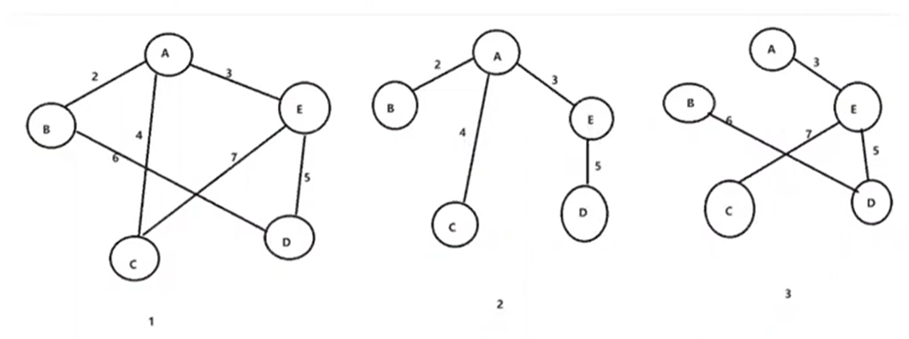

# 最小生成树


## 什么是最小生成树

最小生成树（minimum spanning tree）



> 对于一个图而言，可以生成很多树
> 
> 生成树是将原图的全部顶点以最少的边连通的子图，对于有n个顶点的连通图，生成树有n-1条边
> 
> 
> 对于一个带权连通图，生成树不同，树中各边上权值总和也不同，权值总和最小的生成树则称为图的最小生成树
> 

### 最小生成树算法

1、Prim Native implementation  O(V2)

> 稠密图


2、Prim PQ implementation  O(ElogV)

> 稀疏图

3、Kruskal UF implementation  O(ElogE)（或者更大范围ElogV，E<=V2）

> 稀疏图

## Prim 算法

Prim算法是解决最小生成树的常用算法

它采取贪心策略，从指定的顶点开始寻找最小权值的邻接点

图`G=<V,E>`，初始时$S=\{V_0\}$，把与$V_0$相邻接，且边的权值最小的顶点加入到S。不断地把S中的顶点与V-S中顶点的最小权值边加入，直到所有顶点都已加入到S中。

方法1：使用pq每次找出最近的下一个点

方法2：暴力扫所有点找出最近的下一个顶点，此顶点进入set，同时对所有通过顶点的点做edge relaxiation

| | dense稠密图E=V2 | sparse稀疏图E<<V2 |
|---|:---:|---:|
| prim实现方法 | adjacent matrix O(V2) | adjacent list O(ElogV) |

### PQ实现

原理：

1、以某一个点开始，寻找当前该点可以访问的所有的边

2、在已经寻找的边中发现最小边，这个边必须有一个点还没有访问过，将还没有访问的点加入集合，记录添加的边

3、寻找当前集合可以访问的所有边，重复2的过程，直到没有新的点可以加入

4、此时由所有边构成的树即为最小生成树

```py
def prim(v, e, edges):
    import sys
    import heapq

    # 初始化邻接矩阵，所有值初始化为一个大值，表示无穷大
    grid = [[10001] * (v + 1) for _ in range(v + 1)]

    # 读取边的信息并填充邻接矩阵
    for edge in edges:
        x, y, k = edge
        grid[x][y] = k
        grid[y][x] = k

    # 所有节点到最小生成树的最小距离
    minDist = [10001] * (v + 1)

    # 记录节点是否在树里
    isInTree = [False] * (v + 1)

    # Prim算法主循环
    for i in range(1, v):
        cur = -1
        minVal = sys.maxsize

        # 选择距离生成树最近的节点
        for j in range(1, v + 1):
            if not isInTree[j] and minDist[j] < minVal:
                minVal = minDist[j]
                cur = j

        # 将最近的节点加入生成树
        isInTree[cur] = True

        # 更新非生成树节点到生成树的距离
        for j in range(1, v + 1):
            if not isInTree[j] and grid[cur][j] < minDist[j]:
                minDist[j] = grid[cur][j]

    # 统计结果
    result = sum(minDist[2:v+1])
    return result

if __name__ == "__main__":
    import sys
    input = sys.stdin.read
    data = input().split()
    
    v = int(data[0])
    e = int(data[1])
    
    edges = []
    index = 2
    for _ in range(e):
        x = int(data[index])
        y = int(data[index + 1])
        k = int(data[index + 2])
        edges.append((x, y, k))
        index += 3

    result = prim(v, e, edges)
    print(result)
```

## Kruskal

Prim算法是维护节点的集合，而Kruskal是维护边的集合

整体思路：

1、边的权值排序，因为要优先选最小的边加入到生成树里

2、遍历排序后的边

- 如果边首尾的两个节点在同一个集合，说明如果连上这条边图中会出现环

- 如果边首尾的两个节点不在同一个集合，加入到最小生成树，并把两个节点加入同一个集合

> 怎么判断两个节点在不在同一个集合?
> 
> 借助并查集！


```py
class Edge:
    def __init__(self, l, r, val):
        self.l = l
        self.r = r
        self.val = val

n = 10001
father = list(range(n))

def init():
    global father
    father = list(range(n))

def find(u):
    if u != father[u]:
        father[u] = find(father[u])
    return father[u]

def join(u, v):
    u = find(u)
    v = find(v)
    if u != v:
        father[v] = u

def kruskal(v, edges):
    edges.sort(key=lambda edge: edge.val)
    init()
    result_val = 0

    for edge in edges:
        x = find(edge.l)
        y = find(edge.r)
        if x != y:
            result_val += edge.val
            join(x, y)

    return result_val

if __name__ == "__main__":
    import sys
    input = sys.stdin.read
    data = input().split()

    v = int(data[0])
    e = int(data[1])

    edges = []
    index = 2
    for _ in range(e):
        v1 = int(data[index])
        v2 = int(data[index + 1])
        val = int(data[index + 2])
        edges.append(Edge(v1, v2, val))
        index += 3

    result_val = kruskal(v, edges)
    print(result_val)
```


