# 01

## docker简介

1、是什么
docker的出现使得docker得以打破过去 程序即应用 的观念。

透过镜像image将作业系统核心除外，运作应用程式所需的系统环境，由下而上打包，达到应用程式跨平台间的无缝接轨运作

一次镜像，处处运行

docker是基于go语言实现的云开源项目

主要目标是“build, ship and run any app, anywhere”，也就是通过封装、分发、部署、运行等生命周期的管理，使用户的APP及其运行环境能够做到“一次镜像，处处运行”

docker的出现解决了运行环境和配置问题的软件容器，方便做持续集成并有助于整体发布的容器虚拟化技术


2、能干嘛


Docker本身是一个容器运行载体或称之为管理引擎。

把应用程序和配置依赖打包好形成一个可交付的运行环境，这个打包好的运行环境就是image镜像文件。

只有通过这个镜像文件才能生成Docker容器实例（类似Java中new出来一个对象）。

image文件可以看作是容器的模板。Docker根据image文件生成容器的实例。同一个image文件，可以生成多个同时运行的容器实例。

镜像文件：
- image文件生成的容器实例，本身也是一个文件，称为镜像文件

容器实例：
- 一个容器运行一种服务，当需要的时候，就可以通过docker客户端创建一个对应的运行实例，也就是容器

仓库：
- 就是放一堆镜像的地方，可以把镜像发布到仓库中，需要的时候再从仓库中拉下来就可以了

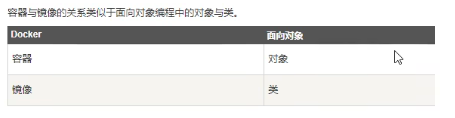

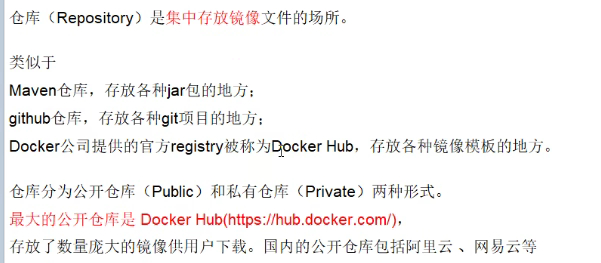

3、下载安装
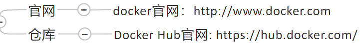

## docker架构图

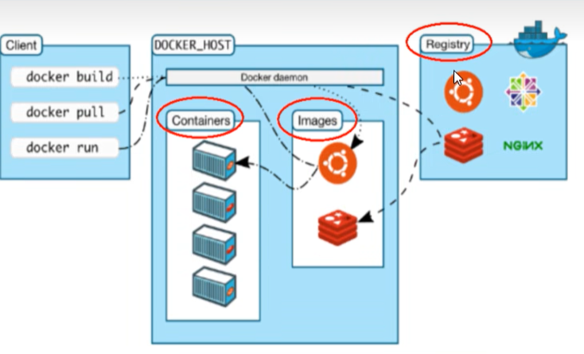


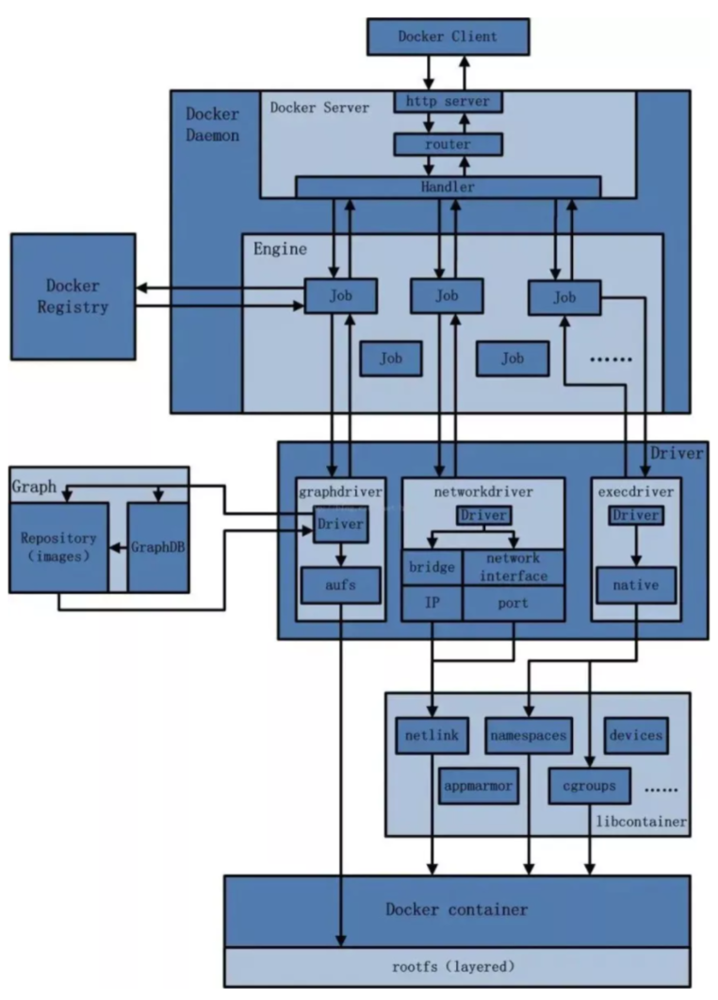

**工作原理**
Docker是一个client-server结构的系统，Docker守护进程运行在主机上，然后通过socket连接从客户端访问，守护进程从客户端接受命令并管理运行在主机上的容器。

容器是一个运行时环境。

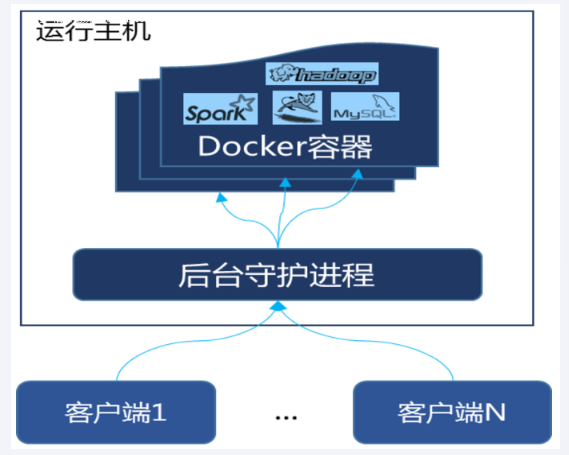


## centos7安装docker
[https://docs.docker.com/engine/install/centos/](https://docs.docker.com/engine/install/centos/)

确定是centos7及以上版本


### 阿里镜像加速
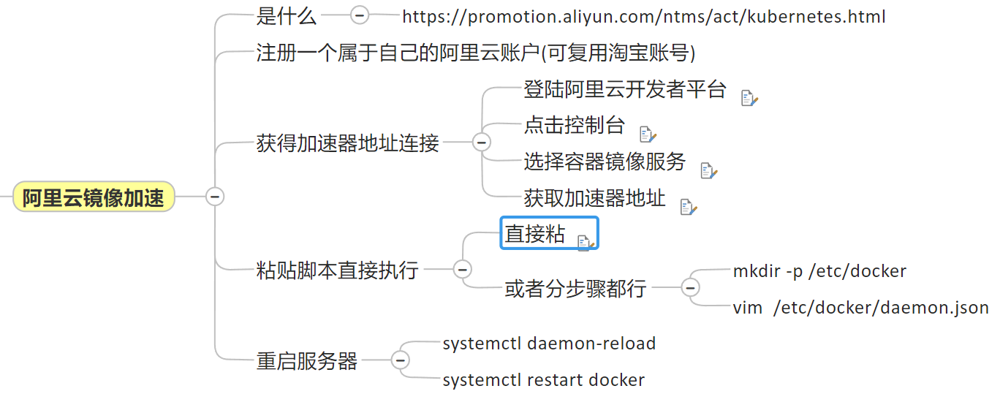

直接粘：
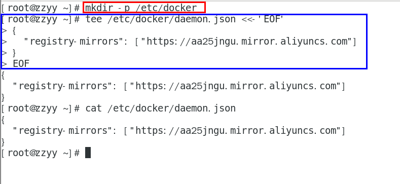

### hello world
```bash
docker run hello-world
```
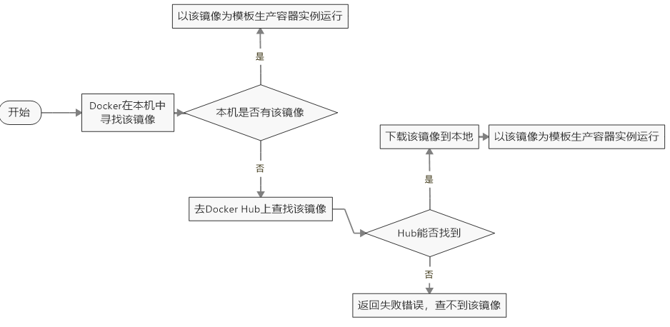

## docker命令
### 启动
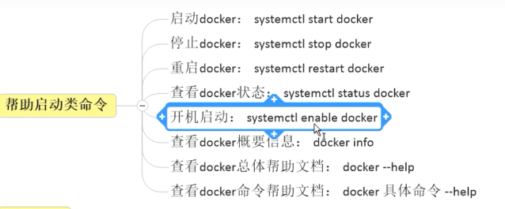

### 镜像命令
docker images


docker search hello-world


docker pull 镜像名


docker system df 
查看镜像/容器/数据卷所占的空间


docker rmi 镜像ID

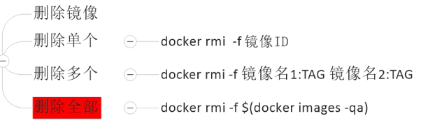

-q意思是只返回id，-a返回所有

#### docker虚悬镜像
仓库名、标签都是`<none>`的镜像，俗称虚悬镜像dangling image


### 容器命令
有镜像才能创建容器，这是根本前提（下载一个centos或者Ubuntu镜像演示）
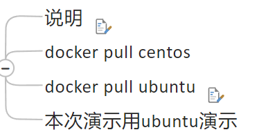

docker run 


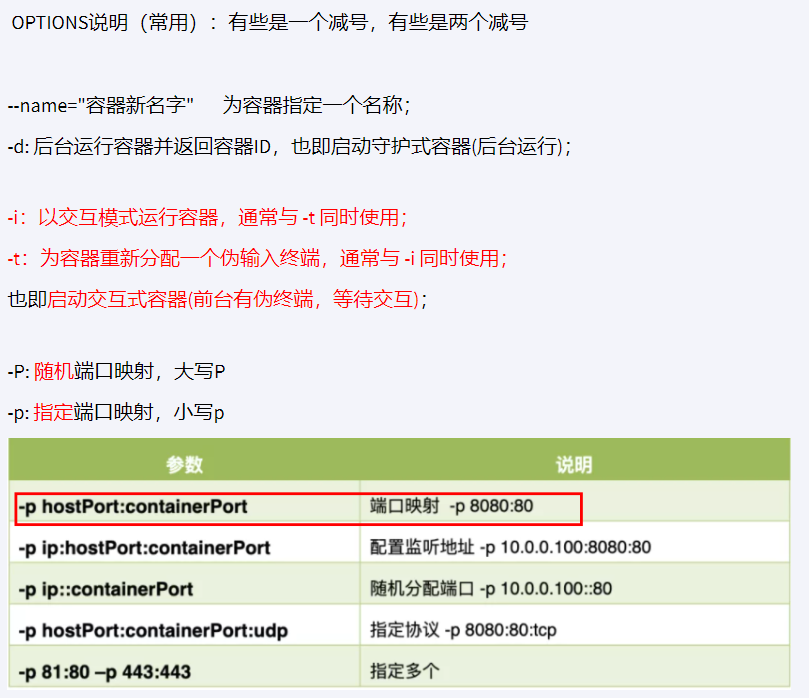

启动交互式容器（前台命令行）


docker ps


退出容器


重启、停止、强制停止


删除已停止的容器
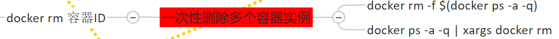

启动守护式容器（后台服务器）
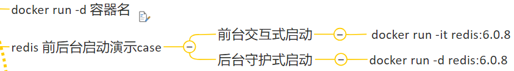

查看容器日志


查看容器内运行的进程


查看容器内部细节


进入正在运行的容器并以命令行交互

docker exec -it 容器ID bashShell
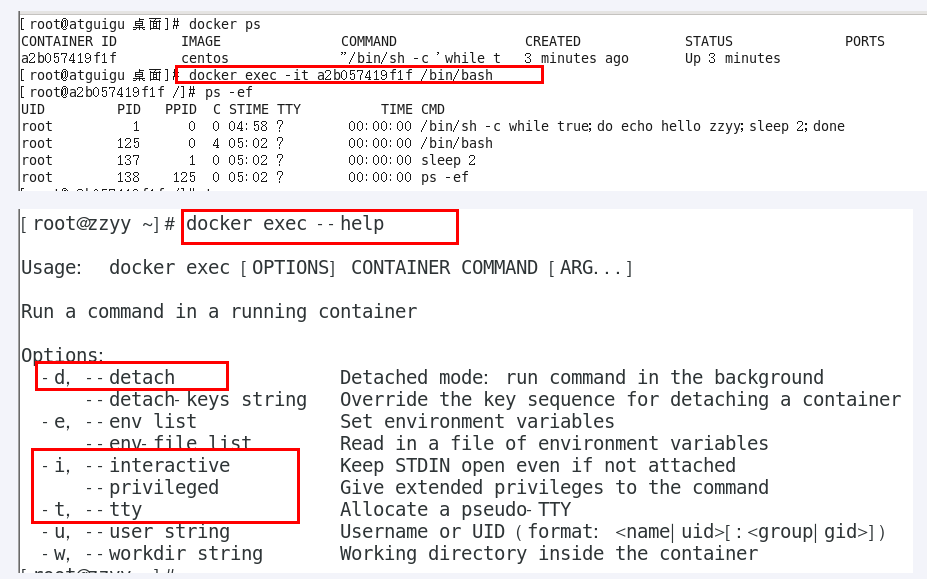


推荐使用docker exec命令，因为退出容器终端，不会导致容器的停止


从容器内拷贝到文件到主机上：
docker cp 容器ID:容器内路径 目的主机路径
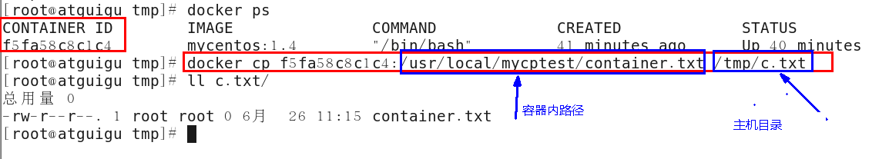

导入和导出容器：
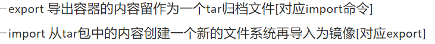

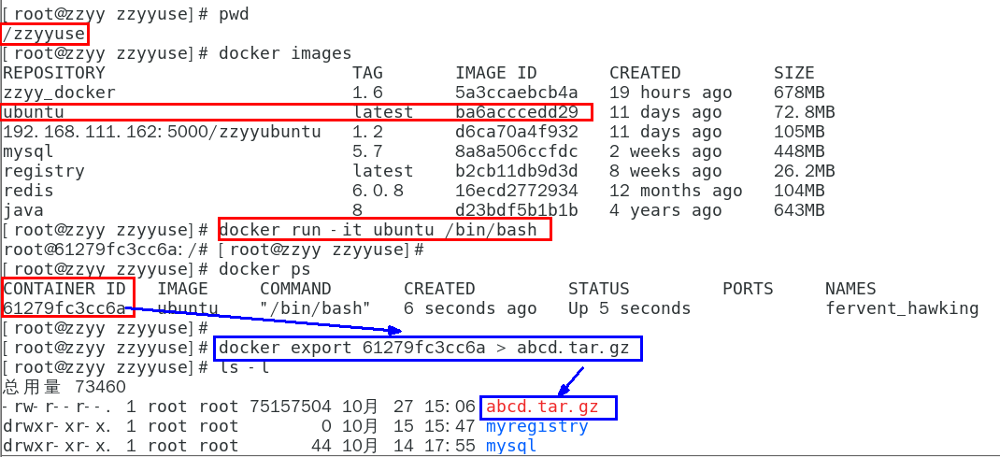
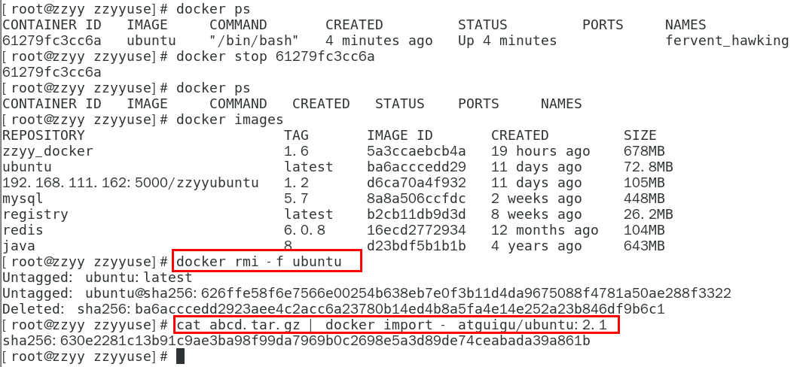

**常用命令**
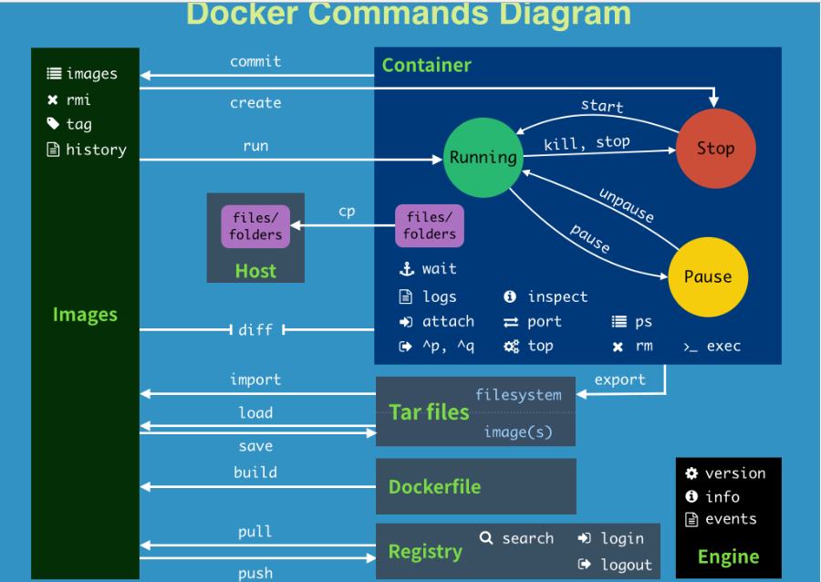
```bash
attach    Attach to a running container                 # 当前 shell 下 attach 连接指定运行镜像

build     Build an image from a Dockerfile              # 通过 Dockerfile 定制镜像

commit    Create a new image from a container changes   # 提交当前容器为新的镜像

cp        Copy files/folders from the containers filesystem to the host path   #从容器中拷贝指定文件或者目录到宿主机中

create    Create a new container                        # 创建一个新的容器，同 run，但不启动容器

diff      Inspect changes on a container's filesystem   # 查看 docker 容器变化

events    Get real time events from the server          # 从 docker 服务获取容器实时事件

exec      Run a command in an existing container        # 在已存在的容器上运行命令

export    Stream the contents of a container as a tar archive   # 导出容器的内容流作为一个 tar 归档文件[对应 import ]

history   Show the history of an image                  # 展示一个镜像形成历史

images    List images                                   # 列出系统当前镜像

import    Create a new filesystem image from the contents of a tarball # 从tar包中的内容创建一个新的文件系统映像[对应export]

info      Display system-wide information               # 显示系统相关信息

inspect   Return low-level information on a container   # 查看容器详细信息

kill      Kill a running container                      # kill 指定 docker 容器

load      Load an image from a tar archive              # 从一个 tar 包中加载一个镜像[对应 save]

login     Register or Login to the docker registry server    # 注册或者登陆一个 docker 源服务器

logout    Log out from a Docker registry server          # 从当前 Docker registry 退出

logs      Fetch the logs of a container                 # 输出当前容器日志信息

port      Lookup the public-facing port which is NAT-ed to PRIVATE_PORT    # 查看映射端口对应的容器内部源端口

pause     Pause all processes within a container        # 暂停容器

ps        List containers                               # 列出容器列表

pull      Pull an image or a repository from the docker registry server   # 从docker镜像源服务器拉取指定镜像或者库镜像

push      Push an image or a repository to the docker registry server    # 推送指定镜像或者库镜像至docker源服务器

restart   Restart a running container                   # 重启运行的容器

rm        Remove one or more containers                 # 移除一个或者多个容器

rmi       Remove one or more images       # 移除一个或多个镜像[无容器使用该镜像才可删除，否则需删除相关容器才可继续或 -f 强制删除]

run       Run a command in a new container              # 创建一个新的容器并运行一个命令

save      Save an image to a tar archive                # 保存一个镜像为一个 tar 包[对应 load]

search    Search for an image on the Docker Hub         # 在 docker hub 中搜索镜像

start     Start a stopped containers                    # 启动容器

stop      Stop a running containers                     # 停止容器

tag       Tag an image into a repository                # 给源中镜像打标签

top       Lookup the running processes of a container   # 查看容器中运行的进程信息

unpause   Unpause a paused container                    # 取消暂停容器

version   Show the docker version information           # 查看 docker 版本号

wait      Block until a container stops, then print its exit code   # 截取容器停止时的退出状态值
```
