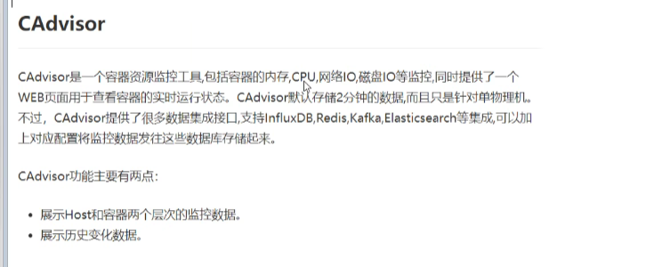
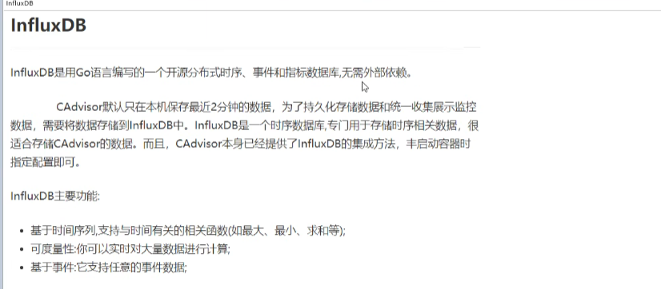
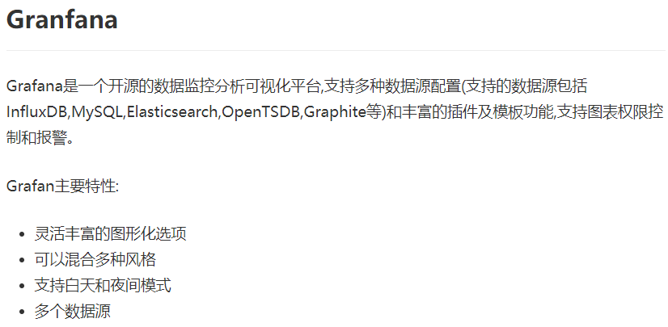
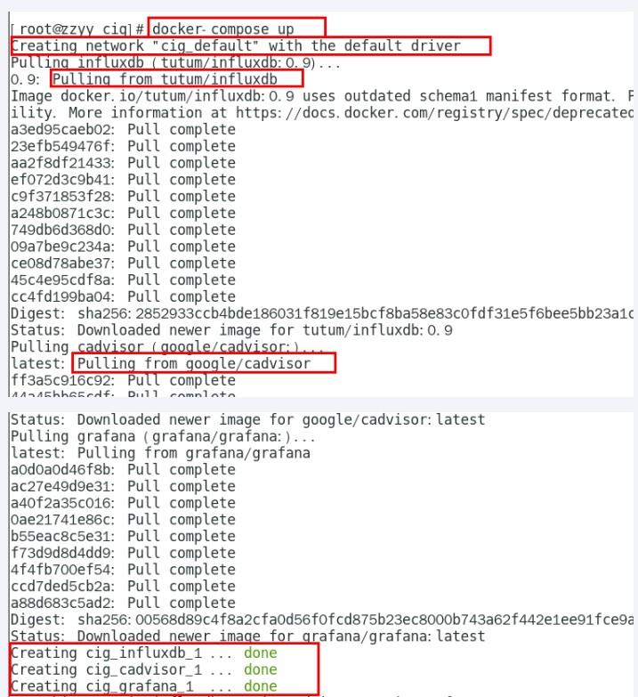
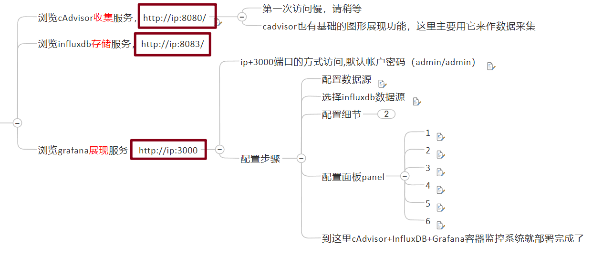
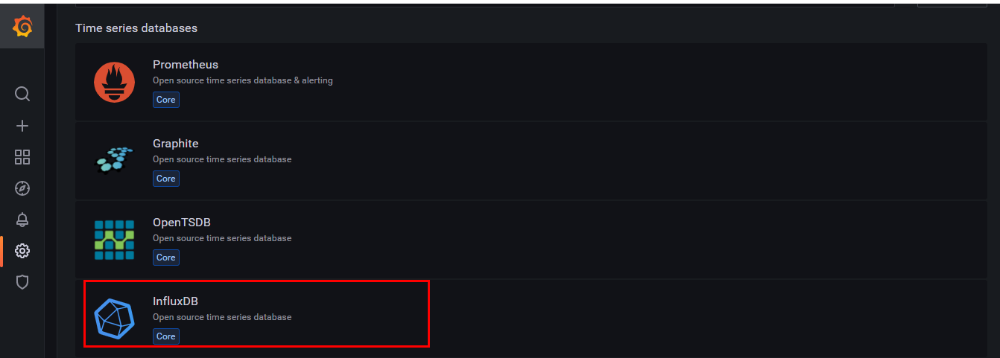

# 04

## 轻量级可视化工具——Portainer

是一款轻量级的应用，提供了图形化界面，用于方便地管理Docker环境，包括单机环境和集群环境

```bash
docker run -d -p 8000:8000 -p 9000:9000 --name portainer     --restart=always     -v /var/run/docker.sock:/var/run/docker.sock     -v portainer_data:/data     portainer/portainer
```

--restart=always意思是跟着docker重新启动而启动


## docker容器监控——CAdvisor+InfluxDB+Granfana








`docker-compose.yml`
```
version: '3.1'

 

volumes:

  grafana_data: {}

 

services:

 influxdb:

  image: tutum/influxdb:0.9

  restart: always

  environment:

    - PRE_CREATE_DB=cadvisor

  ports:

    - "8083:8083"

    - "8086:8086"

  volumes:

    - ./data/influxdb:/data

 

 cadvisor:

  image: google/cadvisor

  links:

    - influxdb:influxsrv

  command: -storage_driver=influxdb -storage_driver_db=cadvisor -storage_driver_host=influxsrv:8086

  restart: always

  ports:

    - "8080:8080"

  volumes:

    - /:/rootfs:ro

    - /var/run:/var/run:rw

    - /sys:/sys:ro

    - /var/lib/docker/:/var/lib/docker:ro

 

 grafana:

  user: "104"

  image: grafana/grafana

  user: "104"

  restart: always

  links:

    - influxdb:influxsrv

  ports:

    - "3000:3000"

  volumes:

    - grafana_data:/var/lib/grafana

  environment:

    - HTTP_USER=admin

    - HTTP_PASS=admin

    - INFLUXDB_HOST=influxsrv

    - INFLUXDB_PORT=8086

    - INFLUXDB_NAME=cadvisor

    - INFLUXDB_USER=root

    - INFLUXDB_PASS=root
```





grafana配置数据源

