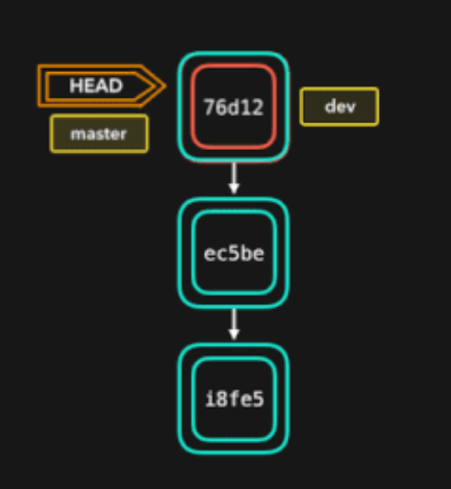
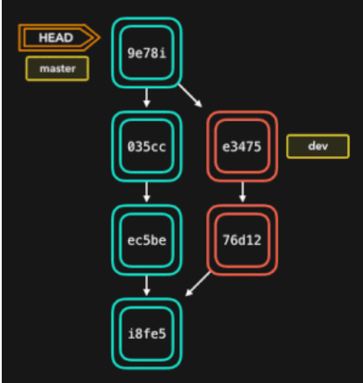
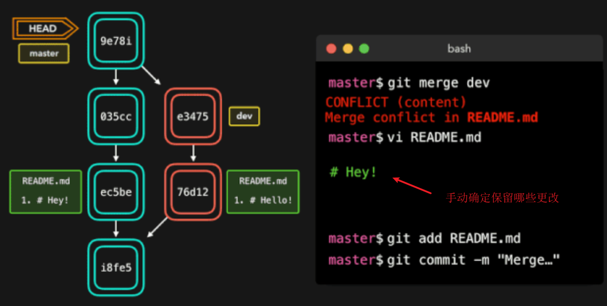
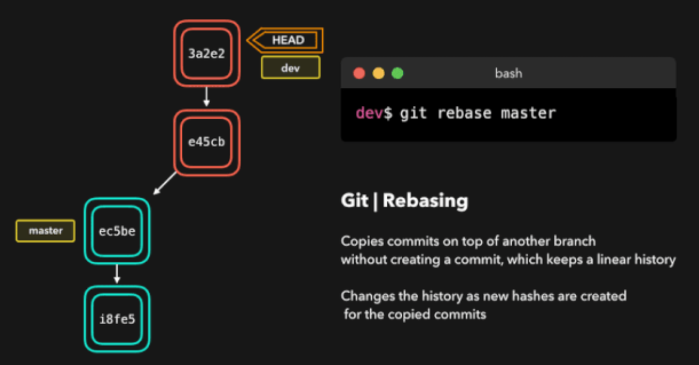
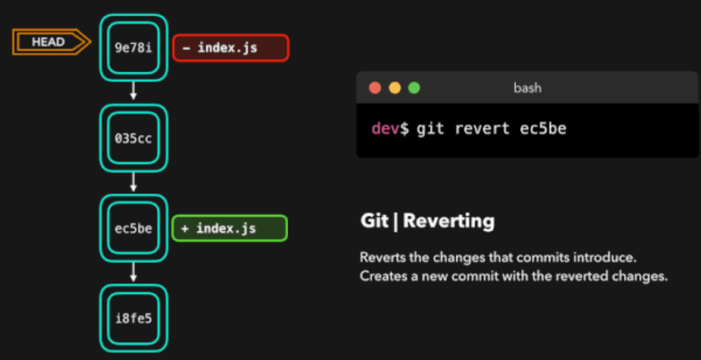
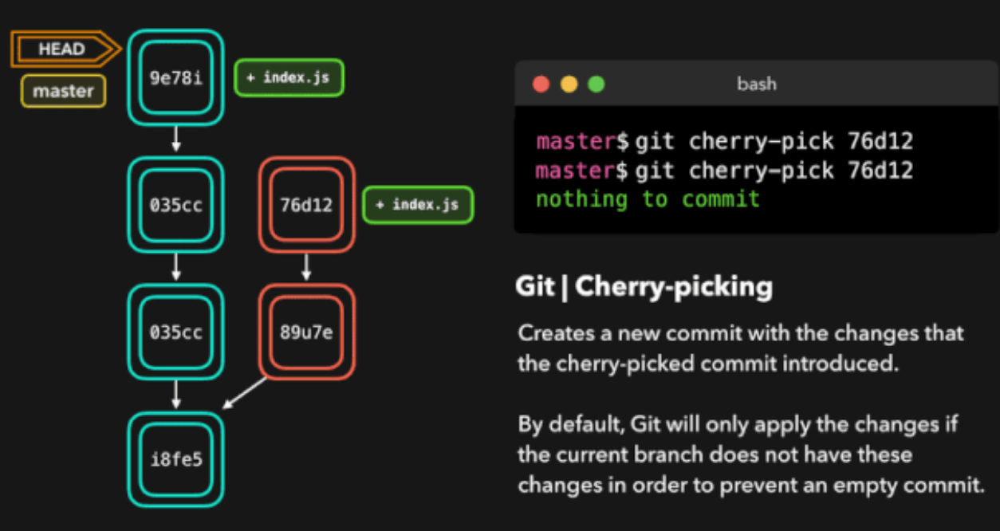
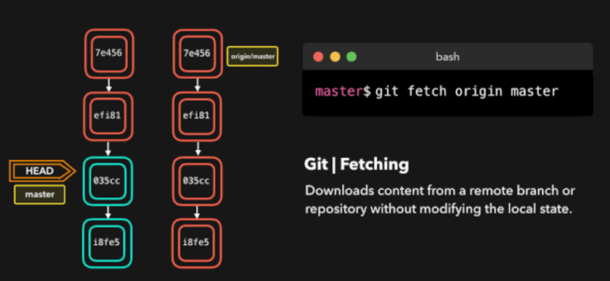
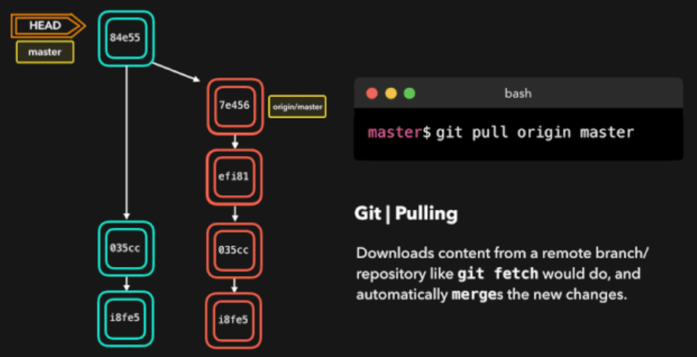
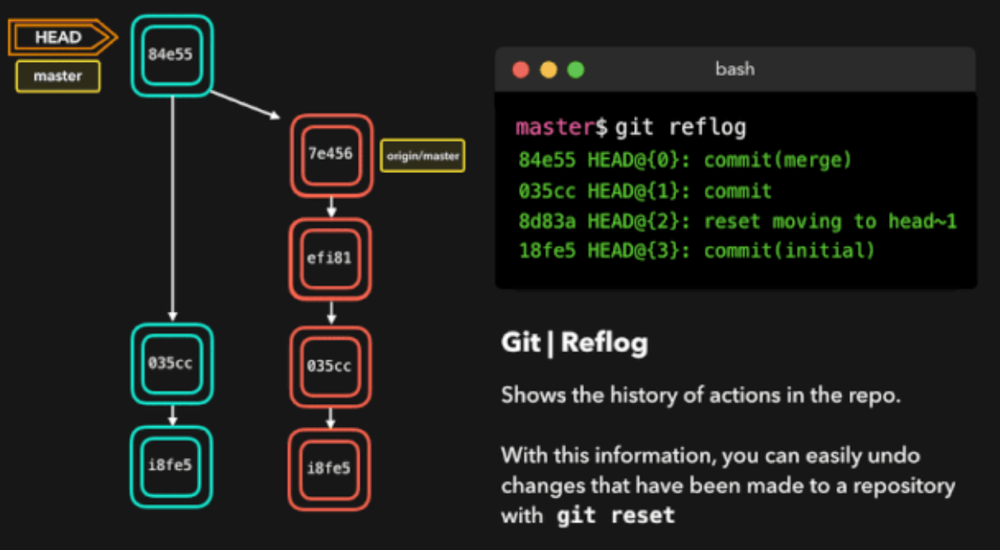
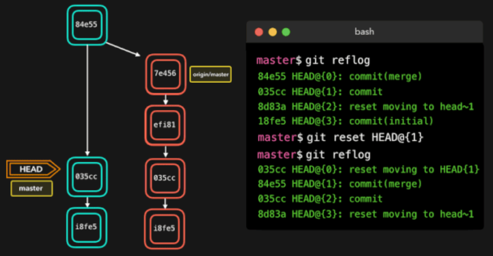

# 常用指令

## 合并——git merge

将一个分支的修改融入到另一个分支的一种方式是执行 git merge

git 可执行两种类型的合并：`fast-forward` 和 `no-fast-forward`

### Fast-forward (—ff)

在当前分支相比于要合并的分支没有额外的提交(commit)时，可以执行 fast-forward 合并

这类合并不会创建新的提交，而是会将正在合并的分支上的提交直接合并到当前分支

### No-fast-foward (—no-ff)

如果当前分支上提交想要合并的分支不具备的改变，那么 git 会执行 `no-fast-forward` 合并。

使用 `no-fast-forward` 合并时，Git 会在当前活动分支上创建新的 `merging commit`。这个提交的父提交（parent commit）即指向这个活动分支，也指向我们想要合并的分支

### 合并冲突

当我们想要合并的两个分支的同一文件中的同一行代码上有不同的修改，或者一个分支删除了一个文件而另一个分支修改了这个文件时，Git 就不知道如何取舍了。

当尝试合并这些分支时，Git 会向你展示冲突出现的位置。我们可以手动移除我们不想保留的修改，保存这些修改，再次添加这个已修改的文件，然后提交这些修改。

## 变基（Rebasing）-- git rebase

可通过执行 git merge 将一个分支的修改应用到另一个分支。另一种可将一个分支的修改融入到另一个分支的方式是执行 git rebase

git rebase 会将当前分支的提交复制到指定的分支之上

变基与合并有一个重大的区别：Git 不会尝试确定要保留或不保留哪些文件。执行 rebase 的分支总是含有想要保留的最新近的修改！这样不会遇到任何合并冲突，而且可以保留一个漂亮的、线性的 Git 历史记录。

git rebase 在为复制的提交创建新的 hash 时会修改项目的历史记录。

如果你在开发一个 feature 分支并且 master 分支已经更新过，那么变基就很好用。你可以在你的分支上获取所有更新，这能防止未来出现合并冲突。

### 交互式变基（Interactive Rebase）

在 rebase 的提交上，可以执行以下 6 个动作：

- reword：修改提交信息；

- edit：修改此提交；

- squash：将提交融合到前一个提交中；

- fixup：将提交融合到前一个提交中，不保留该提交的日志消息；

- exec：在每个提交上运行想要 rebase 的命令；

- drop：移除该提交；

## 重置（Resetting）—— git reset

当不想要之前提交的修改时，就会用到这个命令

git reset 能让我们不再使用当前台面上的文件，让我们可以控制 HEAD 应该指向的位置。

### 软重置

软重置会将 HEAD 移至指定的提交（或与 HEAD 相比的提交的索引），而不会移除该提交之后加入的修改

### 硬重置

有时候我们并不想保留特定提交引入的修改。不同于软重置，我们应该再也无需访问它们。Git 应该直接将整体状态直接重置到特定提交之前的状态：这甚至包括你在工作目录中和暂存文件上的修改。

## 还原（Reverting）—— git revert

另一种撤销修改的方法是执行 git revert。通过对特定的提交执行还原操作，我们会创建一个包含已还原修改的新提交。

假设 ec5be 添加了一个 index.js 文件。但之后我们发现其实我们再也不需要由这个提交引入的修改了

## 拣选（Cherry-picking）—— git cherry-pick

当一个特定分支包含我们的活动分支需要的某个提交时，我们对那个提交执行 cherry-pick

对一个提交执行 cherry-pick 时，我们会在活动分支上创建一个新的提交，其中包含由拣选出来的提交所引入的修改

假设 dev 分支上的提交 76d12 为 index.js 文件添加了一项修改，而我们希望将其整合到 master 分支中。我们并不想要整个 dev 分支，而只需要这个提交

## 取回（Fetching）—— git fetch

如果你有一个远程 Git 分支，比如在 GitHub 上的分支，当远程分支上包含当前分支没有的提交时，可以使用取回

通过在这个远程分支上执行 git fetch，我们就可在本地获取这些修改。这不会以任何方式影响你的本地分支：fetch 只是单纯地下载新的数据而已

## 拉取（Pulling）—— git pull

尽管 git fetch 可用于获取某个分支的远程信息，但我们也可以执行 git pull。git pull 实际上是两个命令合成了一个：git fetch 和 git merge。当我们从来源拉取修改时，我们首先是像 git fetch 那样取回所有数据，然后最新的修改会自动合并到本地分支中

## Reflog —— git reflog

git reflog 是一个非常有用的命令，可以展示已经执行过的所有动作的日志。包括合并、重置、还原，基本上包含你对你的分支所做的任何修改。

如果你犯了错，你可以根据 reflog 提供的信息通过重置 HEAD 来轻松地重做！

## 参考

[https://mp.weixin.qq.com/s/4DVsvzUHje_hRbhuAnsvlQ](https://mp.weixin.qq.com/s/4DVsvzUHje_hRbhuAnsvlQ)
