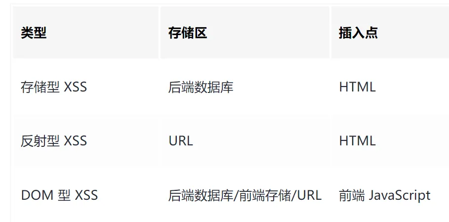
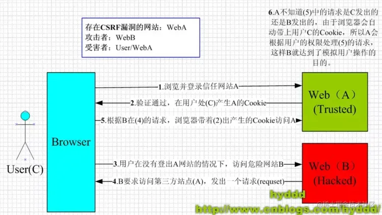

# XSS和CSRF

## XSS
XSS (Cross-Site Scripting)跨站脚本攻击：

● 攻击者往Web页面里面插入`恶意可执行网页脚本代码`，当用户浏览该页时，嵌入其中Web里面的脚本代码会被执行，从而达到攻击者盗取信息或其他侵犯用户安全隐私的目的

● 存储型：恶意代码提交到`目标网站的数据库`，服务器返回恶意代码，恶意代码被执行，窃取用户数据并发送到攻击者网站

● 反射型：构造特殊URL，其中包含恶意代码，打开带有恶意代码的 URL 时，`网站服务端将恶意代码从 URL 中取出，拼接在 HTML 中返回给浏览器`

● DOM型：构造特殊的URL，其中包含恶意代码，`取出和执行恶意代码由浏览器端完成`

### 防御XSS

● httpOnly：cookie设置HttpOnly，js脚本无法读取cookie

● 输入过滤：前后端对输入格式检查

● 转义HTML：如果拼接 HTML 是必要的，就需要对于引号，尖括号，斜杠进行转义

● 白名单：
● 预防存储和反射型：纯前端渲染，代码和数据分隔开；对HTML转移

## CSRF
CSRF 跨站点伪造

● 诱导用户打开黑客的网站，在黑客的网站中，利用用户登录状态发起跨站点伪造

