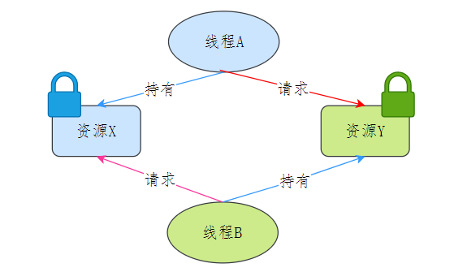

# 死锁

## 进程和线程

线程是调度的基本单位，而进程则是资源拥有的基本单位。

## 死锁的概念

死锁问题的产生是由两个或者以上线程并行执行的时候，争夺资源而造成的

> 两个或多个线程无限期的阻塞、相互等待的一种状态

死锁只有同时满足四个条件才会发生：

1、互斥条件

> 多个线程不能同时使用同一个资源

2、持有并等待条件

> 线程 A 持有资源 1，又想申请资源 2，但 2 已被线程 C 持有，A 就会处于等待状态，但 A 在等待 2 的同时不会释放自己已经持有的资源 1

3、不可剥夺条件

> 当线程已经持有了资源，在自己使用完之前不能被其他线程获取

4、环路等待条件

> 在死锁发生的时候，两个线程获取资源的顺序构成了环形链

## 避免死锁发生

破坏其中一个条件

最常见并且可行的就是使用资源有序分配法，来破坏环路等待条件

### 消除互斥条件：无法实现

这个是没法实现，因为很多资源就是只能被一个线程占用，例如锁

### 消除请求并持有条件：一个线程一次请求其所需要的所有资源
消除这个条件的办法很简单，就是一个线程一次请求其所需要的所有资源。

### 消除不可剥夺条件
占用部分资源的线程进一步申请其他资源时，如果申请不到，可以主动释放它占有的资源，这样不可剥夺这个条件就破坏掉了。

### 消除环路等待条件
可以靠按序申请资源来预防。所谓按序申请，是指资源是有线性顺序的，申请的时候可以先申请资源序号小的，再申请资源序号大的，这样线性化后就不存在环路了

## 活锁和饥饿锁

饥饿锁：这个饥饿指的是资源饥饿，某个线程一直等不到它所需要的资源，从而无法向前推进

活锁：在活锁状态下，处于活锁线程组里的线程状态可以改变，但是整个活锁组的线程无法推进

> 活锁可以用两个人过一条很窄的小桥来比喻：为了让对方先过，两个人都往旁边让，但两个人总是让到同一边。这样，虽然两个人的状态一直在变化，但却都无法往前推进。

## 参考

[https://xiaolincoding.com/os/4_process/deadlock.html#%E6%AD%BB%E9%94%81%E7%9A%84%E6%A6%82%E5%BF%B5](https://xiaolincoding.com/os/4_process/deadlock.html#%E6%AD%BB%E9%94%81%E7%9A%84%E6%A6%82%E5%BF%B5)

[https://javabetter.cn/sidebar/sanfene/os.html#_19%E3%80%81%E5%A6%82%E4%BD%95%E9%81%BF%E5%85%8D%E6%AD%BB%E9%94%81%E5%91%A2](https://javabetter.cn/sidebar/sanfene/os.html#_19%E3%80%81%E5%A6%82%E4%BD%95%E9%81%BF%E5%85%8D%E6%AD%BB%E9%94%81%E5%91%A2)