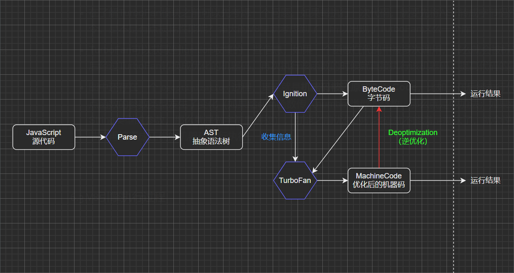
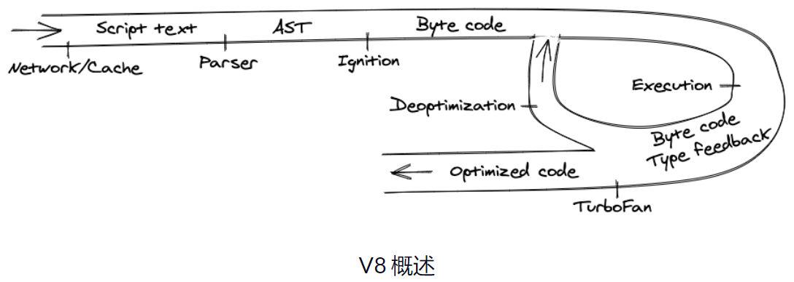
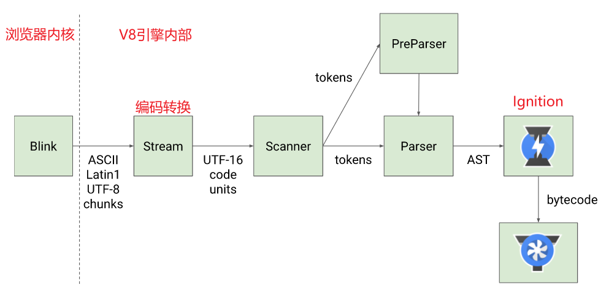

# JS 引擎

## 简介

渲染引擎负责渲染，包括 DOM 树、样式、事件和 V8 集成，解析 DOM 树，解决样式问题，并确定所有元素的几何位置。

JS 引擎将 JavaScript 编译成本地机器代码并执行，每个浏览器都开发了自己的引擎。

谷歌的 Chrome 使用 V8，Safari 使用 JavaScriptCore，Firefox 使用 SpiderMonkey

## 理解 V8

1、下载源代码：网络、缓存或 service workers

2、解析 parsing：扫描器（scanner）和解析器（parser）

- 扫描器接收 JS 文件并将其转换为已知的标记列表

- 解析器识别它并创建一个抽象语法树 AST：源代码的树状表示

> 词法分析：对代码中的每一个词或符号进行解析，最终会生成很多 tokens
>
> ---
>
> 语法分析：在词法分析的基础上，拿到 tokens 中的一个个对象，根据他们不同的类型再进一步分析具体语法，生成 AST

3、Ignition 解释器将 AST 转为字节码 ByteCode

> 字节码：是一种包含执行程序，由一系列 op 代码/数据对组成的二进制文件，是一种中间码
>
> ---
>
> 为什么要转字节码？
>
> - 因为 JS 运行所处的环境是不一定的，可能是 windows 或 Linux 或 IOS，CPU 能识别的机器指令也是不一样的
>
> - 字节码是一种中间码，本事就有跨平台的特性，然后 V8 引擎再根据当前所处的环境将字节码编译成对应的机器指令给当前环境的 CPU 执行

4、TurboFan 模块：一个编译器，可以将字节码编译成 CPU 认识的机器码

TurboFan 可以获取到 Ignition 收集的一些信息，如果一个函数在代码中被多次调用，就会被标记为热点函数，然后经过 TurboFan 转换为优化的机器码，再次执行该函数的时候就直接执行该机器码，提高代码的执行性能

### 执行过程

1、浏览器内核将 JS 源码交给 V8 引擎

2、Stream 获取到 JS 进行编码转换

3、Scanner 进行词法分析，将代码转换成 tokens

4、经过语法分析后，tokens 会被转换成 AST，中间会经过 parser 和 preparser 过程

- parser：直接解析，将 tokens 转成 AST 树

- preparser：预解析

> 并不是所有的 JavaScript 代码一开始就执行，V8 实现了 Lazy Parsing 延迟解析方案，对比不要的函数代码进行预解析，也就是先解析急需执行的代码内容，对函数的全量解析会放到函数被调用时执行

5、生成 AST 后，会被 Ignition 转换成字节码，然后转成机器码，最后就是代码执行

## 参考

[https://www.freecodecamp.org/chinese/news/javascript-under-the-hood-v8/](https://www.freecodecamp.org/chinese/news/javascript-under-the-hood-v8/)

[https://www.cnblogs.com/MomentYY/p/15770904.html](https://www.cnblogs.com/MomentYY/p/15770904.html)

[https://v8.dev/](https://v8.dev/)
