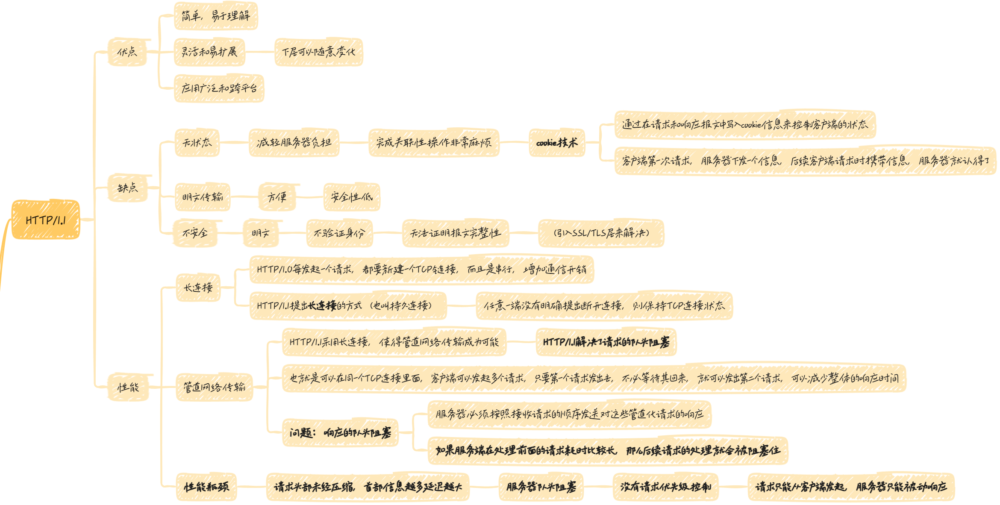
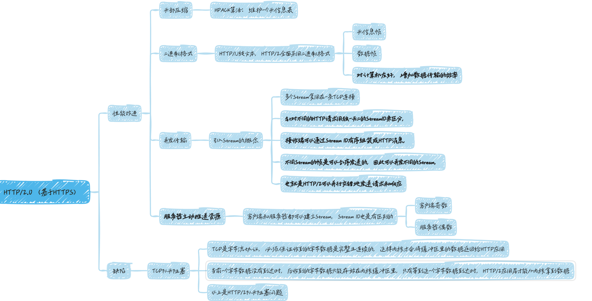
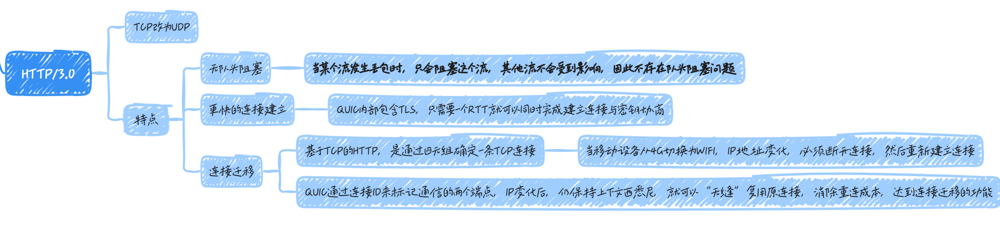
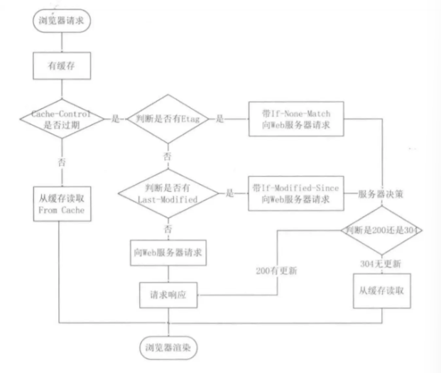

# http

## 概念

### 是什么?

HTTP 是超文本传输协议，HyperText Transfer Protocol

- 超文本： 文字， 图片， 视频等的混合体

- 传输： 两点之间传输数据

- 协议： 使用计算机能理解的语言确立一种计算机之间交流通信的规范，以及相关的各种控制和错误处理方式

### 状态码

1xx 提示信息， 表示目前是`协议处理的中间状态`，还需要后续的操作

- `100 Continue`：客户端继续请求

- `101 Switching Protocols`：服务器同意切换协议

- `102 Processing`：服务器已收到并正在处理请求

2xx 成功， 报文已经成功收到并被正确处理

- `200 OK` 表示一切正常， 非`HEAD`请求，服务器返回的响应头都会有 body 数据

- `200 No Content` 与 200 OK 基本相同，但响应头没有 body 数据

- `204 No Content`：请求成功，但没有内容返回

- `206 Partial Content` 是应用于 HTTP 分块下载或断点续传，表示响应返回的 body 并不是资源的全部，而是其中的一部分，也是服务器处理成功的状态

3xx 重定向，资源位置发生变动，需要客户端重新发送请求

- `301 Moved Permanently` 表示永久重定向，请求的资源已经不存在了，需改用新的 URL 再次访问

- `302 Found` 表示临时重定向，说明请求的资源还在，但暂时需要用另一个 URL 来访问

> 301 和 302 都会在响应头里使用字段 Location，指明后续要添加的 URL，浏览器会自动重定向到新的 URL

- `304 Not Modified` 不具有跳转的含义，表示资源未修改，重定向已存在的缓存文件，也称缓存重定向，也就是告诉客户端可以继续使用缓存资源，用于缓存控制

4xx 客户端错误，请求报文有误，服务器无法处理

- `400 Bad Request` 表示客户端请求的报文有错误，但只是个笼统的错误

- `401 Unauthorized`：请求未通过身份验证

- `403 Forbidden` 表示服务器禁止访问资源，并不是客户端的请求出错

- `404 Not Found` 表示请求的资源在服务器上不存在或未找到，所以无法提供给客户端

5xx 服务器错误，服务器在处理请求时内部发生了错误

- `500 Internal Server Error` 与 400 类似，是个笼统的错误码，服务器发生什么错误并不知道

- `501 Not Implemented` 表示客户端请求的功能还不支持

- `502 Bad Gateway` 同时是服务器作为网关或代理时返回的错误码，表示服务器自身正常，访问后端服务器发生了错误

- `503 Service Unavailable` 表示服务器繁忙，暂时无法响应客户端

### 请求方法

> HTTP/1.0 定义三种： GET， POST， HEAD
>
> HTTP/1.1 新增五种： OPTIONS， PUT， DELETE， TRACE， CONNECT

- `GET` 从服务器获取指定的资源，可以是静态的文本， 页面， 图片视频等， 请求的参数位置一般写在 URL， URL 规定只能支持 ASCII， 所以 GET 请求参数只允许 ASCII 字符，而且`浏览器`会对 URL 的长度有限制

> 从规范定义来看，GET 是安全且幂等的(安全是指请求方法不会破坏服务器上的资源; 幂等是指多次执行相同的操作，结果都是相同的)， 因为是只读操作， 所以可以对 GET 请求的数据做缓存，这个缓存可以做到浏览器本身上，也可以做到代理上(如 nginx)， 而且在浏览器中 GET 请求可以保存为书签
>
> 但实际使用，开发者不一定按照 RFC 规范来实现 GET 方法，比如，可以使用 GET 方法实现新增或删除数据的请求，这样实现的 GET 方法就不是安全和幂等的

- `POST` 根据请求负荷(报文 body)对指定的资源做出处理，具体的处理方式视资源类型而不同， POST 请求携带数据的位置一般是写在报文 body 中，body 中的数据可以是任意格式的数据，只要客户端与服务器协商好即可，而且浏览器不会对 body 大小做限制

> 从 RFC 规范来看，POST 是新增或提交数据的操作，会修改服务器上的资源，所以是不安全的，且多次提交数据就会创建多个资源，所以不是幂等的，所以浏览器一般不会缓存 POST 请求，也不能把 POST 请求保存为书签
>
> 实际使用，开发者可以使用 POST 方法实现查询数据的请求，这样实现的 POST 方法就是安全和幂等的

- `HEAD` 类似 GET 请求，只不过返回的响应中没有具体的内容，用于获取报头

- `OPTIONS` 允许客户端查看服务器的性能

- `PUT` 从客户端向服务器传送的数据取代指定的文档的内容，

> 向指定资源位置上传其最新内容

- `DELETE` 请求服务器删除指定的页面

- `TRACE` 回显服务器收到的请求，主要用于测试或诊断

- `CONNECT` 预留给能够将连接改为管道方式的代理服务器

### 常见字段

`Host` 客户端发送请求时，用来指定服务器的域名

`Content-Length` 表示服务器本次响应的数据长度

`Connection` 客户端要求服务器使用`HTTP长连接`机制，以便其他请求复用

> `Keep-Alive： timeout=10， max=500`
>
> `Connection： Keep-Alive`

> HTTP/1.1 版本的默认连接都是长连接，但为了兼容老版本的 HTTP，需要指定 Connection 首部字段的值为`Keep-Alive`

- `Content-Type` 用于服务器回应时告诉客户端本次数据的格式

> `Content-Type： text/html; Charset=utf-8`
>
> 客户端请求时，可以使用`Accept`字段生命自己可以接受哪些数据类型
>
> `Accept： */*`

- `Content-Encoding` 说明数据的压缩方法，表示服务器返回的数据使用了什么压缩格式

> `Content-Encoding： gzip`
>
> 客户端请求时，用`Accept-Encoding`字段说明自己可以接受哪些压缩方法
>
> `Accept-Encoding： gzip， deflate`

## 特性

### HTTP/1.1

#### 优点

- 简单

> 报文格式简单

- 灵活和易扩展

> 协议的每个组成(请求方法， URL/URI， 状态码， 头字段)都没有固定，可以自定义和扩充
>
> 工作在应用层，下层可以随意变化
>
> 如 HTTPS 是在 HTTP 和 TCP 之间增加了 SSL/TLS

- 应用广泛和跨平台

#### 缺点

- 无状态

> 服务器不记忆 HTTP 的状态，所以不需要额外的资源，能减轻服务器负担
>
> 完成关联性的操作时，每次都要问一遍身份信息
>
> 解决方案：
>
> 可以使用 Cookie，第一次请求时，服务器返回，后续客户端请求，带上

- 明文传输

- 不安全

> 解决方案： HTTPS

#### 性能

- 长连接

> HTTP/1.0 每发起一个请求，都要新建一次 TCP 连接，而且是串行请求，做了无谓的 TCP 建立和断开，增加了通信开销
>
> HTTP/1.1 提出了`长连接`的通信方式，也叫做`持久连接`，减少了 TCP 连接的重复建立和断开所造成的额外开销，减轻了服务器端的负载
>
> 持久连接的特点是：只要任意一端没有明确提出断开连接，则保持 TCP 连接状态

- 管道网络传输

> 即在同一个 TCP 连接里面， 客户端可以发起多个请求，只要第一个请求发出去了，不必等其回来，就可以发第二个请求出去，可以减少整体响应时间，但服务器必须按照请求的顺序发送对这些管道化请求的响应
>
> 如果服务器处理 A 请求耗时较长，后续请求就会被阻塞，这称为`队头阻塞`
>
> 所以，HTTP/1.1 管道解决了请求的队头阻塞，但没有解决响应的队头阻塞

- 队头阻塞

### HTTPS

HTTP 存在`窃听风险`，`篡改风险`， `冒充风险`

HTTPS 在 HTTP 与 TCP 之间加入了 SSL/TLS 协议，可以解决上述风险，

- `信息加密`

- `校验机制`

- `身份证书`

如何解决的?

- `混合加密`：实现信息的`机密性`，解决了窃听风险

> 通信建立前使用`非对称加密`，交换会话密钥
>
> 通信过程中全部使用`对称加密`的会话密钥的方式加密明文数据
>
> 采用混合加密的方式的原因：
>
> - 对称加密：只使用一个密钥，运算速度快，密钥必须保密，无法做到安全的密钥交换
>
> - 非对称加密：使用两个密钥：公钥和私钥，公钥可以任意分发而私钥保密，解决了密钥交换问题但速度慢

- `摘要算法`：实现`完整性`，生成独一无二的指纹，解决了篡改的风险

- 服务器公钥放入`数字证书`中，解决了冒充风险

#### TLS 建立过程

- ClientHello

> 客户端支持 TLS 版本
>
> Client Random
>
> 客户端支持的密码套件

- ServerHello

> 确认 TLS 协议版本，如果浏览器不支持，则关闭加密通信
>
> Server Random
>
> 确认密码套件列表
>
> 服务器的数字证书

- 客户端回应

> 通过浏览器或操作系统的 CA 公钥，确认数字证书的真实性，证书没问题，就从数字证书中取出 服务器的公钥 ，加密报文
>
> 一个随机数 pre-master key
>
> 加密通信算法改变通知，表示随后的信息都用会话密钥加密通信
>
> 客户端握手结束通知，表示客户端的握手阶段已经结束，这一项同时把之前所以内容的发生的数据做个摘要，用来供服务端校验
>
> `服务器和客户端有了三个随机数(Client Random， Server Random， pre-master key)，接着就用双方协商的加密算法，各自生成本次通信的会话密钥`

- 服务器最后回应

> 收到第三个随机数之后，通过协商的加密算法，计算本次通信的 会话密钥，然后，发送最后的信息
>
> 加密通信算法改变通知
>
> 服务器握手结束通知

### HTTP/2

HTTP/2 基于 HTTPS

- 头部压缩

> 如果同时发出多个请求，头是一样的或相似的，那协议会消除重复的部分(`HPACK算法`，在客户端和服务器同时维护一张头信息表，所有字段都会存入这个表，生成一个索引号，以后就不发送同样的字段，只发送索引号)

- 二进制格式

> 头信息和数据体都是二进制，统称为帧 frame
>
> - 头信息帧 Headers Frame
>
> - 数据帧 Data Frame

- 并发传输

> 引入 Stream 概念，多个 Stream 复用在一条 TCP 连接
>
> 1 个 TCP 连接包含多个 Stream，Stream 里可以包含 1 个或多个 Message，Message 对应 HTTP/1 中的请求或响应，由 HTTP 头部和包体构成。Message 里包含一条或者多个 Frame，Frame 是 HTTP/2 最小单位，以二进制压缩格式存放 HTTP/1 中的内容（头部和包体）
>
> `针对不同的 HTTP 请求用独一无二的 Stream ID 来区分，接收端可以通过 Stream ID 有序组装成 HTTP 消息，不同 Stream 的帧是可以乱序发送的，因此可以并发不同的 Stream ，也就是 HTTP/2 可以并行交错地发送请求和响应`

- 服务器主动推送资源

> 服务端不再是被动地响应，可以主动向客户端发送消息
>
> 客户端和服务器双方都可以建立 Stream， Stream ID 也是有区别的，客户端建立的 Stream 必须是奇数号，而服务器建立的 Stream 必须是偶数号
>
> HTTP/2 通过 Stream 的并发能力，解决了 HTTP/1 队头阻塞的问题，看似很完美了，但是 HTTP/2 还是存在“队头阻塞”的问题，只不过问题不是在 HTTP 这一层面，而是在 TCP 这一层
>
> `HTTP/2 是基于 TCP 协议来传输数据的，TCP 是字节流协议，TCP 层必须保证收到的字节数据是完整且连续的，这样内核才会将缓冲区里的数据返回给 HTTP 应用，那么当「前 1 个字节数据」没有到达时，后收到的字节数据只能存放在内核缓冲区里，只有等到这 1 个字节数据到达时，HTTP/2 应用层才能从内核中拿到数据，这就是 HTTP/2 队头阻塞问题`

### HTTP/3

- HTTP/1.1 中的管道（ pipeline）虽然解决了请求的队头阻塞，但是没有解决响应的队头阻塞，因为服务端需要按顺序响应收到的请求，如果服务端处理某个请求消耗的时间比较长，那么只能等响应完这个请求后， 才能处理下一个请求，这属于 HTTP 层队头阻塞

- HTTP/2 虽然通过多个请求复用一个 TCP 连接解决了 HTTP 的队头阻塞 ，但是一旦发生丢包，就会阻塞住所有的 HTTP 请求，这属于 TCP 层队头阻塞

HTTP/2 队头阻塞的问题是因为 TCP，所以 HTTP/3 把 HTTP 下层的 TCP 协议改成了 UDP

UDP 发送是不管顺序，也不管丢包的，所以不会出现像 HTTP/2 队头阻塞的问题。 UDP 是不可靠传输的，但基于 UDP 的 QUIC 协议 可以实现类似 TCP 的可靠性传输

QUIC 的特点

- 无队头阻塞

> QUIC 连接上的多个 Stream 之间并没有依赖，都是独立的，某个流发生丢包了，只会影响该流，其他流不受影响

- 更快的连接建立

> HTTP/3 在传输数据前虽然需要 QUIC 协议握手，但是这个握手过程只需要 1 RTT，握手的目的是为确认双方的「连接 ID」，连接迁移就是基于连接 ID 实现的
>
> HTTP/3 的 QUIC 协议并不是与 TLS 分层，而是 QUIC 内部包含了 TLS，它在自己的帧会携带 TLS 里的“记录”，再加上 QUIC 使用的是 TLS/1.3，因此仅需 1 个 RTT 就可以「同时」完成建立连接与密钥协商

- 连接迁移

> 基于 TCP 传输协议的 HTTP 协议，由于是通过四元组（源 IP、源端口、目的 IP、目的端口）确定一条 TCP 连接
>
> 当移动设备的网络从 4G 切换到 WIFI 时，意味着 IP 地址变化了，那么就必须要断开连接，然后重新建立连接
>
> QUIC 协议没有用四元组的方式来“绑定”连接，而是通过连接 ID 来标记通信的两个端点，客户端和服务器可以各自选择一组 ID 来标记自己，因此即使移动设备的网络变化后，导致 IP 地址变化了，只要仍保有上下文信息（比如连接 ID、TLS 密钥等），就可以“无缝”地复用原连接，消除重连的成本，没有丝毫卡顿感，达到了连接迁移的功能

## 缓存技术

HTTP 缓存会存储与请求关联的响应，并将存储的响应复用于后续请求

### 不同种类的缓存

- 私有缓存

> 是绑定到特定客户端的缓存——通常是浏览器缓存，不予其他客户端共享，因此可以存储该用户的个性化响应

- 共享缓存：位于客户端和服务器之间，可以存储能在用户之间共享的响应

> - 代理缓存：一些代理实现缓存来减少网络流量，通常不由服务开发人员管理，因此必须由恰当的 HTTP 标头等控制。
>
> - 托管缓存：由服务开发人员明确部署，降低服务器负载并有效地交付内容，包括`反向代理`、`CDN`和`service worker`与缓存 API 的组合

### 强制缓存

只要浏览器判断缓存没有过期，则直接使用浏览器的本地缓存，决定是否使用缓存的主动性在浏览器这边

使用的字段(Cache-Control 的优先级高于 Expires)：

- 响应头部`Cache-Control`，相对时间

- 响应头部`Expires`，绝对时间

具体过程：

- 浏览器第一次请求访问浏览器资源时，服务器返回资源的同时，在 Response 头部加上 Cache-Control，设置过期时间大小;

- 浏览器再次请求访问服务器中的该资源时，会先通过请求资源的时间与 Cache-Control 中设置过期时间大小，计算资源是否过期，没有则使用缓存，否则重新请求服务器

- 服务器再次受到请求后，会再次更新 Response 头部的 Cache-Control

Cache-Control 的设置：

- no-cache：强制重新验证，始终从服务器获取最新内容。（但不会阻止响应的存储，而是阻止在没有重新验证的情况下重用响应）

> max-age=0 和 must-revalidate 的组合与 no-cache 具有相同的含义，但 max-age=0 是为了解决 HTTP/1.1 之前的许多实现无法处理 no-cache 这一指令，但现在 HTTP/1.1 已广泛部署，没有理由使用 max-age=0 和 must-revalidate 组合

- no-store：不将响应存储在任何缓存中，阻止存储响应

### 协商缓存

某些请求的响应码是`304`，这个是告诉浏览器可以使用本地缓存的资源，通常这种通过服务端告知客户端是否可以使用缓存的方式被称为协商缓存

协商缓存就是与服务端协商之后，通过协商结果来判断是否使用本地缓存

使用的字段：

- 请求头部`If-Modified-Since`与响应头部`Last-Modified`

> Last-Modified：标示这个响应资源的最后修改时间
>
> 当资源过期了，发现响应头中具有 Last-Modified 声明，则再次发起请求的时候带上 Last-Modified 的时间，服务器收到请求后发现有 If-Modified-Since 则与被请求资源的最后修改时间进行对比（Last-Modified），如果最后修改时间较新（大），说明资源又被改过，则返回最新资源，HTTP 200 OK；如果最后修改时间较旧（小），说明资源无新修改，响应 HTTP 304 走缓存

- 请求头部`If-None-Match`与响应头部`Etag`

> Etag：唯一标识响应资源
>
> 当资源过期时，浏览器发现响应头里有 Etag，则再次向服务器发起请求时，会将请求头 If-None-Match 值设置为 Etag 的值。服务器收到请求后进行比对，如果资源没有变化返回 304，如果资源变化了返回 200

第一种实现方式是基于时间实现的，第二种实现方式是基于一个唯一标识实现的，相对来说后者可以更加准确地判断文件内容是否被修改，避免由于时间篡改导致的不可靠问题

如果在第一次请求资源的时候，服务端返回的 HTTP 响应头部同时有 Etag 和 Last-Modified 字段，那么客户端再下一次请求的时候，如果带上了 ETag 和 Last-Modified 字段信息给服务端，这时 Etag 的优先级更高，也就是服务端先会判断 Etag 是否变化了，如果 Etag 有变化就不用在判断 Last-Modified 了，如果 Etag 没有变化，然后再看 Last-Modified

ETag 主要能解决 Last-Modified 几个比较难以解决的问题：

- 在没有修改文件内容情况下文件的最后修改时间可能也会改变，这会导致客户端认为这文件被改动了，从而重新请求；

- 可能有些文件是在秒级以内修改的，If-Modified-Since 能检查到的粒度是秒级的，使用 Etag 就能够保证这种需求下客户端在 1 秒内能刷新多次；

- 有些服务器不能精确获取文件的最后修改时间。

### 流程

协商缓存这两个字段都需要配合强制缓存中 Cache-Control 字段来使用，只有在未能命中强制缓存的时候，才能发起带有协商缓存字段的请求

当使用 ETag 字段实现的协商缓存的过程：

- 当浏览器第一次请求访问服务器资源时，服务器会在返回这个资源的同时，在 Response 头部加上 ETag 唯一标识，这个唯一标识的值是根据当前请求的资源生成的；

- 当浏览器再次请求访问服务器中的该资源时，首先会先检查强制缓存是否过期：

> - 如果没有过期，则直接使用本地缓存；
>
> - 如果缓存过期了，会在 Request 头部加上 If-None-Match 字段，该字段的值就是 ETag 唯一标识；

- 服务器再次收到请求后，会根据请求中的 If-None-Match 值与当前请求的资源生成的唯一标识进行比较：

> - 如果值相等，则返回 304 Not Modified，不会返回资源；
>
> - 如果不相等，则返回 200 状态码和返回资源，并在 Response 头部加上新的 ETag 唯一标识；

- 如果浏览器收到 304 的请求响应状态码，则会从本地缓存中加载资源，否则更新资源。

## 参考链接

[https：//xiaolincoding.com/network/2_http/http_interview.html#http-%E6%98%AF%E4%BB%80%E4%B9%88](https：//xiaolincoding.com/network/2_http/http_interview.html#http-%E6%98%AF%E4%BB%80%E4%B9%88)
