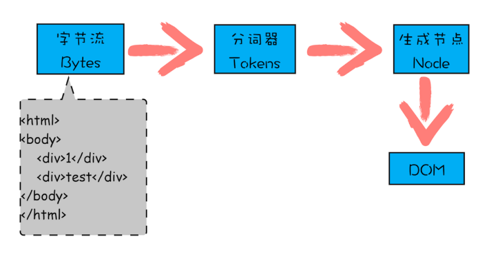

# TCP

## 概念
TCP是`面向连接的、可靠的、基于字节流`的传输层通信协议。

工作在传输层的可靠数据传输服务，确保接收端接收的网络包是`无损坏、无间隔、非冗余和按序的`。

### TCP连接

用于保证可靠性和流量控制维护的某些状态信息，这些信息的组合，包括`socket`、`序列号`和`窗口大小`称为连接。

建立TCP连接是需要客户端和服务端达成上述三个信息的共识。

- Socket：IP和端口号组成

- 序列号：用来解决乱序问题等

- 窗口大小：做流量控制

### 与UDP的区别

UDP不提供复杂的控制机制，利用IP提供面向无连接的通信服务。

区别：

- 连接

> TCP面向连接，传输数据前先建立连接。
>
> UDP是不需要连接，即刻传输数据。

- 服务对象

> TCP是一对一
>
> UDP支持一对一、一对多、多对多

- 可靠性

> TCP是可靠交付数据的，数据可以无差错、不丢失、不重复、按序到达
>
> UDP是尽最大努力交付，不保证可靠交付数据。

- 拥塞控制、流量控制

> TCP有拥塞控制、流量控制，保证数据传输的安全性
>
> UDP没有

- 首部开销

> TCP首部长度较长
>
> UDP首部只有8个字节，并且固定不变，开销较小

- 传输方式

> TCP流式传输，没有边界，但保证顺序和可靠
>
> UDP是一个包一个包的发送，有边界，但可能会丢包和乱序

- 分片不同

> TCP数据大小大于MSS大小，会在传输层进行分片，目标主机收到后，也同样在传输层组装TCP数据包，如果中途丢失一个分片，只需要传输丢失的这个分片
>
> UDP数据大小如果大于MTU大小，会在IP层进行分片，目标主机收到后，在IP层组装完数据，接着再传给传输层

### TCP应用场景

- FTP文件传输

- HTTP/HTTPS

### UDP应用场景

- 包总量较少的通信，如DNS、SNMP等

- 视频、音频等多媒体通信

- 广播通信

## 连接建立

### 三次握手

### 三次握手的原因
- 三次握手才可以阻止重复历史连接的初始化（主要原因）

- 三次握手才可以同步双方的初始序列号

> 序列号的作用：1、接收方可以去除重复的数据；2、接收方可以根据数据包的序列号按序接收；3、可以标识发送出去的数据包，哪些是已经被对方收到的（通过ACK报文中的序列号）

- 三次握手才可以避免资源浪费

> 两次握手无法防止历史连接的建立，会造成双方资源的浪费，也无法，能帮助双方同步初始化序列号。

### 每次建立连接，初始化的序列号要求不一样

- 为了防止历史报文被下一个相同的四元组的连接接收（主要方面）；

- 为了安全性，防止黑客伪造的相同序列号的TCP报文被对方接收；

#### 初始序列号ISN是如何随机产生的
起始`ISN`是基于时钟的，每4微秒+1，转一圈要4.55个小时

### IP层分片，TCP层MSS

## 参考链接
[https://xiaolincoding.com/network/3_tcp/tcp_interview.html#%E4%B8%BA%E4%BB%80%E4%B9%88%E9%9C%80%E8%A6%81-tcp-%E5%8D%8F%E8%AE%AE-tcp-%E5%B7%A5%E4%BD%9C%E5%9C%A8%E5%93%AA%E4%B8%80%E5%B1%82](https://xiaolincoding.com/network/3_tcp/tcp_interview.html#%E4%B8%BA%E4%BB%80%E4%B9%88%E9%9C%80%E8%A6%81-tcp-%E5%8D%8F%E8%AE%AE-tcp-%E5%B7%A5%E4%BD%9C%E5%9C%A8%E5%93%AA%E4%B8%80%E5%B1%82)
