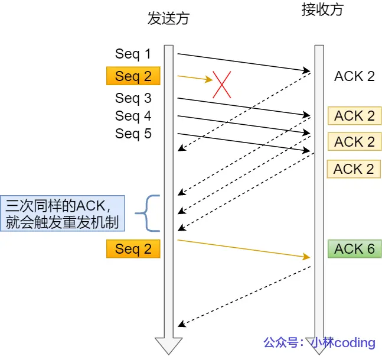
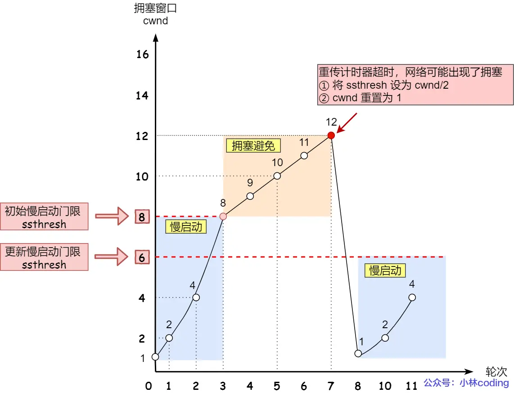

# TCP

## 概念
TCP是`面向连接的、可靠的、基于字节流`的传输层通信协议。

工作在传输层的可靠数据传输服务，确保接收端接收的网络包是`无损坏、无间隔、非冗余和按序的`。

### TCP连接

用于保证可靠性和流量控制维护的某些状态信息，这些信息的组合，包括`socket`、`序列号`和`窗口大小`称为连接。

建立TCP连接是需要客户端和服务端达成上述三个信息的共识。

- Socket：IP和端口号组成

- 序列号：用来解决乱序问题等

- 窗口大小：做流量控制

### 与UDP的区别

UDP不提供复杂的控制机制，利用IP提供面向无连接的通信服务。

区别：

- 连接

> TCP面向连接，传输数据前先建立连接。
>
> UDP是不需要连接，即刻传输数据。

- 服务对象

> TCP是一对一
>
> UDP支持一对一、一对多、多对多

- 可靠性

> TCP是可靠交付数据的，数据可以无差错、不丢失、不重复、按序到达
>
> UDP是尽最大努力交付，不保证可靠交付数据。

- 拥塞控制、流量控制

> TCP有拥塞控制、流量控制，保证数据传输的安全性
>
> UDP没有

- 首部开销

> TCP首部长度较长
>
> UDP首部只有8个字节，并且固定不变，开销较小

- 传输方式

> TCP流式传输，没有边界，但保证顺序和可靠
>
> UDP是一个包一个包的发送，有边界，但可能会丢包和乱序

- 分片不同

> TCP数据大小大于MSS大小，会在传输层进行分片，目标主机收到后，也同样在传输层组装TCP数据包，如果中途丢失一个分片，只需要传输丢失的这个分片
>
> UDP数据大小如果大于MTU大小，会在IP层进行分片，目标主机收到后，在IP层组装完数据，接着再传给传输层

### TCP应用场景

- FTP文件传输

- HTTP/HTTPS

### UDP应用场景

- 包总量较少的通信，如DNS、SNMP等

- 视频、音频等多媒体通信

- 广播通信

## 连接建立

### 三次握手

### 三次握手的原因
- 三次握手才可以阻止重复历史连接的初始化（主要原因）

- 三次握手才可以同步双方的初始序列号

> 序列号的作用：1、接收方可以去除重复的数据；2、接收方可以根据数据包的序列号按序接收；3、可以标识发送出去的数据包，哪些是已经被对方收到的（通过ACK报文中的序列号）

- 三次握手才可以避免资源浪费

> 两次握手无法防止历史连接的建立，会造成双方资源的浪费，也无法，能帮助双方同步初始化序列号。

### 每次建立连接，初始化的序列号要求不一样

- 为了防止历史报文被下一个相同的四元组的连接接收（主要方面）；

- 为了安全性，防止黑客伪造的相同序列号的TCP报文被对方接收；

#### 初始序列号ISN是如何随机产生的
起始`ISN`是基于时钟的，每4微秒+1，转一圈要4.55个小时

### 四次挥手

## 可靠性
TCP 是通过序列号、确认应答、重发控制、连接管理以及窗口控制等机制实现可靠性传输的。

### 重传机制

#### 超时重传
在发送数据时，设定一个定时器，当超过指定的时间后，没有收到对方的ACK确认应答报文，就会重发该数据，也就是`超时重传`

两种情况发生超时重传：

- 数据包丢失

- 确认应答丢失

**RTT(Round-Trip Time往返时延)**
RTT指的是`数据发送时刻到接收到确认的时刻的差值`，也就是包的往返时间

超时重传时间是以`RTO(Retransmission Timeout超时重传时间)`表示

- RTO较大，重发就慢，没有效率，性能差；

- RTO较小，重发快，增加网络拥塞，导致更多的超值，更多的超时导致更多的重发

`超时重传时间RTO的值应该略大于报文往返RTT的值`

RTT的值是经常变化的（网络时常变化），所以RTO的值应该是一个`动态变化的值`

如果超时重发的数据，再次超时的时候，又需要重传的时候，TCP 的策略是`超时间隔加倍`。

也就是`每当遇到一次超时重传的时候，都会将下一次超时时间间隔设为先前值的两倍。两次超时，就说明网络环境差，不宜频繁反复发送`。

超时重传存在的问题是，超时周期可能相对较长

可以用`快速重传`机制来解决超时重发的时间等待

#### 快速重传
快速重传(Fast Retransmit)机制，不以时间为驱动，而是以数据驱动重传

`发送端收到三个ACK=2的确认，知道了Seq2还没有收到，就会在定时器过期之前，重传丢失的Seq2`

面临的问题：重传的时候，是重传一个，还是所有。如果只重传seq2，重传效率低，如果重传seq2之后已发送的所有，浪费资源

所以怎么重传都存在问题，于是有了`SACK`方法

#### SACK
SACK(Selective Acknowledgement)，选择性确认

需要在TCP头部选项字段里加一个SACK，可以讲已收到的数据的信息发送给发送方，这样发送方就可以知道哪些数据收到了，哪些数据没收到，知道了这些信息，就可以只重传丢失的数据。

#### D-SACK

D-SACK(Doulicate SACK)，主要使用了SACK告诉发送方有哪些数据被重复接收了

D-SACK的好处：

1、可以让发送方知道，是发出去的包丢了，还是接收方回应的ACK丢了

2、可以知道是不是发送方的数据包被网络延迟了

3、可以知道网络中是不是把发送方的数据包给复制了

### 滑动窗口
每次发送一个数据，都要进行一次确认应答，上一个收到了应答，再发送下一个，这种模式效率低。

数据包的往返时间越长，通信的效率越低

为了解决上述问题，引入`窗口`的概念

有了窗口，就可以指定窗口大小，窗口大小就是无需等待确认应答，而可以继续发送数据的最大值

窗口的实现实际上是操作系统开辟的一个缓存空间，发送方主机在等到确认应答返回之前，必须在缓冲区中保留已发送的数据，如果按期收到确认应答，此时数据就可以从缓存区清除

 ACK 600 确认应答报文丢失，也没关系，因为可以通过下一个确认应答进行确认，只要发送方收到了 ACK 700 确认应答，就意味着 700 之前的所有数据「接收方」都收到了。这个模式就叫累计确认或者累计应答

TCP头中有一个字段`Window`，也就是窗口大小

> 这个字段是接收端告诉发送端主机还有多少缓冲区可以接收数据，于是发送端就可以根据这个接收端的处理能力来发送数据，而不会导致接收端处理不过来

`通常窗口的大小都是由接收方窗口大小来决定的`

**发送方的滑动窗口**

`TCP滑动窗口方案使用三个指针来跟踪四个传输类别中的每个类别中的字节，其中两个指针是绝对指针（指特定的序列号），一个是相对指针（需要做偏移）`

- SND.WND：发送窗口的大小

- SND.UNA：绝对指针，已发送但未收到确认的第一个字节的序列号

- SND.NXT：绝对指针，指向未发送但可发送范围的第一个字节的序列号

可用窗口大小 = SND.WND - (SND.NXT - SND.UNA)

**接收方的滑动窗口**

三个接收部分，用两个指针进行划分：

- RCV.WND：接收窗口的大小

- RCV.NXT：是一个指针，指向期望从发送方发送来的下一个数据字节的序列号

接收窗口和发送窗口的大小并不完全相等，接收窗口的大小约等于发送窗口的大小

### 流量控制
让发送方根据接收方的实际接收能力控制发送的数据量

#### 操作系统缓存与滑动窗口
TCP 规定是不允许同时减少缓存又收缩窗口的，而是采用先收缩窗口，过段时间再减少缓存，这样就可以避免了丢包情况

#### 窗口关闭
如果窗口大小为 0 时，就会阻止发送方给接收方传递数据，直到窗口变为非 0 为止，这就是窗口关闭

**如何解决上图潜在死锁现象？**
TCP 为每个连接设有一个持续定时器，只要 TCP 连接一方收到对方的零窗口通知，就启动持续计时器

如果持续计时器超时，就会发送窗口探测 ( Window probe ) 报文，而对方在确认这个探测报文时，给出自己现在的接收窗口大小。

窗口探测的次数一般为 3 次，每次大约 30-60 秒（不同的实现可能会不一样）。如果 3 次过后接收窗口还是 0 的话，有的 TCP 实现就会发 RST 报文来中断连接。

#### 糊涂窗口综合征

如果接收方太忙了，来不及取走接收窗口里的数据，那么就会导致发送方的发送窗口越来越小。

到最后，如果接收方腾出几个字节并告诉发送方现在有几个字节的窗口，而发送方会义无反顾地发送这几个字节，这就是糊涂窗口综合症。

糊涂窗口综合症的现象是可以发生在发送方和接收方：

- 接收方可以通告一个小的窗口

- 而发送方可以发送小数据

于是，要解决糊涂窗口综合症，就要同时解决上面两个问题就可以了：

- 让接收方不通告小窗口给发送方
> 当窗口大小小于min(MSS，缓存空间/2)，也就是小于MSS与1/2缓存大小中的最小值时，就会向发送方通告窗口为`0`，也就阻止了发送方再发数据过来

- 让发送方避免发送小数据
> 使用Nagle算法
>
> 该算法的思路是延时处理，只有满足下面两个条件中的任意一个条件时，才可以发送数据：
>
> 条件一：要等到窗口大小>=`MSS`并且数据大小>=`MSS`
> 
> 条件二：收到之前发送数据的`ack`回包
>
> 接收方需要满足`不通告小窗口给发送方`+发送方开启Nagle算法，才能避免糊涂窗口综合征

### 拥塞控制
`拥塞窗口`cwnd是发送方维护的一个状态变量，会根据网络的拥塞程度动态变化

发送窗口swnd，接收窗口rwnd

swnd=min(cwnd,rwnd)

拥塞窗口变化的规则：

- 只要网络中没有出现拥塞，cwnd就会增大；

- 网络中出现拥塞，cwnd就减少

`发送方没有在规定时间内接收到ACK报文，就发生了超时重传，就会人为网络出现了拥塞`

拥塞控制算法：

> 慢启动
>
> 拥塞避免
>
> 拥塞发生
> 
> 快速恢复

##### 慢启动
一点一点的提高发送数据包的数量

`当发送方每收到一个ACK，拥塞窗口cwnd的大小就会加1`

慢启动门限ssthresh(slow start threshold)：

- `当cwnd<ssthresh时，使用慢启动算法`

- `当cwnd>=ssthresh时，使用拥塞避免算法`

##### 拥塞避免
规则：`每当收到一个ACK时，cwnd增加1/cwnd`

拥塞避免算法将原本慢启动算法的指数增长变成了线性增长，但还在增长阶段，一直增长会进入拥塞，就会发生丢包现象，就需要对丢失的数据包进行重传，触发了重传机制，就进入了`拥塞发生算法`

##### 拥塞发生
出现拥塞时，重传机制主要有两种：

- 超时重传

- 快速重传

**超时重传拥塞发生算法**
- ssthresh设为cwnd/2

- cwnd重置为1（恢复为cwnd初始化值）

接着重新开始慢启动，这种方式`太激进`，反应也很强烈，会造成网络卡顿

**快速重传拥塞发生算法**
- cwnd=cwnd/2

- ssthresh = cwnd

- 进入快速恢复算法

##### 快速恢复
快速重传和快速恢复算法一般同时使用，快速恢复算法认为，还能收到3个重复ACK说明网络也不那么糟糕，所以没必要像RTO超时那么强烈。

进入快速恢复算法后：

- cwnd=ssthresh+3(3表示确认有3个数据包被收到了)

- 重传丢失的数据包

- 如果再收到重复的ACK，那么cwnd增加1

- 如果收到新数据的ACK后，把cwnd设置为第一步中的ssthresh的值，原因是该ACK确认了新的数据，说明duplicated ACK时的数据都已经收到，该恢复过程已经结束，可以恢复之前的状态了，也即再次进入`拥塞避免`状态

## 面向字节流
TCP是面向字节流的协议，UDP是面向报文的协议

### 字节流/报文
操作系统对TCP和UDP协议的发送方的机制不同

#### UDP面向报文

> 当用户消息通过UDP协议传输时，操作系统不会对消息进行拆分，在组装好UDP头部后就交给网络层来处理，所以发出去的UDP报文中的数据部分就是完整的用户消息，也就是每个UDP报文就是一个用户消息的边界，这样接收方在接收到UDP报文后，读一个UDP报文就能读取到完整的用户消息

> 操作系统收到UDP报文后，会将其插入到队列里，队列里的每一个元素就是一个UDP报文

#### TCP面向字节流

当用户消息通过TCP协议传输时，消息可能会被操作系统分组成多个TCP报文

接收方的程序如果不知道发送方发送的消息的长度，也就是不知道消息的边界时，无法读出一个有效的用户消息

不能认为一个用户消息对应一个TCP报文，所以，TCP是面向字节流的协议

当两个消息的某个部分内容被分到同一个TCP报文时，也就是`TCP粘包问题`，这时接收方不知道消息的边界，就无法读出有效的消息

要解决这个问题，要交给`应用程序`

### 解决粘包
主要是确定用户消息的边界

一般有三种方式分包：

- 固定长度的消息
> 灵活性不高，实际中很少用到

- 特殊字符作为边界
> 作为边界点的特殊字符，如果刚好消息内容里有这个特殊字符，需要对这个字符转义，避免被接收方当作消息的边界点二解析到无效的字符

- 自定义消息结构

## 参考链接
[https://xiaolincoding.com/network/3_tcp/tcp_interview.html#%E4%B8%BA%E4%BB%80%E4%B9%88%E9%9C%80%E8%A6%81-tcp-%E5%8D%8F%E8%AE%AE-tcp-%E5%B7%A5%E4%BD%9C%E5%9C%A8%E5%93%AA%E4%B8%80%E5%B1%82](https://xiaolincoding.com/network/3_tcp/tcp_interview.html#%E4%B8%BA%E4%BB%80%E4%B9%88%E9%9C%80%E8%A6%81-tcp-%E5%8D%8F%E8%AE%AE-tcp-%E5%B7%A5%E4%BD%9C%E5%9C%A8%E5%93%AA%E4%B8%80%E5%B1%82)

[https://xiaolincoding.com/network/3_tcp/tcp_feature.html#%E5%BF%AB%E9%80%9F%E6%81%A2%E5%A4%8D](https://xiaolincoding.com/network/3_tcp/tcp_feature.html#%E5%BF%AB%E9%80%9F%E6%81%A2%E5%A4%8D)

[https://xiaolincoding.com/network/3_tcp/tcp_stream.html#%E5%A6%82%E4%BD%95%E7%90%86%E8%A7%A3%E5%AD%97%E8%8A%82%E6%B5%81](https://xiaolincoding.com/network/3_tcp/tcp_stream.html#%E5%A6%82%E4%BD%95%E7%90%86%E8%A7%A3%E5%AD%97%E8%8A%82%E6%B5%81)