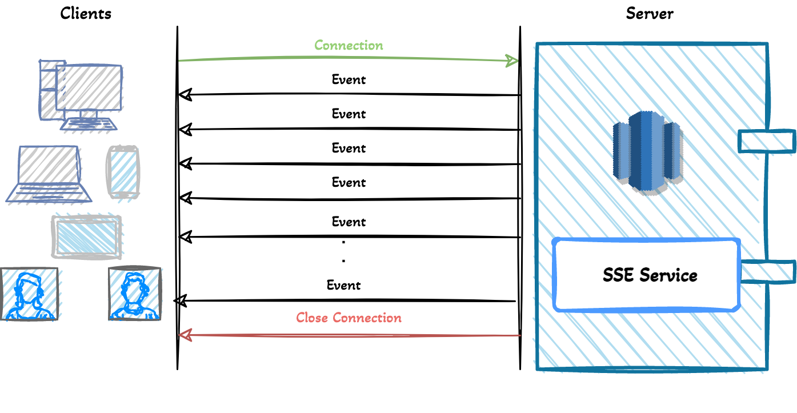
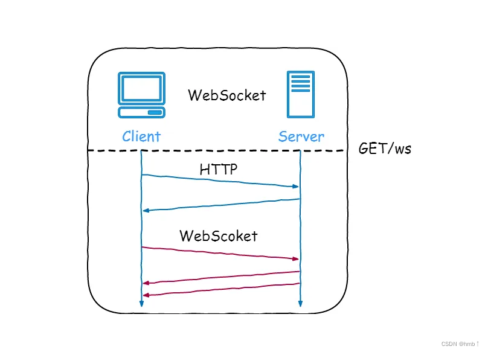

# 服务端推送

## 轮询

轮询 polling 是消息推动方案中最简单的一种

### 短轮询

指定的时间间隔，由浏览器向服务器发出 HTTP 请求

```js
setInterval(() => {
  // 方法请求
  messageCount().then((res) => {
    if (res.code === 200) {
      this.messageCount = res.data;
    }
  });
}, 1000);
```

缺点：由于推送数据并不会频繁变更，无论后端此时是否有新的消息产生，客户端都会进行请求，势必会对服务端造成很大压力，浪费带宽和服务器资源。

### 长轮询

是对短轮询的改进，在尽可能减少对服务器资源浪费的同时，保证消息的相对实时性

长轮询相比于短轮询在性能上提升了很多，但依然会产生较多的请求

## iframe 流

iframe 流就是在页面中插入一个隐藏的`<iframe>`标签，通过在 src 中请求消息数量 API 接口，由此在服务端和客户端之间创建一条长连接，服务端持续向 iframe 传输数据

> 传输的数据通常是 HTML、或是内嵌的 javascript 脚本，来达到实时更新页面的效果

```js
<iframe src="/iframe/message" style="display:none"></iframe>
```

## SSE

Server-sent events 服务器发送事件

SSE 是基于 HTTP 协议的

SSE 在服务器和客户端之间打开了一个单向通道，服务端响应的不再是一次性的数据包，而是`text/event-stream`类型的数据流信息，在有数据变更时从服务器流式传输到客户端

EventSource 是 浏览器提供的对应 API，通过 EventSource 实例打开与 HTTP 服务器的持久连接，该服务器以文本/事件流格式发送事件，连接会保持打开状态，直到服务端或客户端主动关闭



SSE 有四种字段，其他的字段会被忽略。字段之间用`\n` 分隔，每条消息要以 `\n\n` 结尾

```js
data; // 数据项
event; // 事件项 默认为 message 可设置任意值
id; // 数据标识符，用于断线重连
retry; // 断线后重连时间
```

### 与 websocket 对比

1、SSE 基于 HTTP 协议，不需要特殊的协议或服务器实现即可工作，websocket 需要单独服务器来处理协议

2、SSE 单向通信，只能由服务端向客户端单向通信；websocket 全双工通信

3、SSE 实现简单，开发成本低，无需引入其他组件；websocket 传输数据需要做二次解析，开发门槛高

4、SSE 默认支持断线重连；websocket 需要自己实现

5、SSE 只能传送文本消息，二进制数据需要经过编码后传送；websocket 默认支持传送二进制数据

### 适用场景

不需要从客户端发送数据，只需要一些服务器操作的更新

SSE 具有 WebSockets 在设计上缺乏的多种功能，例如：自动重新连接、事件 ID 和发送任意事件的能力

```js
// 客户端
<script>
    let source = null;
    let userId = 7777
    if (window.EventSource) {
        // 建立连接
        source = new EventSource('http://localhost:7777/sse/sub/'+userId);
        setMessageInnerHTML("连接用户=" + userId);
        /**
         * 连接一旦建立，就会触发open事件
         * 另一种写法：source.onopen = function (event) {}
         */
        source.addEventListener('open', function (e) {
            setMessageInnerHTML("建立连接。。。");
        }, false);
        /**
         * 客户端收到服务器发来的数据
         * 另一种写法：source.onmessage = function (event) {}
         */
        source.addEventListener('message', function (e) {
            setMessageInnerHTML(e.data);
        });
    } else {
        setMessageInnerHTML("你的浏览器不支持SSE");
    }
</script>
```

```java
// 服务端
private static Map<String, SseEmitter> sseEmitterMap = new ConcurrentHashMap<>();

/**
 * 创建连接
 */
public static SseEmitter connect(String userId) {
    try {
        // 设置超时时间，0表示不过期。默认30秒
        SseEmitter sseEmitter = new SseEmitter(0L);
        // 注册回调
        sseEmitter.onCompletion(completionCallBack(userId));
        sseEmitter.onError(errorCallBack(userId));
        sseEmitter.onTimeout(timeoutCallBack(userId));
        sseEmitterMap.put(userId, sseEmitter);
        count.getAndIncrement();
        return sseEmitter;
    } catch (Exception e) {
        log.info("创建新的sse连接异常，当前用户：{}", userId);
    }
    return null;
}

/**
 * 给指定用户发送消息
 */
public static void sendMessage(String userId, String message) {

    if (sseEmitterMap.containsKey(userId)) {
        try {
            sseEmitterMap.get(userId).send(message);
        } catch (IOException e) {
            log.error("用户[{}]推送异常:{}", userId, e.getMessage());
            removeUser(userId);
        }
    }
}
```

SSE 不支持 IE 浏览器

## MQTT 协议

MQTT Message Queue Telemetry Transport

是一种基于发布/订阅(publish/subscribe)模式的轻量级通讯协议，通过订阅相应的主题来获取消息，是物联网(Internet of Thing)中的一个标准传输协议

该协议将消息的发布者和订阅者进行分离，因此可以在不可靠的网络环境中，为远程连接的设备提供可靠的消息服务，使用方式与传统的 MQ 类似

TCP 协议位于传输层，MQTT 协议位于应用层，MQTT 协议构建于 TCP/IP 协议上，也就是说只要支持 TCP/IP 协议栈的地方，都可以使用 MQTT 协议

### 为什么物联网中要用 MQTT

1、HTTP 协议是一种同步协议，客户端请求后需要等待服务器的响应。而在物联网（IOT）环境中，设备会很受制于环境的影响，比如带宽低、网络延迟高、网络通信不稳定等，显然异步消息协议更为适合 IOT 应用程序

2、HTTP 是单向的，如果要获取消息客户端必须发起连接，而在物联网（IOT）应用程序中，设备或传感器往往都是客户端，这意味着它们无法被动地接收来自网络的命令

3、通常需要将一条命令或者消息，发送到网络上的所有设备上。HTTP 要实现这样的功能不但很困难，而且成本极高。

## websocket

WebSocket 是一种在 TCP 连接上进行全双工通信的协议，建立客户端和服务器之间的通信渠道。浏览器和服务器仅需一次握手，两者之间就直接可以创建持久性的连接，并进行双向数据传输。



## 参考

[https://www.cnblogs.com/chengxy-nds/p/16495096.html](https://www.cnblogs.com/chengxy-nds/p/16495096.html)

[https://juejin.cn/post/6844904097561182222](https://juejin.cn/post/6844904097561182222)
