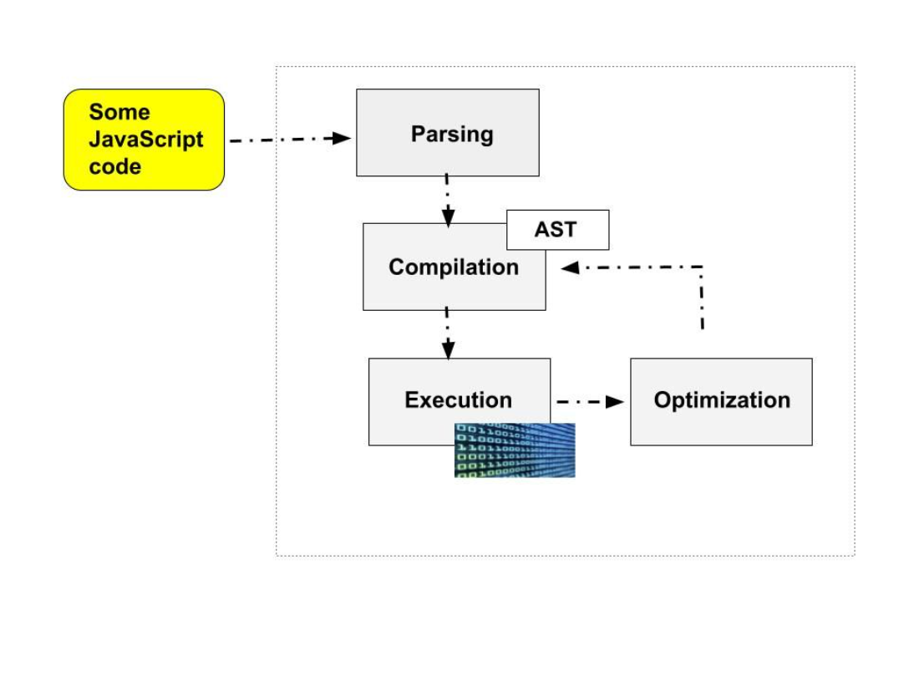
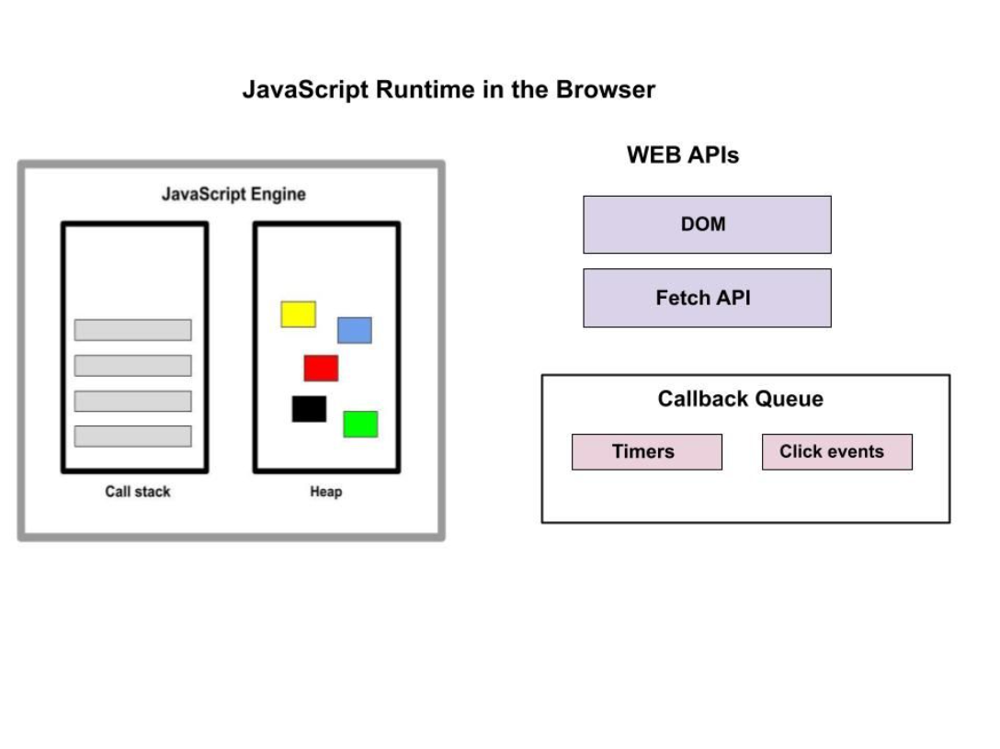

# 浏览器内核

## 常见的浏览器内核

浏览器内核可以分成两部分：`渲染引擎(layout engineer 或者 Rendering Engine)`和 `JS 引擎`。

- 渲染引擎：负责获取网页的内容并显示，不同的浏览器内核对网页的解析渲染也不同

- JS 引擎：负责解析 JavaScript 语言，执行 JavaScript 语言来实现网页的动态效果

最开始渲染引擎和 JS 引擎并没有区分的很明确，后来 JS 引擎越来越独立，`内核就倾向于只指渲染引擎`。所以现在讲浏览器内核主要说的就是渲染引擎。

那渲染引擎又是什么呢，简单来说`就是把 html、css 的代码变成你现在看到的页面的样子`。常见的浏览器内核可以分这四种：

- Trident

- Gecko

- Webkit

- Chromium/Blink

### Trident

IE 浏览器，其排版引擎就是 Trident，Trident 内核也因此被称为 “IE 内核”

当时微软一家独大，很长一段时间没有更新 Trident 内核，这导致了两个后果，一是 Trident 内核几乎与 W3C 标准脱轨，二是产生了很多 bug，一些致力于开源的开发者逐渐认为 IE 不安全，很多用户开始弃用 IE

### Gecko

Gecko（Firefox 内核）之前 Netscape 6 在使用该内核，后来 Mozilla FireFox(火狐浏览器) 也采用了该内核。

Gecko 内核是完全开源的，可开发程度很高，因此受到很多人的青睐，使用 Gecko 内核的浏览器逐渐增多，Gecko 的市场份额也因此迅速提高。不过使用 Firefox 的用户居多，因此 Gecko 也被称为 Firefox 内核。

此外 `Gecko 也是一个跨平台内核，可以在 Windows、 BSD、Linux 和 Mac OS X 中使用`。

### Webkit

苹果公司的内核，也是苹果的 Safari 浏览器使用的内核。 Webkit 引擎包含 WebCore 排版引擎及 JavaScriptCore 解析引擎，均是从 KDE 的 KHTML 及 KJS 引擎衍生而来，它们都是自由软件，在 GPL 条约下授权，同时支持 BSD 系统的开发。所以 Webkit 也是自由软件，同时开放源代码。在安全方面不受 IE、Firefox 的制约，所以 Safari 浏览器在国内还是很安全的。

常见的 WebKit 内核的浏览器：Apple Safari(Win/Mac/iPhone/iPad)、Symbian 手机浏览器、Android 默认浏览器，

### Chromium/Blink

2008 年，谷歌公司发布了 chrome 浏览器，浏览器使用的内核被命名为 chromium。

`chromium fork 自开源引擎 webkit，却把 WebKit 的代码梳理得可读性提高很多`，所以以前可能需要一天进行编译的代码，现在只要两个小时就能搞定。因此 Chromium 引擎和其它基于 WebKit 的引擎所渲染页面的效果也是有出入的。所以有些地方会把 chromium 引擎和 webkit 区分开来单独介绍，而有的文章把 chromium 归入 webkit 引擎中，都是有一定道理的。

谷歌公司还研发了自己的 Javascript 引擎，V8，极大地提高了 Javascript 的运算速度。

chromium 问世后，带动了国产浏览器行业的发展。一些基于 chromium 的单核，双核浏览器如雨后春笋般拔地而起，例如 搜狗、360、QQ 浏览器等等，无一不是套着不同的外壳用着相同的内核。

然而 2013 年 4 月 3 日，谷歌在 Chromium Blog 上发表 博客，称将与苹果的开源浏览器核心 Webkit 分道扬镳，在 Chromium 项目中研发 Blink 渲染引擎（即浏览器核心），内置于 Chrome 浏览器之中。

webkit 用的好好的，为何要投入到一个新的内核中去呢？

Blink 其实是 WebKit 的分支，如同 WebKit 是 KHTML 的分支。Google 的 Chromium 项目此前一直使用 WebKit(WebCore) 作为渲染引擎，但出于某种原因，并没有将其多进程架构移植入 Webkit。

后来，由于苹果推出的 WebKit2 与 Chromium 的沙箱设计存在冲突，所以 Chromium 一直停留在 WebKit，并使用移植的方式来实现和主线 WebKit2 的对接。这增加了 Chromium 的复杂性，且在一定程度上影响了 Chromium 的架构移植工作。

基于以上原因，Google 决定从 WebKit 衍生出自己的 Blink 引擎（后由 Google 和 Opera Software 共同研发），将在 WebKit 代码的基础上研发更加快速和简约的渲染引擎，并逐步脱离 WebKit 的影响，创造一个完全独立的 Blink 引擎。这样以来，唯一一条维系 Google 和苹果之间技术关系的纽带就这样被切断了。

这里顺便介绍下 Chrome 和 Chromium 两个浏览器的区别:

Chromium 浏览器是谷歌为发展自家的浏览器 Chrome 而开启的计划，所以 Chromium 相当于 Chrome 的工程版或称实验版（尽管 Chrome 自身也有 β 版阶段），新功能会率先在 Chromium 上实现，待验证后才会应用在 Chrome 上。Chromium 一天最多可以更新十几二十个版本，实验性的新特性都会现在这里放出，但是 Chromium 本身其实并不稳定；而 Chrome 总共有四个更新分支：Canary、Dev、Beta、Stable，稳定性依次增强。

## 移动端

目前移动设备浏览器上常用的内核有 Webkit，Blink，Trident，Gecko 等

- iPhone 和 iPad 等苹果 iOS 平台主要是 WebKit

- Android 4.4 之前的 Android 系统浏览器内核是 WebKit

- Android 4.4 系统浏览器切换到了 Chromium，内核是 Webkit 的分支 Blink，

- Windows Phone 8 系统浏览器内核是 Trident。

## JS 引擎

JavaScript 引擎是一个解释 JavaScript 代码的计算机程序，该引擎负责执行代码

每个主流的浏览器都有一个可以执行的 JavaScript 代码的 JavaScript 引擎，最流行的是谷歌浏览器的 Chrome 的 V8 引擎

谷歌的 V8 为 Chrome 和 Node.js 提供支持，Node.js 是一个后端 JavaScript 运行环境，用于构建服务器端应用程序。

其他主要的浏览器引擎包括：

- 由 Mozilla 为 Firefox 开发的 SpiderMonkey

- 为 Safari 浏览器提供支持的 JavaScriptCore

- 为 Internet Explorer 提供支持的 Chakra

JavaScript 引擎通常包括一个调用栈和一个堆，调用栈是代码执行的地方，堆是一个非结构化的内存池，用于存储应用程序所需的所有对象

计算机处理器只能理解二进制，当代码片段进入引擎时，代码首先被解析，也就是被读取，随后被解析为抽象语法树 AST 的数据结构，生成的树被用来创建机器代码

执行发生在使用执行上下文的 JavaScript 引擎调用栈中，这是执行 JavaScript 代码的环境

### JavaScript 运行时

JavaScript 运行时包含运行 JavaScript 所需的所有组件的房子，包括 JavaScript 引擎、Web API 和回调队列

Web APIs 是提供给引擎的功能，但不是 JavaScript 语言的一部分，引擎可以通过浏览器访问，并有助于访问数据或增强浏览器的功能

## 参考

[https://github.com/RonkTsang/interview/blob/master/browser/%E5%B8%B8%E8%A7%81%E6%B5%8F%E8%A7%88%E5%99%A8%E5%86%85%E6%A0%B8.md](https://github.com/RonkTsang/interview/blob/master/browser/%E5%B8%B8%E8%A7%81%E6%B5%8F%E8%A7%88%E5%99%A8%E5%86%85%E6%A0%B8.md)

[https://www.freecodecamp.org/chinese/news/how-javascript-works-behind-the-scenes/](https://www.freecodecamp.org/chinese/news/how-javascript-works-behind-the-scenes/)
