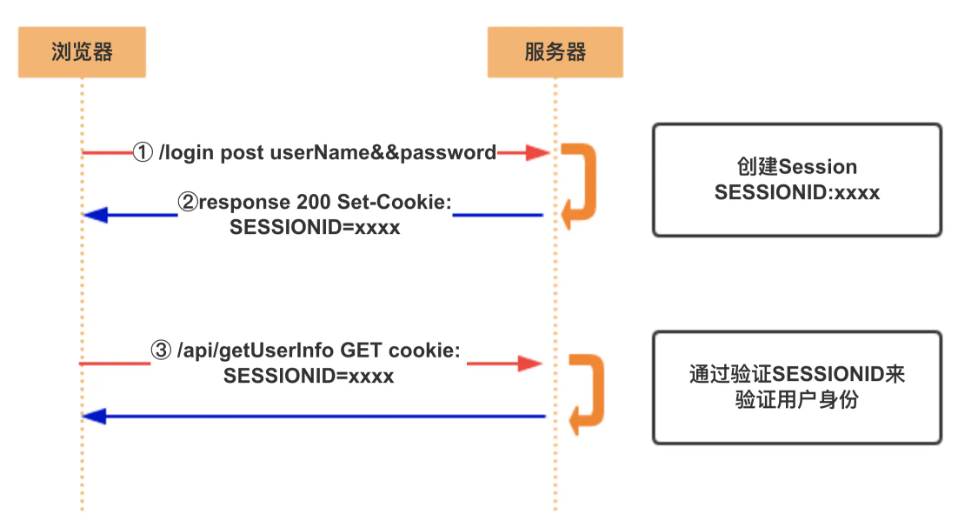
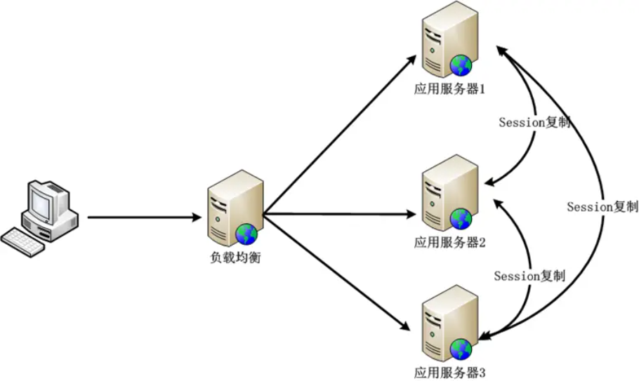
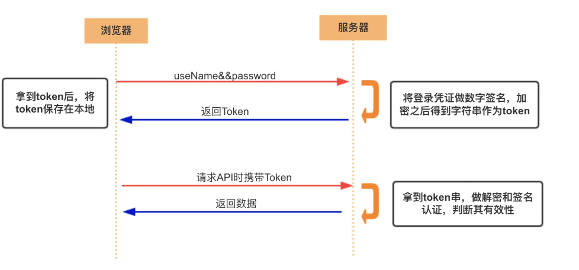
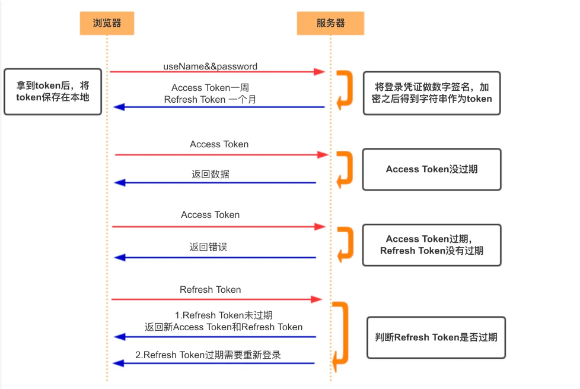

# 浏览器存储

## 浏览器存储

> 浏览器存储是指浏览器在本地计算机上保存数据的方式，以便用户访问网站时能够更快地加载内容，提供更好的用户体验。
>
> 浏览器存储（本地缓存）主要有几种方式：
>
> 1、Cookie
>
> 2、Web Storage
>
> 3、Local Storage
>
> 4、Session Storage
>
> 5、IndexedDB
> 
> 

### Cookie
> cookie由服务端生成。cookie就是存放在客户端的一个小文件，也可以存放在本地，例如浏览器关闭后，cookie也依旧存在

> 如果不设置过期时间，会默认在会话结束后过期，浏览器关闭时过期

#### Cookie的设置过程
1、客户端向服务器发送HTTP请求

2、服务器接收到请求后在响应头添加一个`set-cookie`字段

3、客户端接收到服务器的响应后将cookie保存下来，保存到本地的文件夹内

4、之后浏览器的每一次请求都会携带cookie发送到服务器

#### 一些属性

- Name

- Value：需要做编码处理

- Expire：cookie过期时间

- max-age：cookie失效之前的秒数，`Set-Cookie:Max-Age=604800;`属性值可以是正值，表示持久性的cookie，负数表示会话的cookie在浏览器关闭时就消失，为0表示立即删除这个cookie
> max-age和expire都存在时，max-age的优先级更高

- size：cookie的大小，超过4kb会被忽略

- Domain：记录域名信息，但不能跨站点设置域名，不起作用

- path：指定浏览器发出请求时，哪些路径要附带cookie

- SameSite：限制第三方对cookie的携带请求，可以防止CSRF攻击
> 三个重要的属性：
>
> `strict`：禁止第三方请求携带cookie
>
> `Lax`：允许部分第三方携带cookie值
>
> `None`：无论是否跨站都会发送cookie

- HttpOnly：限定cookie只能通过HTTP传输，JavaScript不能读取，防止XSS攻击

- Secure：限定了只有HTTPS才可以传输cookie

#### 优缺点
- 弥补了HTTP的无状态

- 容量小，只有4kb

- 不安全，可以随意修改cookie内容

- 耗费性能，每一次请求都会携带完整的cookie

### localStorage
和cookie类似，都会存放到同一个域名下，localStorage可以长期存储，没有时间限制

#### 优缺点

- 扩展cookie的大小，可以存放5M大小，不同浏览器不同

- 只存储在浏览器，不和服务器通信，解决cookie安全和性能消耗问题

- 需要手动删除保存的数据

- 只支持字符串类型，JSON类型需要通过JSON.stringify()转换

#### 使用场景

利用localStorage可以存放一些稳定的资源和base64的图片

### sessionStorage

和localStorage一致，但是会话级别存储

且localStorage可以在同源环境的不同页面之间共享，但sessionStorage中同源下的数据是不能共享的

#### 使用场景

可用于保存一些临时的数据，防止页面消失后数据就没了，比如表单填写和用户的浏览器记录等。

### indexedDB
> 浏览器提供的非关系型数据库，indexedDB提供大量的接口提供查询功能，还能建立查询

- 同源限制

- 存储空间没有限制

## cookie和session
cookie和session的存在是为了解决HTTP连接的无状态


### cookie

1、HTTP Request

2、HTTP Response + Set-Cookie

3、HTTP Request + Cookie

4、HTTP Response

### session


客户端在请求服务器时，服务器会将需要保存的状态信息存储在服务器上，然后返回客户端一个SessionId（通常采用Set-Cookie的方式，也就是需要Cookie支持）。

客户端拿到SessionId后，在后续的请求中携带此数据，这样服务器就能通过SessionId拿到对应的状态信息

Seesion机制是通过核对“客户端明细表”来确认身份

cookie机制是检查“通行证”来确认身份

#### 优缺点

- 扩展性不好
> 如果是服务器集群，或者是跨域的服务导向架构，就要求session数据共享，每台服务器都能读取session
> 
> 解决方案：1、Nginx ip_hash策略（nginx代理，把每个请求按访问IP的hash分配，来自同一IP固定访问一个后台服务器，避免了在服务器A创建的session分发到B）；2、Session复制；3、共享session（将session id集中存储到一个地方，所以的机器都来访问这个地方的数据，有点是架构清晰，缺点是工程量大）；4、token
>



### Token


token意思是“令牌”，是服务端生成的一串字符串，作为客户端进行请求的一个标识

用户第一次登录后，服务器生成一个token并将此token返回给客户端，以后客户端只需带上这个token前来请求数据即可，无需再次带上用户名和密码

简单的token组成：uid(用户唯一的身份标识)、time(当前时间的时间戳)、sign(前面，token的前几位以哈希算法压缩成一定长度的十六进制字符串，以防止token泄露)

这种方式的计数有很多实现，并且有现成的标准可用，这个标准就是JWT

#### 优缺点
- 支持跨域访问，cookie不支持跨域访问

- 无状态，session是有状态

- 更适用移动应用，cookie不支持手机端访问

- 网络传输性能更好

- 占带宽，正常情况比session_id更大

- 无法在服务端注销，难以解决劫持问题

- 性能问题，加密签名需要更多CPU开销验证签名

#### JWT (JSON Web Token)
由`.`分隔的三个部分组成：

- Header
> 是一个JSON对象
```js
{
  "alg": "HS256", // 表示签名的算法，默认是 HMAC SHA256（写成 HS256）
  "typ": "JWT"  // 表示Token的类型，JWT 令牌统一写为JWT
}
```

- Payload
> 也是json对象，用来存放实际需要传递的数据

```js
{
  // 7个官方字段
  "iss": "a.com", // issuer：签发人
  "exp": "1d", // expiration time： 过期时间
  "sub": "test", // subject: 主题
  "aud": "xxx", // audience： 受众
  "nbf": "xxx", // Not Before：生效时间
  "iat": "xxx", // Issued At： 签发时间
  "jti": "1111", // JWT ID：编号
  // 可以定义私有字段
  "name": "John Doe",
  "admin": true
}
```

JWT默认不加密

- Signature
> 是对前两部分的签名，防止数据被篡改

首先，需要指定一个密钥(只有服务器才知道)，

然后，使用Header里面指定的签名算法(默认是HMAC SHA256)产生签名

```js
HMACSHA256(base64UrlEncode(header) + "." + base64UrlEncode(payload), secret)
```

算出签名后，把Header、Payload、Signature三部分拼接成一个字符串，每个部分之间用`.`分隔，就可以返回给用户
```js
JWT = Base64(Header) + "." + Base64(Payload) + "." + $Signature
```

> 如何保证安全

- 发送JWT要使用HTTPS；不使用HTTPS发送的时候，JWT里不要写入秘密数据

- JWT的payload中要设置expire时间

##### JWT优缺点
- 服务器不需要存储session，使得服务器认证鉴权业务可以方便扩展；

- 由于服务器不需要存储Session状态，因此使用过程中无法废弃某个Token，或者更改Token的权限。也就是说一旦JWT签发了，到期之前就会始终有效。

#### 对JWT的改进
上述所说都是Access Token，也就是访问资源接口时所需要的Token，还有另一种Token，Refresh Token

一般情况下，Refresh Token的有效期会比较长，而Access Token的有效期比较短。

当Acesss Token由于过期而失效时，使用Refresh Token就可以获取到新的Token，如果Refresh Token也失效了，用户就只能重新登录了。

Refresh Token及过期时间是存储在服务器的数据库中，只有在申请新的Acesss Token时才会验证，不会对业务接口响应时间造成影响，也不需要向Session一样一直保持在内存中以应对大量的请求。



## 浏览器多标签页之间的通信
1、使用localStorage事件：通过监听storage事件，一个标签页中的更改可以通知到其他标签页

2、使用BroadcastChannel API

3、使用Service Workers

4、使用SharedArrayBuffer和Atomics

5、使用websocket或server-sent events

## 浏览器的垃圾回收机制

浏览器的垃圾回收机制是浏览器管理内存、确保资源有效利用的关键部分。

当变量、对象或其他资源不再使用时，垃圾回收机制会自动释放它们所占用的内存，从而防止内存泄漏。

JavaScript具有自动垃圾回收机制，会定期对不再使用的变量、对象进行清理，主要通过标记清除和引用计数来实现。

标记清除：当变量进入环境时，例如在一个函数中声明一个变量，这个变量会被标记为“进入环境”，而当变量离开环境时，会被标记为“离开环境”，随后被垃圾挥手机制回收。

还需要处理全局变量和局部变量。

全局变量的生命周期会持续到页面卸载，而局部变量在函数执行结束后就不再被使用，它们的内存空间会被释放。

### JavaScript垃圾回收
JavaScript的内存管理是自动的，JavaScript引擎中有个被称作`垃圾回收器`的东西在后台执行，它监控所有对象的状态，并删除掉已经不可达的

> 可达性reachability
>
> "可达"值是那些以某种方式可访问或可用的值，被存储在内存中
>
> - 固有发可达值的基本集合，包括当前执行的函数，它的局部变量和参数，当前嵌套调用链上的其他函数，它们的局部变量和参数，全局变量，还有其他的内部实现，这些值被称为“根(roots)”
>
> - 如果一个值可用从根通过引用或者引用链进行访问，则认为该值是可达的
>

#### 内部算法

垃圾回收的基本算法被称为`mark-and-sweep`

定期执行以下垃圾回收步骤：

- 垃圾收集器找到所有的根，并标记它们；

- 然后遍历并标记来自它们的所有引用；

- 然后遍历标记的对象并标记它们的引用，所有被遍历到的对象都会被记住，以免将来再次遍历到同一个对象；

- 直到所有可达的（从根部）引用都被访问到；

- 没有标记的对象都会被删除。

#### 引擎优化

- 分代收集generational collection
> 对象分为新旧两组

- 增量收集incremental collection
> 将现有整个对象集拆分为多个部分，然后将这些部分逐一清除

- 闲时收集idle-time collection
> 垃圾收集器只会在CPU空闲时尝试运行，以减少可能对代码执行的影响


## 参考链接
[https://juejin.cn/post/6973072516763877384?searchId=202407201526404EE6FB52E6F45DDD6C24#heading-10](https://juejin.cn/post/6973072516763877384?searchId=202407201526404EE6FB52E6F45DDD6C24#heading-10)

[https://juejin.cn/post/7351301328206331939?searchId=202407201526404EE6FB52E6F45DDD6C24](https://juejin.cn/post/7351301328206331939?searchId=202407201526404EE6FB52E6F45DDD6C24)

[https://juejin.cn/post/7287483692694863927?searchId=2024072012270116713577B46DAACFBE20](https://juejin.cn/post/7287483692694863927?searchId=2024072012270116713577B46DAACFBE20)

[https://juejin.cn/post/6844903864810864647?searchId=2024072012270116713577B46DAACFBE20](https://juejin.cn/post/6844903864810864647?searchId=2024072012270116713577B46DAACFBE20)
