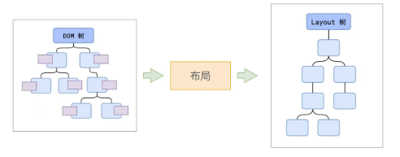
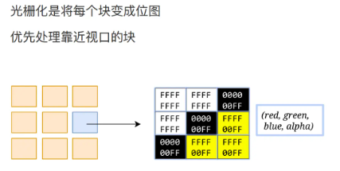

# 浏览器渲染网页

## 渲染（render）

浏览器中的渲染指的是将 HTML 字符串转化为屏幕上像素信息的过程，可以当成 render 函数，函数接收 html 字符串，将其经过一系列处理得出若干像素点的颜色，将这些像素信息存在 pixels 变量中返回

### 渲染时间点


## 渲染流水线


### 解析 HTML


由于字符串难以进行操作，浏览器首先将`HTML字符串`解析成`DOM树`和`CSSOM树`这种容易操作的对象解构。

- `document`就是`DOM树`的根节点，`body`是根节点的子节点，只要拿到根节点就可以拿到网页的所有节点

- `StyleSheetList`就是`CSSOM树`（CSS Object Model）的根节点，代表网页中所有的层叠样式表

> 层叠样式表有哪些？

```js
<style></style>//内部样式表
<link src="..."></link>//外部样式表
<div style="..."></div>//内联样式表或行内样式表
// 浏览器默认样式表
```

> 每一个`层叠样式表`都是根节点的子节点，每个样式表中有很多`CSS规则`，这些规则会形成很多`规则对象`，作为样式表的子节点
>
> 规则中会有很多选择器和样式，作为`规则对象`的子节点，每个样式又有多个键值作为子节点，如此层层嵌套

- 第一步完成后，会得到`DOM树`和`CSSOM树`，`浏览器的默认样式`、`内部样式`、`外部样式`、`行内样式`均会包含在`CSSOM树`中

#### HTML 解析过程遇到 CSS 和 JS

为了提高解析效率，浏览器在开始解析之前，会启动一个`预解析的线程`，率先下载 HTML 中的`外部CSS文件`和`外部的JS文件`

如果主线程解析到`link位置`，此时外部的 CSS 文件还没有下载解析好，`主线程不会等待`，继续解析后续的 HTML。

> 这是因为下载和解析 CSS 的工作是在预解析线程中进行的。
>
> 这是 CSS 不会阻塞 HTML 解析的根本原因


如果主线程解析到`script位置`，会`停止解析HTML`，转而等待 JS 文件下载好，并将全局代码解析执行完成后，才能继续解析 HTML。

> 这是因为 JS 代码的执行过程`可能会修改当前的DOM树`，所以 DOM 树的生成必须暂停
>
> 这就是 JS 会阻塞 HTML 解析的根本原因


### 样式计算

- 主线程会遍历得到的 DOM 树，依次为树中的每个节点计算出它最终的样式，称之为`Computed Style`

这一过程中，很多预设值会变成绝对值，相对单位会变成绝对单位

> red -> rgb(255,0,0)
>
> em -> px

- 这一步完成后，会得到一颗带有样式的 DOM 树


### 布局 layout



- 布局阶段会依次遍历 DOM 树的每一个节点，计算每个节点的`几何信息`。如节点的宽高、相对包含块的位置。

- 大多数情况，DOM 树和布局树并非一一对应
  > 比如 display:none 的节点没有几何信息，因此不会生成布局树；
  >
  > 又比如 使用了伪元素选择器，虽然 DOM 树中不存在这些伪元素节点，但它们拥有几何信息，所以会生成到布局树中
  >
  > 还有匿名行盒、匿名块盒等都会导致 DOM 和布局树无法一一对应


- 布局树的每一个节点不是 DOM 树，而是 C++对象

### 分层 layer


- 主线程会使用一套复杂的策略对整个布局树中进行分层

  > 分层的好处在于，将来某一个层改变后，仅会对该层进行后续处理，从而提高效率

- 滚动条、堆叠上下文、transform、opacity 等样式都会或多或少的影响分层结果，也可以通过 will-change 属性更大程度的影响分层结果

### 绘制 paint


- 主线程会为每个层单独产生绘制指令集，用于描述这一层的内容该如何画出来

- 绘制完成后，**渲染主线程的工作到此为止**，剩余步骤交给其他线程来完成

### 分块 Tiling

- 完成绘制后，`主线程`将每个图层的绘制信息提交给**合成线程**，剩余工作将由`合成线程`完成

- `合成线程`首先对每个图层进行`分块`，将其划分为更多的小区域

- 它会从线程池中拿取多个线程来完成分块工作


### 光栅化 Raster

分块完成后，进入光栅化阶段



- `光栅化`是将每个块变成`位图`，`位图`可以理解成内存里的一个`二维数组`，这个二维数组记录了每个像素点信息

- `合成线程`会将块信息交给`GPU进程`，以极高的速度完成光栅化


- `GPU进程`会开启多个线程来完成光栅化，并且优先处理靠近视口区域的块

光栅化的结果，就是一块一块的位图

### 画 Draw


- `合成线程`拿到每个层、每个块的位图后，生成一个个`指引（quad）`信息

- `指引`会标识出每个`位图`应该画到屏幕的哪个位置，以及会考虑到旋转、缩放等变形

- `变形`发生在`合成线程`，与`渲染主线程`无关，这就是 transform 效率高的本质原因

- `合成线程`会`把quad提交给GPU进程`，由 GPU 进程产生系统调用，提交给 GPU 硬件，完成最终的屏幕成像

### 总结


`解析HTML`：将字符串解析成 DOM 树和 CSSOM 树

`样式计算`：得到 Computed Style

`布局`：产生布局树

`分层`：划分图层

`绘制`：产生绘制指令集

`分块`：划分区域

`光栅化`：生成位图

`画`：生成 quad，提交硬件，完成成像

## 回流和重绘、如何优化？

回流 Reflow 是指网页渲染引擎根据元素的尺寸、位置和显示属性重新计算页面的排版和布局

重绘 Repaint 是指网页渲染引擎根据显示属性（如颜色、文字大小等）重新绘制页面元素，不影响元素的位置和尺寸

回流和重绘分别指渲染的布局和绘制步骤

### 什么时候回流？

当一个元素的长与宽改变，可能会影响到画面中其他元素的编排，所以每当`有一个元素的布局改变`，浏览器的 CPU 需要重新计算整个页面中不同元素的长宽、间距等。

### 什么时候重绘？

当页面上的某个属性需要改变颜色或其他不影响布局的属性时，浏览器会对其进行重绘，与回流不同，重绘不回影响页面布局，但是也会影响页面的性能，例如：改变 outline、visibility、color、background-color 等

### 减少回流和重绘

浏览器渲染的最后一个步骤是合成，某些情况，可以只需要让浏览器合成，避免回流和重绘

1、移动调整元素时，使用 transform

2、使用 opacity 改变元素的能见度

3、如果需要频繁重绘或回流节点，可以透过 will-change 设定成独立的图层，因为独立的图层可以避免该节点渲染行为影响到其他节点

- 避免频繁使用 JavaScript 操作 DOM 节点

## 渲染主线程如何调度任务

渲染主线程需要处理很多任务，什么时候该处理哪一个任务呢？

解决方案：**排队**


1、最开始，渲染主线程进入一个无限循环

2、每一次循环会检查消息队列中是否有任务存在

> 如果有，就取出第一个任务执行，执行完一个后进入下一次循环；
>
> 如果没有，则进入休眠状态

3、其他所有线程（包括其他进程的线程）可以随时向消息队列添加任务。

> 新任务会加到消息队列的末尾
>
> 在添加新任务时，如果主线程是休眠状态，则会将其唤醒以继续循环拿取任务

整个过程，被称之为**事件循环（消息循环）**

### 异步

代码执行过程中，会遇到无法立即处理的任务

如果让渲染主线程等待这些任务的时机到达，就会导致主线程长期处于**阻塞**状态，从而导致浏览器卡死


因此，浏览器选择异步来解决这个问题


### 任务的优先级

任务没有优先级，在消息队列中先进先出

消息队列有优先级

根据 W3C 的最新解释:

- 每个任务都有一个任务类型，同一个类型的任务必须在一个队列，不同类型的任务可以分属于不同的队列。 在一次事件循环中，浏览器可以根据实际情况从不同的队列中取出任务执行。

- 浏览器必须准备好一个微队列，微队列中的任务优先所有其他任务执行 [html.spec.whatwg.org/multipage/w…](https://link.juejin.cn/?target=https%3A%2F%2Fhtml.spec.whatwg.org%2Fmultipage%2Fwebappapis.html%23perform-a-microtask-checkpoint)

> 随着浏览器的复杂度急剧提升，W3C 不再使用宏队列的说法

在目前 chrome 的实现中，至少包含了下面的队列：

- `延时队列`：用于存放计时器到达后的回调任务，优先级「中」

- `交互队列`：用于存放用户操作后产生的事件处理任务，优先级「高」

- `微队列`：用户存放需要最快执行的任务，优先级「最高」

> 添加任务到微队列的主要方式主要是使用 Promise、MutationObserver

## 参考链接

[https://juejin.cn/post/7262263050102095929?searchId=20240711185221F02B40947082C19EAAA2](https://juejin.cn/post/7262263050102095929?searchId=20240711185221F02B40947082C19EAAA2)

[https://juejin.cn/post/7261631406581022775](https://juejin.cn/post/7261631406581022775)

[https://www.explainthis.io/zh-hans/swe/repaint-and-reflow](https://www.explainthis.io/zh-hans/swe/repaint-and-reflow)
