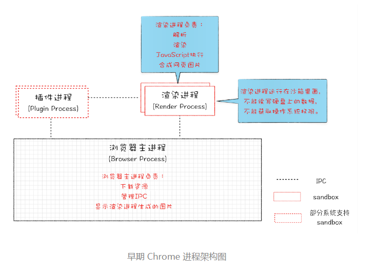
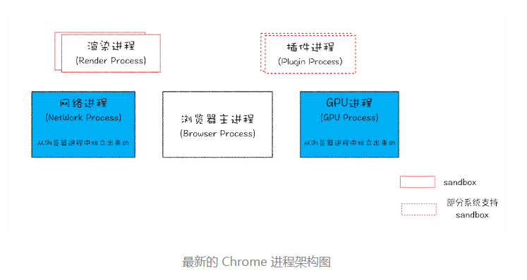
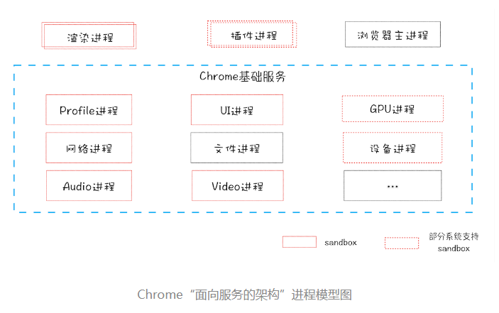

# 浏览器进程

## 并行处理
> 并行处理Parallel Processing是计算机系统中能同时执行两个或多个处理的一种计算方法。并行处理可同时工作于同一程序的不同方面

## 进程和线程
进程是资源（CPU、内存等）分配的基本单位，具有一定功能的程序关于某个数据集合上的一次运行活动，进程是`系统进行资源分配和调度的一个独立单位`。

线程是进程的一个实体，是独立运行和独立调度的基本单位（CPU上真正运行的是线程）。线程自己基本上不拥有系统资源，只拥有一点在运行中必不可少的资源(如程序计数器,一组寄存器和栈)，但是它可与同属一个进程的其他的线程共享进程所拥有的全部资源。

一个进程就是一个程序的运行实例。就是启动一个程序时，操作系统会为该程序创建一块内存，这块内存用来存放代码、运行数据和一个执行任务的主线程，上面的这样一个运行环境统叫进程。

### 关系
进程中的任意一线程执行出错，都会导致整个进程的崩溃。

线程之间共享进程中的数据。

当一个进程关闭之后，操作系统会回收进程所占用的内存。

进程之间的内容相互隔离。

> 也不是完全隔离，进程之间在特定情况下还是可以进行通信（IPC 机制）
> IPC（Inter-Process Communication，进程间通信）。进程间通信是指两个进程的数据之间产生交互。

## 单进程浏览器
单进程浏览器是指浏览器所有功能模块（网络、插件、JavaScript 运行环境、渲染引擎和页面等）都是运行在同一个进程里。谷歌浏览器发布前浏览器多是单进程的。

单进程的问题：

- 不稳定：插件和渲染引擎会导致整个进程崩溃

- 不流畅：JavaScript执行环境一旦出现大量计算或者循环就会导致整个进程运行变慢或卡顿，内存泄漏也是一大原因。

- 不安全：第三方插件可以编写相关调用操作系统底层的恶意代码来获取系统信息；页面脚本可以通过浏览器漏洞获取系统权限造成安全问题。

## 多进程浏览器
多进程浏览器泛指谷歌浏览器等现代浏览器。

### 早期多进程架构
2008 年谷歌发布时的进程架构：

### 目前多进程架构

最新的谷歌浏览器包括了5个进程：

1、`浏览器进程`
>主要负责`界面显示`、用户交互、`子进程管理`，同时提供存储等功能。

2、`渲染进程`
>核心任务是将 HTML、CSS 和 JavaScript 转换为用户可以与之交互的网页，排版引擎Blink和JavaScript引擎V8都是运行在该进程中，默认情况下，Chrome会为每个Tab标签创建一个渲染进程。出于安全考虑，渲染进程都是运行在沙箱模式下。
>
>渲染进程启动后，会开启一个`渲染主线程`，主线程负责执行 HTML、CSS、JS 代码。
>

3、`GPU进程`
>Chrome刚开始发布的时候是没有GPU进程的。而GPU的使用初衷是为了实现3D CSS的效果，只是随后网页、Chrome的UI界面都选择采用GPU来绘制，这使得GPU成为浏览器普遍的需求。最后，Chrome在其多进程架构上也引入了GPU进程。

4、`网络进程`
>主要负责`页面的网络资源加载`，之前是作为一个模块运行在浏览器进程里面的，直至最近才独立出来，成为一个单独的进程。

5、`插件进程`
>主要是负责插件的运行，因插件易崩溃，所以需要通过插件进程来隔离，以保证插件进程崩溃不会对浏览器和页面造成影响

打开一个网页，至少有4个进程，即至少需要1个网络进程、1个浏览器进程、1个GPU进程和一个渲染进程；如果打开的页面有运行插件，还需要加上1个插件进程。

### 页面渲染过程，进程之间的交互

1、导航栏输入一个内容，`浏览器进程`里的`UI线程`会先进行解析判断是URL还是搜索关键词，如果是URL，会通过IPC通道将信息传送给`网络进程`

2、`网络进程`拿到URL后，以数据包的形式通过`TCP/IP`协议栈来获取响应的数据，此时`网络进程`会将拿到的内容与URL一并交给 `SafeBrowsing` 做安全检查，检查内容是否与某个已知的网站相匹配以及这个IP是否在黑名单里，如果有安全风险会先展示警告页面询问是否继续访问。

3、返回的数据准备完毕并且无风险，`网络进程`会将数据返回给`UI线程`，`UI线程`就会找`渲染进程`，进入渲染阶段。

4、`渲染进程`的任务是把html、css、JavaScript等资源进行计算，然后转换为显示器的像素点，最终`合成帧`，返回给`浏览器进程`。
> 具体渲染过程见[下一篇]()。

5、`浏览器进程`将`渲染进程`里的`合成帧`发送给`GPU进程`，`GPU进程`将其进行`渲染`并展示在屏幕上，至此用户就可以看到页面了。

### 多进程的缺点
1、更高的资源占用

2、更复杂的体系架构

## 面向服务的架构
为了解决多进程架构的问题，在 2016 年，Chrome 官方团队使用`“面向服务的架构”（Services Oriented Architecture，简称SOA）`的思想设计了新的 Chrome 架构。也就是说 Chrome 整体架构会朝向现代操作系统所采用的“面向服务的架构” 方向发展，原来的各种模块会被重构成独立的`服务（Service）`，每个服务（Service）都可以在独立的进程中运行，访问服务（Service）必须使用定义好的接口，通过 IPC 来通信，从而构建一个`更内聚、松耦合、易于维护和扩展的系统`，更好实现 Chrome 简单、稳定、高速、安全的目标。

Chrome 最终要把 UI、数据库、文件、设备、网络等模块重构为基础服务，类似操作系统底层服务

## 扩展——协程
协程Coroutines是一种比线程更加轻量级的存在。

协程完全由程序所控制（在用户态执行），带来的好处是性能大幅度的提升。

一个操作系统中可以有多个进程；一个进程可以有多个线程；一个线程可以有多个协程。

协程是一个特殊的函数，这个函数可以在某个地方挂起，并且可以重新在挂起处继续运行。

一个线程内的多个协程的运行是串行的，这点和多进程（多线程）在多核CPU上执行是不同的。

多进程（多线程）在多核CPU上是可以并行的。当线程内的某一个协程运行时，其他协程必须挂起。

### JavaScript协程的发展

- 同步代码

- 异步JavaScript：callback hell（回调地狱）

- ES6引入promise/a+，生成器Generators（语法 `function foo(){}*`，可以赋予函数执行暂停/保存上下文/恢复执行状态的功能），新关键词yield使生成器函数暂停。

- ES7引入async函数/await语法糖，async可以声明一个异步函数（将Generator函数和自动执行器包装在一个函数里），此函数需要返回一个Promise对象，await可以等待一个Promise对象resolve，并拿到结果

> Promise中也利用了回调函数，在then和catch方法中都传入了一个回调函数，分别在Promise被满足和拒绝时执行，这样就能让它能够被链接起来完成一系列任务。总之是吧层层嵌套的callback变成.then().then()...，从而使代码编写和阅读更直观

## 参考资料
[https://www.cnblogs.com/wx980416/p/16380357.html](https://www.cnblogs.com/wx980416/p/16380357.html)

[https://juejin.cn/post/7178033357601636409?searchId=20240711185221F02B40947082C19EAAA2](https://juejin.cn/post/7178033357601636409?searchId=20240711185221F02B40947082C19EAAA2)
