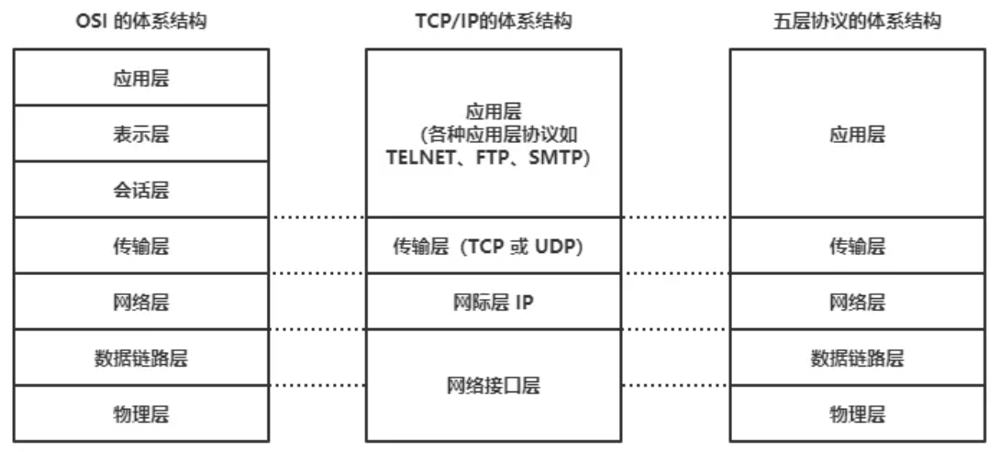

# 网络模型

## OSI七层模型

- 应用层

> 为应用程序提供服务

- 表示层

> 数据格式转化、数据加密

- 会话层

> 建立、管理和维护会话

- 传输层

> 建立、管理和维护端到端的连接

- 网络层

> IP地址及路由选择

- 数据链路层

> 提供介质访问和链路管理

- 物理层

> 

OSI七层模型通信特点：对等通信

> 对等通信：为了使数据分组从源传送到目的地，源端OSI模型的每一层都必须与目的端的对等层进行通信，这种通信方式称为对等通信。在每一层通信过程中，使用本层自己协议进行通信

## TCP/IP五层协议

- 应用层

> HTTP、Telnet、FTP、SMTP、DNS、TFTP

- 传输层

> 四层交换机、四层的路由器

> TCP、UDP

- 网络层

> 路由器、三层交换机

> IP、ICMP、RIP、IGMP

- 数据链路层

> 网桥、以太网交换机、网卡

> ARP、RARP、PPP、IEEE802.3、CSMA/CD

- 物理层

> 中继器、集线器、双绞线

> FE自协商
