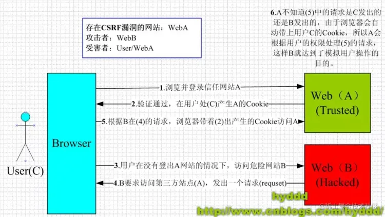

# XSS 和 CSRF

## XSS

XSS (Cross-Site Scripting)跨站脚本攻击：

● 攻击者往 Web 页面里面插入`恶意可执行网页脚本代码`，当用户浏览该页时，嵌入其中 Web 里面的脚本代码会被执行，从而达到攻击者盗取信息或其他侵犯用户安全隐私的目的

### 攻击类型

● 存储型：恶意代码提交到`目标网站的数据库`，服务器返回恶意代码，恶意代码被执行，窃取用户数据并发送到攻击者网站

● 反射型：构造特殊 URL，其中包含恶意代码，打开带有恶意代码的 URL 时，`网站服务端将恶意代码从 URL 中取出，拼接在 HTML 中返回给浏览器`

● DOM 型：构造特殊的 URL，其中包含恶意代码，`取出和执行恶意代码由浏览器端完成`


### 防御 XSS

核心要素：防止攻击者提交恶意代码，防止浏览器执行恶意代码

● httpOnly：cookie 设置 HttpOnly，js 脚本无法读取 cookie

● 输入过滤：前后端对输入格式检查

● 转义 HTML：如果拼接 HTML 是必要的，就需要对于引号，尖括号，斜杠进行转义

● 白名单：

● 预防存储和反射型：纯前端渲染，代码和数据分隔开；对 HTML 转移

CSP，设置字段`default-src 'self'`，所有加载的内容必须来自站点的同一个源

## CSRF

CSRF 跨站点伪造 Cross-site request forgery

● 诱导用户打开黑客的网站，在黑客的网站中，利用用户登录状态发起跨站点伪造

### 攻击步骤

1、受害者登录 a.com，保留了 cookie

2、攻击者诱导受害者访问 b.com

3、b.com 向 a.com 发送请求 a.com/xxx，浏览器就会带上 cookie

4、a 收到请求并执行对应操作

5、攻击者在受害者不知情的情况下，冒充受害者让 a.com 执行自己定义的操作



### 攻击类型

- GET 型：在页面中的某个 img 发起一个 get 请求

- POST 型：自动提交表单到恶意网站

```html
<form method="POST">
  <input type="hidden" name="account" value="jervis" />
</form>
<script>
  document.forms[0].submit();
</script>
```

- 诱导用户点击链接`<a href="xxx"/>`

### 防范 CSFR

1、同步令牌模式（Synchronizer Token Pattern）： 在服务器生成一个随机且难以预测的令牌（Token），并将其嵌入到表单或请求参数中，前端在提交表单或发送请求时，必须携带这个令牌。服务器端验证请求中的令牌是否有效，如果无效则拒绝请求。

2、双重提交 Cookie 模式（Double Submit Cookie Pattern）： 服务器在用户登录成功后设置一个包含随机令牌的 Cookie，前端在发送请求时，将 Cookie 中的令牌值作为请求参数或请求头的一部分发送，服务器端验证这两个值是否一致来判断请求的合法性。

3、添加验证码： 在关键操作（如修改密码、转账等）时要求用户输入验证码，这个虽不能直接防止，但可以增加攻击者自动执行请求的难度。

4、限制请求来源（Origin 和 Referer 检查）： 检查请求的来源（Origin 头）或引用页面（Referer 头）是否合法，但需要注意，这些头信息可能会被伪造或不可靠。

5、使用 SameSite 属性设置 Cookie： 将 Cookie 的 SameSite 属性设置为 Strict 或 Lax，以限制 Cookie 在跨站请求中的发送。

6、避免使用 GET 请求进行重要操作： GET 请求的参数会显示在 URL 中，容易被利用，尽量使用 POST、PUT 等请求方法进行重要操作

## 参考

[https://mp.weixin.qq.com/s/pKfKqdsT99vibXNs-vciug](https://mp.weixin.qq.com/s/pKfKqdsT99vibXNs-vciug)
