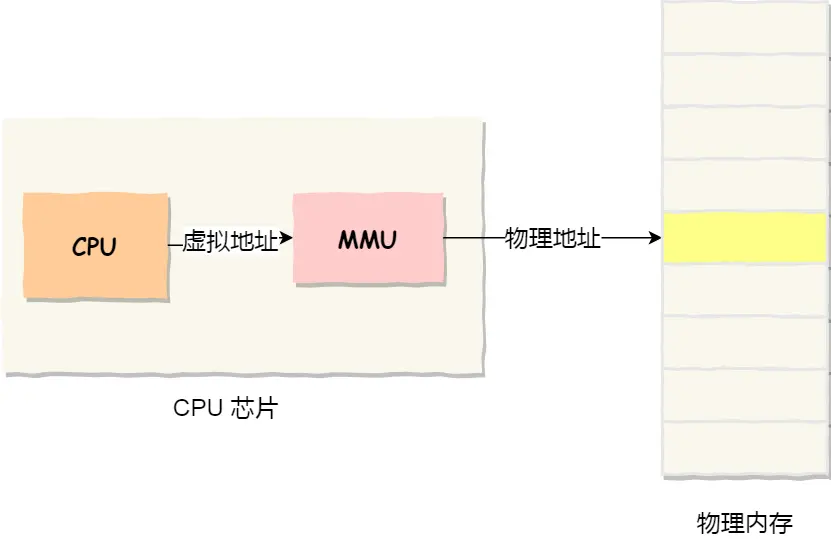
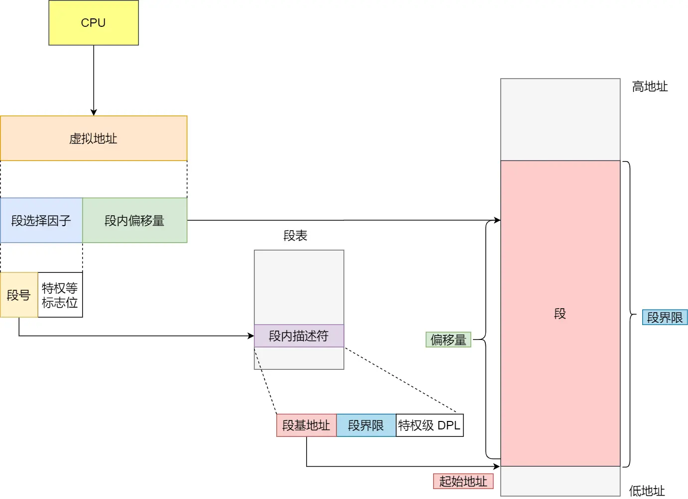
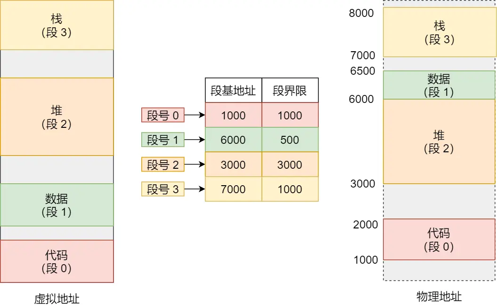

# 内存管理

## 虚拟内存

实际的物理内存主要是主存，但是物理主存空间有限，所以一般现代操作系统都会想办法把一部分内存块放到磁盘中，用到的时候再装入主存，但是对用户程序而言，是不需要注意实际的物理内存的，为什么呢？因为有虚拟内存的机制。

**简单说，虚拟内存是操作系统提供的⼀种机制，将不同进程的虚拟地址和不同内存的物理地址映射起来。**

> 如何映射？
> 
> - 内存分段
> 
> - 内存分页

程序所使用的内存地址叫做虚拟内存地址

实际存在硬件里面的空间地址叫做物理内存地址

## 内存分段

分段机制下的虚拟地址由两部分组成，`段选择因子`和`段内偏移量`。

- 段选择因子 保存在段寄存器里。段选择因子最重要的是**段号**，用作段表的索引。段表里面保存的是这个段的基地址、段的界限和特权级别等

- 虚拟地址 中的 `段内偏移量` 应该位于 0 和段界限之间，如果段内偏移量是合法的，就将段基地址加上段内偏移量得到物理内存地址

### 问题

1、内存碎片问题

> 内部内存碎片和外部内存碎片
> 
> 内存`分段管理`可以做到段根据实际需求分配内存，所以有多少需求就分配多大的段，所以`不会出现内部内存碎片`
> 
> 但由于每个段的长度不固定，所以多个段未必能恰好使用所有的内存空间，会产生了多个不连续的小物理内存，导致新的程序无法被装载，所以会出现外部内存碎片问题

> 解决方法是：内存交换

2、内存交换的效率低的问题

> 

## 内存分页

分段的好处就是能产生连续的内存空间，但是会出现「外部内存碎片和内存交换的空间太大」的问题。

要解决这些问题，那么就要想出能少出现一些内存碎片的办法。另外，当需要进行内存交换的时候，让需要交换写入或者从磁盘装载的数据更少一点，这样就可以解决问题了。这个办法，也就是内存分页（Paging）

分页是把整个虚拟和物理内存空间切成一段段固定尺寸的大小

在分页机制下，虚拟地址分为两部分，页号和页内偏移。

- `页号`作为页表的索引，页表包含物理页每页所在物理内存的基地址，这个基地址与页内偏移的组合就形成了物理内存地址。

### 问题

有空间上的缺陷。

因为操作系统是可以同时运行非常多的进程的，这就意味着页表会非常的庞大。

## 多级页表

> 多级页表（Multilevel Page Table）是一种内存管理技术，用于在虚拟内存系统中高效地管理和转换虚拟地址到物理地址。它通过分层结构减少页表所需的内存开销，以解决单级页表在大地址空间中的效率问题。

要解决上面的问题，就需要采用一种叫作多级页表（Multi-Level Page Table）的解决方案。

把页表项的单级页表再分页，形成二级分页

根据具体的系统，可以再分页

## 快表TLB

同样利用了局部性原理，即在⼀段时间内，整个程序的执⾏仅限于程序中的某⼀部分。相应地，执⾏所访问的存储空间也局限于某个内存区域。

利⽤这⼀特性，把最常访问的⼏个⻚表项存储到访问速度更快的硬件，于是计算机科学家们，就在 CPU 芯⽚中，加⼊了⼀个专⻔存放程序最常访问的⻚表项的 Cache，这个 Cache 就是 TLB（Translation Lookaside Buffer） ，通常称为⻚表缓存、转址旁路缓存、快表等。

## 段页式内存管理

- 段号

- 段内页号

- 页内位移

## 虚拟内存的作用

1、`虚拟内存可以使得进程对运行内存超过物理内存大小，因为程序运行符合局部性原理`，CPU 访问内存会有很明显的重复访问的倾向性，对于那些没有被经常使用到的内存，我们可以把它换出到物理内存之外，比如硬盘上的 swap 区域。

2、由于每个进程都有自己的页表，所以每个进程的虚拟内存空间就是相互独立的。进程也没有办法访问其他进程的页表，所以这些页表是私有的，这就`解决了多进程之间地址冲突的问题`。

3、页表里的页表项中除了物理地址之外，还有一些标记属性的比特，比如控制一个页的读写权限，标记该页是否存在等。在内存访问方面，操作系统提供了更好的安全性。

## 参考

[https://xiaolincoding.com/os/3_memory/vmem.html#%E8%99%9A%E6%8B%9F%E5%86%85%E5%AD%98](https://xiaolincoding.com/os/3_memory/vmem.html#%E8%99%9A%E6%8B%9F%E5%86%85%E5%AD%98)

[https://javabetter.cn/sidebar/sanfene/os.html#_21%E3%80%81%E4%BB%80%E4%B9%88%E6%98%AF%E8%99%9A%E6%8B%9F%E5%86%85%E5%AD%98](https://javabetter.cn/sidebar/sanfene/os.html#_21%E3%80%81%E4%BB%80%E4%B9%88%E6%98%AF%E8%99%9A%E6%8B%9F%E5%86%85%E5%AD%98)

