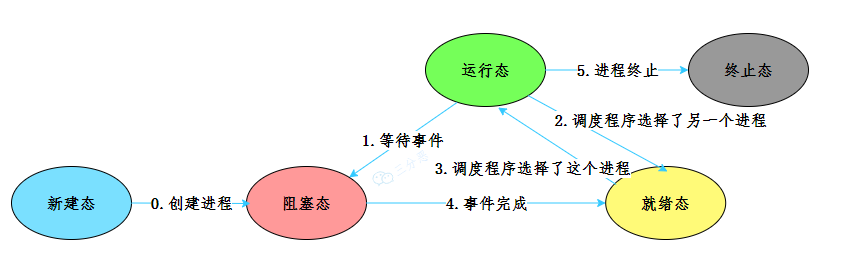
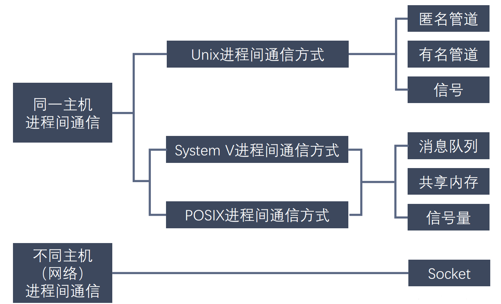
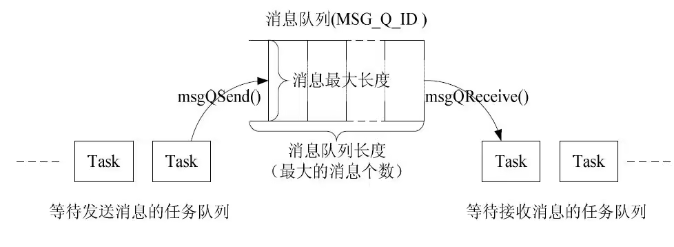
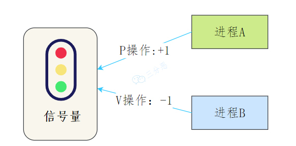
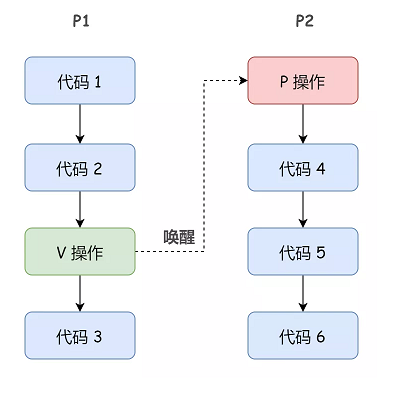
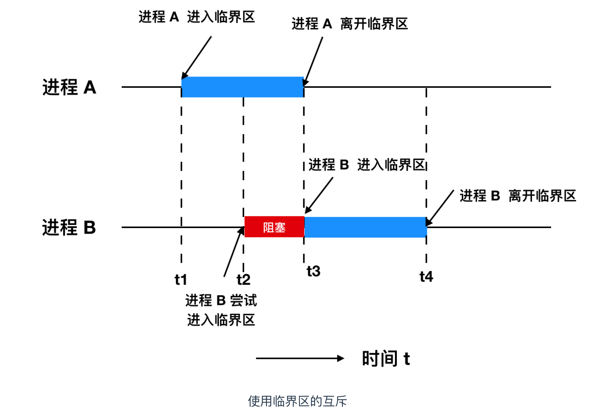
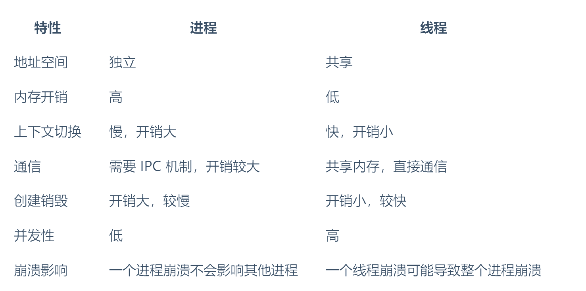

# 进程和线程

## 进程状态

## 僵尸进程与孤儿进程

僵尸进程是已完成且处于终止状态，但在进程表中却仍然存在的进程。

僵尸进程一般发生有父子关系的进程中，一个子进程的进程描述符在子进程退出时不会释放，只有当父进程通过 wait() 或 waitpid() 获取了子进程信息后才会释放。如果子进程退出，而父进程并没有调用 wait() 或 waitpid()，那么子进程的进程描述符仍然保存在系统中

孤儿进程：一个父进程退出，而它的一个或多个子进程还在运行，那么这些子进程将成为孤儿进程。孤儿进程将被 init 进程 (进程 ID 为 1 的进程) 所收养，并由 init 进程对它们完成状态收集工作。因为孤儿进程会被 init 进程收养，所以孤儿进程不会对系统造成危害。

## 进程间通信

进程间通信是指在操作系统中，多个进程之间为了完成任务需要进行数据交换或协同工作的技术

常见的方式有：

1、管道Pipe

> 进程间的管道就是内核中的一串缓存，从管道的一端写入数据，另一端读取。数据`只能单向流动`，遵循先进先出的原则

> 管道效率低，不适合进程间频繁地交换数据

2、消息队列

> 消息队列是保存在内核中的消息链表，按照消息的类型进行消息传递，具有较高的可靠性和稳定性
> 
> 缺点：消息体有一个最大长度的限制，不适合比较大的数据传输；存在用户态与内核态之间的数据拷贝开销

3、共享内存（是最快的进程间通信方式）

> 为了防止数据竞争，需要配合其他同步机制，如信号量或互斥锁

4、信号量

是一种同步机制，可以用于进程间的写作与同步

> 本质上是一个计数器，用来控制对共享资源的访问数量
> 
> 它常作为一种锁机制，防止某进程正在访问共享资源时，其他进程也访问该资源
> 
> 控制信号量的方式有两种原子操作：
> 
> - P操作（wait，减操作），当进程希望获取资源时，它会执行P操作。如果信号量的值大于0，表示有资源可用，信号量的值减1，进程继续执行。如果信号量的值为0，表示没有可用资源，进程进入等待状态，知道信号量的值变为大于0 
> 
> - V操作（signal，加操作），当进程释放资源时，它会执行V操作，信号量的值加1。如果有其他进程因为等待该资源而被阻塞，这时会唤醒其中一个进程

5、信号

是一种比较简单的通信方式，用于通知进程某些事件的发生，通常用于中断进程的执行，或者进程之间传递一些控制信息

6、套接字socket

7、内存映射Memory-Mapped Files

通过将一个文件映射到进程的地址空间中，多个进程可以通过映射到同一文件的方式来共享数据

8、消息缓冲区

9、文件系统

通过读写同一文件来实现通信

10、远程过程调用RPC

允许进程通过调用远程进程的函数来实现通信，抽象出通信细节，让进程之间的通信看起来像是本地函数调用

总结：

- `管道和消息队列`适合简单的数据传输。

- `共享内存`适合大量数据的快速交换，但需要同步机制保证一致性。

- `信号量`适合同步和协调进程操作。

- `套接字`则适合分布式系统或需要网络通信的场景。

## 进程调度策略

### 先来先服务FCFS，First-Come First-Served

按照进程到达的先后顺序进行调度，先到的进程先执行，直到该进程结束或阻塞后，再调度下一个进程

优点：实现简单，容易理解

缺点：不能有效处理长短作业混合的情况，容易导致`长作业占用资源过多`，从而引发饥饿问题（短作业等待过长）

### 短作业优先SJF，Shortest Job First

每次调度优先选择预计运行时间最短的进程进行执行

优点：能够最小化平均等待时间，适合短作业密集的场景

缺点：难以准确预测作业长度，且可能导致长作业饥饿问题

### 最高相应比优先调度HRRN，Highest Response Ratio Next

综合考虑等待时间和作业长度，优先调度响应比最高的进程，响应比计算公式为：`(等待时间+运行时间)/运行时间`

优点：避免了饥饿问题，兼顾长短作业，动态调整进程优先级

缺点：实现较为复杂，适用场景相对有限

### 时间片轮转调度RR，Round Robin

将CPU时间片分成固定长度的时间片，每个进程在一个时间片内执行。时间片到期后，如果进程未完成，则放到队列尾部，等待下一轮调度

优点：对所有进程公平，适合交互式系统，确保每个进程都能得到处理

缺点：如果时间片过长，可能退化为FCFS；如果时间片过短，则调度开销增加，影响系统效率

### 优先级调度Priority Scheduling

根据进程的优先级进行调度，优先级高的进程先执行。优先级可以是静态的，也可以动态变化。

优点：灵活性高，可以满足不同进程的响应需求

缺点：可能会导致优先级反转（低优先级的进程长期等待），从而引发饥饿问题

### 多级反馈队列Multilevel Feedback Queue

多个调度队列，每个队列有不同的优先级和时间片，进程可以根据其执行时间和响应情况在不同队列之间动态调整。例如，刚到达的进程进入高优先级队列，如果适用的CPU时间过多，则逐渐降到低优先级队列

优点：兼顾短作业和长作业的需求，对交互式和批处理系统都有较好表现

缺点：实现复杂，调优难度大

### 抢占式调度Preemptive Scheduling

运行操作系统在某些条件下中断当前进程的执行，并将CPU分配给另一个进程，这种调度策略可以和其他调度算法结合适用，例如优先级调度和时间片轮转调度

优点：可以更好地响应高优先级进程，确保系统的实时性

缺点：增加了调度开销，可能影响系统效率

### 实时调度Real-Time Scheduling

用于实时系统，要求进程必须在严格的时间限制内完成，分为硬实时（必须在截至时间内完成）和软实时（尽量在截至时间内完成）

优点：能够满足关键任务的时间约束

缺点：调度复杂，通常需要硬件和软件的支持

## 线程间同步

同步解决的是多线程操作共享资源的问题，不管线程之间是如何穿插执行的，最后的结果都是正确的。

临界区的概念：对共享资源访问的程序片段，希望这段代码是互斥的，可以保证在某个时刻只能被一个线程执行，也就是说一个线程在临界区执行时，其他线程应该被阻止进入临界区

> 临界区不仅针对线程，同样针对进程

### 互斥锁

忙等待锁（也成为自旋锁，Spinlock）是指当一个线程试图获取锁时，如果该锁已经被其他线程持有，当前线程不会立即进入休眠或阻塞，而是不断地检查锁的状态，直到该锁可用为止。这个过程被称为忙等待，因为线程在等待锁时仍然占用CPU资源，处于活跃状态。优点是避免了线程的上下文切换。

无忙等待锁是指当一个线程尝试获取锁时，如果锁已经被其他线程持有，当前线程不会忙等待，而是主动让出CPU，进入阻塞状态或休眠状态，等待锁释放，当锁被释放时，线程被唤醒并重新尝试获取锁，这类锁的主要目的是避免忙等待带来的CPU资源浪费

### 信号量
通常表示资源的数量，对应的变量是⼀个整型（sem）变量。

两个原子操作的系统调用函数来控制信号量：

- P 操作：当线程想要进入临界区时，会尝试执行 P 操作。如果信号量的值大于 0，信号量值减 1，线程可以进入临界区；否则，线程会被阻塞，直到信号量大于 0。

- V 操作：当线程退出临界区时，执行 V 操作，信号量的值加 1，释放一个被阻塞的线程。

## 进程线程区别总结

## 参考

[https://javabetter.cn/sidebar/sanfene/os.html#_12%E3%80%81%E8%BF%9B%E7%A8%8B%E9%97%B4%E9%80%9A%E4%BF%A1%E6%9C%89%E5%93%AA%E4%BA%9B%E6%96%B9%E5%BC%8F](https://javabetter.cn/sidebar/sanfene/os.html#_12%E3%80%81%E8%BF%9B%E7%A8%8B%E9%97%B4%E9%80%9A%E4%BF%A1%E6%9C%89%E5%93%AA%E4%BA%9B%E6%96%B9%E5%BC%8F)