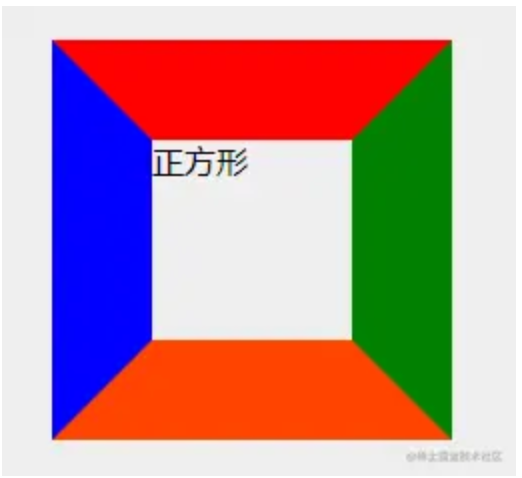
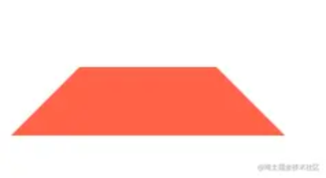
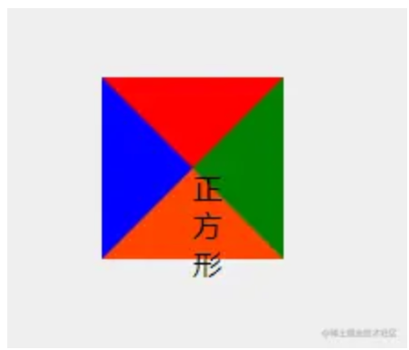
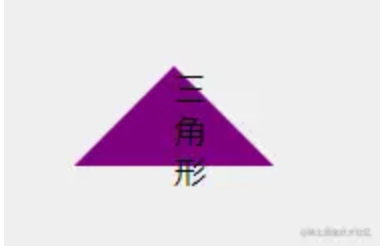
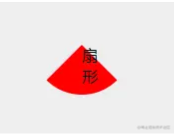
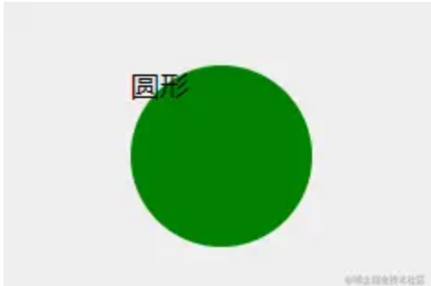
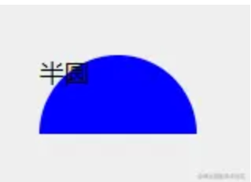

# css 绘制各种图形

## 标准的盒子

给盒子定义宽高，然后给他的各个 border 定义不同的样式

```css
/* HTML CODE:
<div class="square">正方形</div>
*/ /* CSS CODE */
.square {
  width: 100px;
  height: 100px;
  border-top: 50px solid red;
  border-right: 50px solid green;
  border-bottom: 50px solid orangered;
  border-left: 50px solid blue;
}
```



## 梯形

其他的设置为 transparent(透明)即可

```css
  <style>
    .trapezoidal{
        width: 100px;
        height: 100px;
        border: 50px solid transparent;
        border-bottom-color: tomato;
    }
  </style>

  <div class="trapezoidal"></div>
```



## 三角形

```css
/* HTML CODE: 
    <div class="square">正方形</div>
    */

/* CSS CODE */
.square {
  width: 0;
  height: 0;
  border-top: 50px solid red;
  border-right: 50px solid green;
  border-bottom: 50px solid orangered;
  border-left: 50px solid blue;
}
```



所以画三角形可以把其他三个边的 border-color 设置为 transparent，然后另一条设置为非透明的颜色即可

```css
/* HTML CODE
	<div class="triangle">三角形</div>
*/

/* CSS CODE */
.triangle {
  width: 0;
  height: 0;
  border: 50px solid transparent;
  border-bottom-color: purple;
}
```



## 扇形

给三角形对应的元素加上 border-radius 即可

```css
/* HTML CODE
	<div class="sector">扇形</div>
*/

/* CSS CODE */
.sector {
  width: 0;
  height: 0;
  border-radius: 50%;
  border: 50px solid transparent;
  border-bottom-color: red;
}
```



## 圆形

```css
/* HTML CODE
	<div class="circle">圆形</div>
*/

/* CSS CODE */
.circle {
  width: 100px;
  height: 100px;
  border-radius: 50%;
  background-color: green;
}
```



## 半圆

```css
/* HTML CODE
	<div class="half-circle">半圆</div>
*/

/* CSS CODE */
.half-circle {
  width: 100px;
  height: 50px;
  background-color: blue;
  border-top-left-radius: 50px;
  border-top-right-radius: 50px;
}
```



## 参考

[https://juejin.cn/post/6879741264166649863](https://juejin.cn/post/6879741264166649863)
