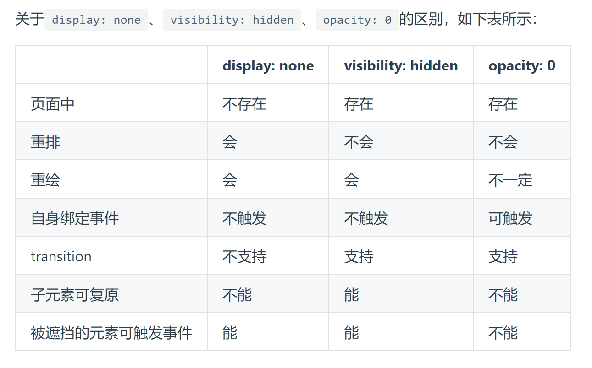

# css 隐藏页面元素

### display:none

彻底消失，空间被其他元素占有，会导致浏览器的重排和重绘

特点：元素不可见，不占据空间，无法响应点击事件

### visibility:hidden

DOM 会存在，不会触发重排，但会触发重绘

特点：元素不可见，占据空间，无法响应点击事件

### opacity:0

元素透明度，不引发重排，一般会引发重绘

但如果利用 animation 动画，对 opacity 做变化（animation 会默认触发 GPU 加速），只会触发 GPU 层面的 composite，不会触发重绘

其子元素无法设置 opacity 来达到显示的效果

特点：改变元素透明度，元素不可见，占据页面空间，可以响应点击事件

### 设置 height、width 模型属性为 0

margin，border，padding，height 和 width 等影响元素盒模型的属性设置成 0，如果元素内有子元素或内容，还应该设置其 overflow:hidden 来隐藏其子元素

特点：元素不可见，不占据页面空间，无法响应点击事件

### position:absolute

将元素移出可视区域

特点：元素不可见，不影响页面布局

### clip-path

通过裁剪的形式

```css
.hide {
  clip-path: polygon(0px 0px, 0px 0px, 0px 0px, 0px 0px);
}
```

特点：元素不可见，占据页面空间，无法响应点击事件

### 区别


