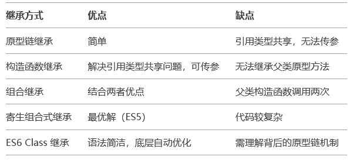

# JavaScript继承

## 原型链继承

原理：子类的原型对象指向父类的实例，通过原型链向上查找属性和方法。

缺点：所有子类实例共享父类的引用类型属性，且无法向父类构造函数传参。

```js
function Parent(name){
    this.name=name;
    this.colors=["red","blue"];
}

Parent.prototype.sayName=function(){
    console.log(this.name);
}

function Child() {}
Child.prototype = new Parent("Parent"); // 核心：子类原型指向父类实例

// 测试
const child1 = new Child();
child1.colors.push("green");
const child2 = new Child();
console.log(child2.colors); // ["red", "blue", "green"]（共享问题）
```

## 构造函数继承

原理：在子类构造函数中调用父类构造函数（通过call或apply），复制父类实例属性到子类。

缺点：无法继承父类原型上的方法

```js
function Parent(name) {
  this.name = name;
  this.colors = ["red", "blue"];
}
Parent.prototype.sayName = function () {
  console.log(this.name);
};

function Child(name) {
  Parent.call(this, name); // 核心：调用父类构造函数
}

// 测试
const child1 = new Child("Child1");
child1.colors.push("green");
const child2 = new Child("Child2");
console.log(child2.colors); // ["red", "blue"]（不共享）
child1.sayName(); // 报错：无法访问父类原型方法
```

## 组合继承

原理：结合原型链继承和构造函数继承，既继承父类原型方法，又避免引用类型共享问题

问题：父类构造函数被调用两次（`Parent.call`和`new Parent()`），效率较低

```js
function Parent(name) {
  this.name = name;
  this.colors = ["red", "blue"];
}
Parent.prototype.sayName = function () {
  console.log(this.name);
};

function Child(name) {
  Parent.call(this, name); // 第1次调用父类构造函数（继承属性）
}
Child.prototype = new Parent(); // 第2次调用父类构造函数（继承方法）
Child.prototype.constructor = Child; // 修正构造函数指向

// 测试
const child1 = new Child("Child1");
child1.colors.push("green");
const child2 = new Child("Child2");
console.log(child2.colors); // ["red", "blue"]（不共享）
child2.sayName(); // "Child2"（可访问原型方法）
```

## 原型式继承

原理：基于已有对象创建新对象（类似`Object.create()`）

适用场景：简单对象继承，无需构造函数

缺点：与原型链继承类似，存在引用类型共享问题

```js
function createObject(obj) {
  function F() {}
  F.prototype = obj;
  return new F();
}

const parent = { name: "Parent", colors: ["red", "blue"] };
const child1 = createObject(parent);
child1.colors.push("green");
const child2 = createObject(parent);
console.log(child2.colors); // ["red", "blue", "green"]（共享问题）
```

## 寄生式继承

原理：在原型式继承上增强对象，添加新方法。

缺点：与原型式继承相同，存在共享问题。

```js
function createEnhancedObject(obj) {
  const clone = Object.create(obj);
  clone.sayName = function () {
    console.log(this.name);
  };
  return clone;
}

const parent = { name: "Parent", colors: ["red", "blue"] };
const child = createEnhancedObject(parent);
child.sayName(); // "Parent"
```

## 寄生组合式继承

原理：通过`Object.create()`继承父类原型，避免调用两次父类构造函数

最佳实践：ES6之前最理想的继承方式

```js
function inheritPrototype(child, parent) {
  const prototype = Object.create(parent.prototype); // 创建父类原型的副本
  prototype.constructor = child; // 修正构造函数指向
  child.prototype = prototype; // 赋值给子类原型
}

function Parent(name) {
  this.name = name;
  this.colors = ["red", "blue"];
}
Parent.prototype.sayName = function () {
  console.log(this.name);
};

function Child(name) {
  Parent.call(this, name); // 继承属性
}
inheritPrototype(Child, Parent); // 继承方法

// 测试
const child1 = new Child("Child1");
child1.colors.push("green");
const child2 = new Child("Child2");
console.log(child2.colors); // ["red", "blue"]（不共享）
child2.sayName(); // "Child2"
```

## ES6的Class继承

原理：通过class和extends关键字实现语法糖，底层仍是原型链继承

最佳实践：现代JavaScript推荐方式

```js
class Parent {
  constructor(name) {
    this.name = name;
    this.colors = ["red", "blue"];
  }
  sayName() {
    console.log(this.name);
  }
}

class Child extends Parent {
  constructor(name) {
    super(name); // 调用父类构造函数（必须在使用this之前）
  }
}

// 测试
const child1 = new Child("Child1");
child1.colors.push("green");
const child2 = new Child("Child2");
console.log(child2.colors); // ["red", "blue"]（不共享）
child2.sayName(); // "Child2"
```

## 总结

