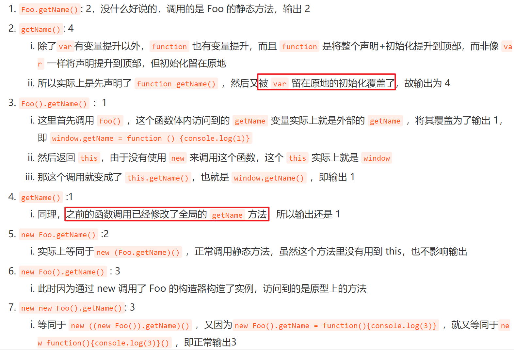

# 函数-变量代码输出

```js
function Foo() {
  getName = function () {
    console.log(1);
  };
  return this;
}
Foo.getName = function () {
  console.log(2);
};
Foo.prototype.getName = function () {
  console.log(3);
};
var getName = function () {
  console.log(4);
};
function getName() {
  console.log(5);
}
Foo.getName();
getName();
Foo().getName();
getName();
new Foo.getName();
new Foo().getName();
new new Foo().getName();
```

输出结果：

```
2
4
1
1
2
3
3
```


- `Foo.prototype.getName`：给 `Foo` 的原型添加了一个 `getName` 方法，其输出为 `console.log(3)`。这个方法只在通过实例化 `Foo` 时才会使用。



## 来源

[https://www.nowcoder.com/discuss/658728729333530624](https://www.nowcoder.com/discuss/658728729333530624)
