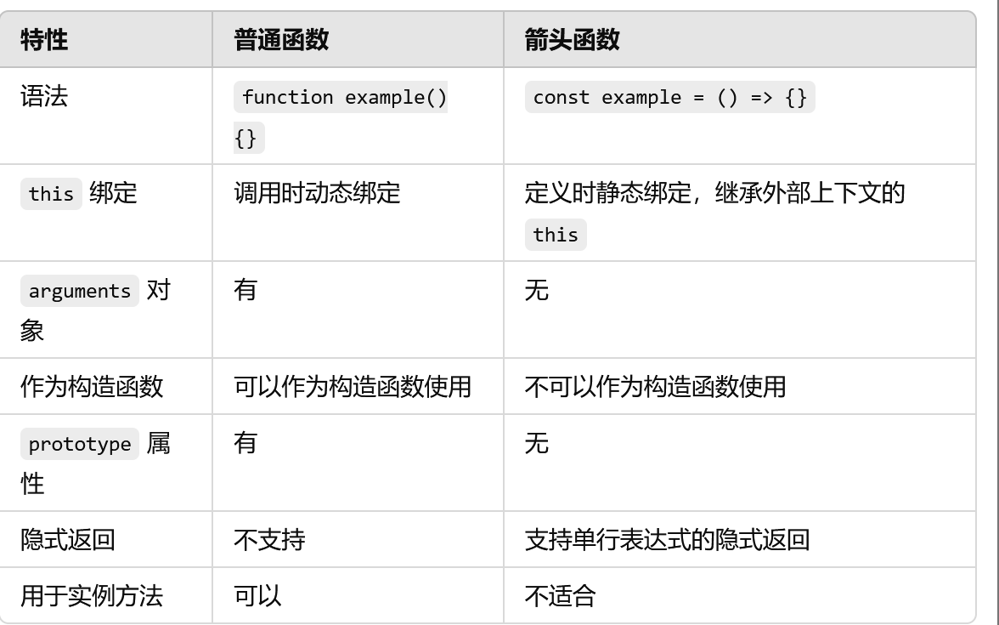

# 箭头函数和普通函数

箭头函数的 this 为定义时所在的 this，不绑定 this（因为箭头函数没有 constructor），会捕捉其所在上下文的 this 作为自己的 this

若包裹在函数中，就是函数调用时所在的对象，放在全局就是 window，箭头函数的 this 就是外层代码块的 this，固定不变

- 没有自己的 this

- 继承来的 this 不会变

- 没有 arguments，实际获得的 arguments 是外层函数的 arguments

- call、apply、bind 无法改变 this 指向

- 不可用于构造函数，没有 new 关键字

- 无 prototype

- 不能用于 generator 函数，没有 yield 关键字

## 区别

在实际开发中，箭头函数更适合用于简短的、无状态的函数，特别是在回调中使用。而普通函数更适合需要 this 动态绑定或用于构造函数的场景。