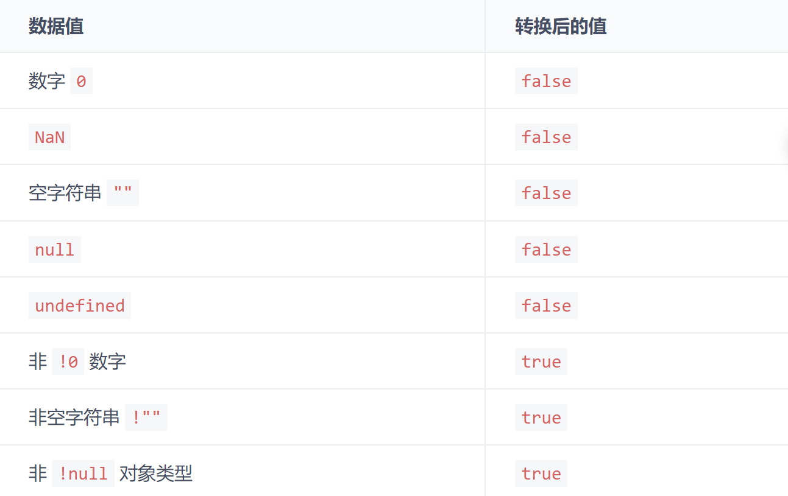
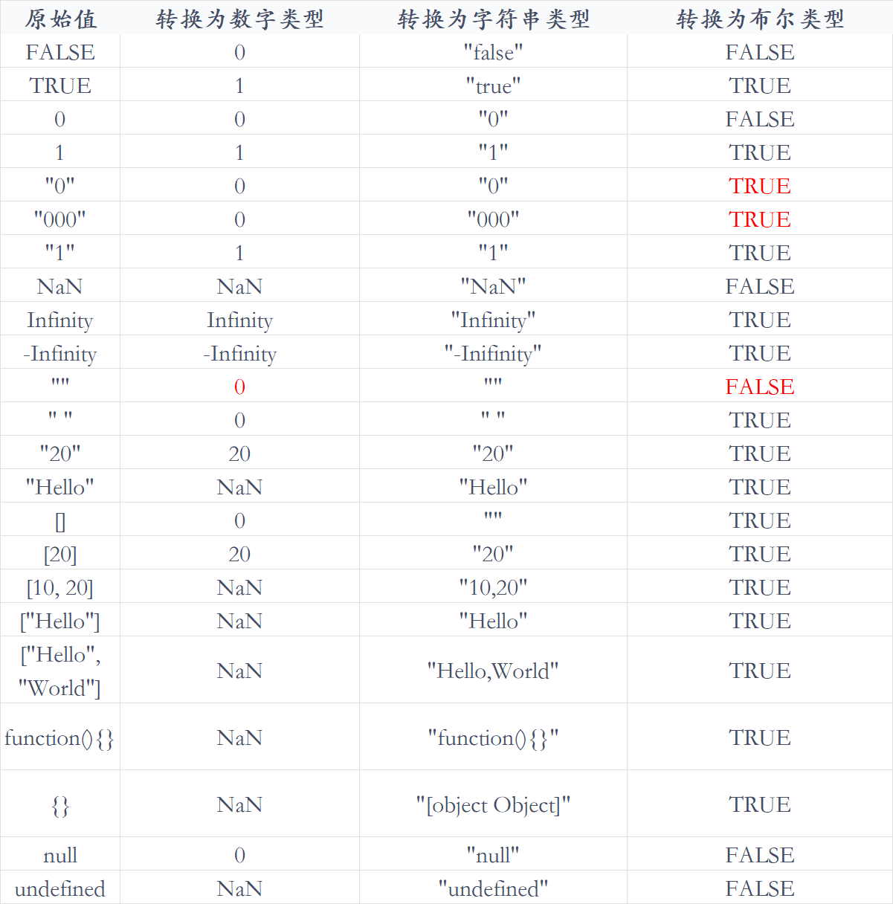

# 类型转换

## 类型转换

[https://tsejx.github.io/javascript-guidebook/basic-concept/data-types/type-conversion#%E9%9A%90%E5%BC%8F%E7%B1%BB%E5%9E%8B%E8%BD%AC%E6%8D%A2](https://tsejx.github.io/javascript-guidebook/basic-concept/data-types/type-conversion#%E9%9A%90%E5%BC%8F%E7%B1%BB%E5%9E%8B%E8%BD%AC%E6%8D%A2)

主要摘抄隐式类型转换，涉及到转换为 Boolean、Number、String 类型

JavaScript 中，当运算符在运算时，如果两边数据不统一，CPU 就无法运算，这时编译器会自动将运算符两边的数据做一个数据类型转换，转成相同的数据类型再计算

### 隐式类型转换——Boolean

值在逻辑判断和逻辑运算时会隐式转换为 Boolean



:::tip
使用 new 运算符创建的对象隐式转换为 Boolean 类型的值都是 true。
:::

两个连续非操作可以将一个数据强制转换为 Boolean 类型

```js
!!undefined;
// false

!!null;
// false

!!1;
// true

!!"";
// false

!!"Hello";
// true

!!{};
// true

!![];
// true

!!function () {};
// true
```

### 隐式类型转换——运行环境

很多内置函数期望传入的参数的数据类型是固定的，如 alert(value)，它期望传入的 value 为 String 类型，但是如果我们传入的是 Number 类型或者 Object 类型等非 String 类型的数据的时候，就会发生数据类型的隐式转换。这就是环境运行环境对数据类型转换的影响。

类似的方法还有：

- alert()

- parseInt()

### 隐式类型转换——运算符

#### 加号运算符

当加号运算符作为一元运算符运算值时，它会将该值转换为 Number 类型

```js
' ' +
// 0

'0' +
// 0

'10' +
// 10

'String' +
// NaN

true +
// 1

false +
// 0

undefined +
// 0

null +
// 0

[] +
// 0

![] +
// 0

[1] +
// 1

[1, 2] +
// NaN

[[1]] +
// 1

[[1, 2]] +
// NaN

{} +
// NaN

function () {};
// NaN

+'' +
// 0
```

当加号运算符作为`二元运算符`操作值时，它会根据两边值类型进行数据类型隐式转换

首先，当引用对象类型的值进行二元加号运算符运算时，会涉及到转换为原始数据类型的问题。事实上，当一个对象执行例如加法操作的时候，如果它是原始类型，那么就不需要转换。否则，将遵循以下规则：

- 调用实例的 valueOf() 方法，如果有返回的是基础类型，停止下面的过程；否则继续

- 调用实例的 toString() 方法，如果有返回的是基础类型，停止下面的过程；否则继续

- 都没返回原始类型，就会报错

如果运算符两边均为原始数据类型时，则按照以下规则解释：

- 字符串连接符：如果两个操作数中`只要存在一个操作数为 String 类型`，那么另一个操作数会调用 String() 方法转成字符串然后拼接

- 算术运算符：如果两个操作数`都不是 String 类型`，两个操作数会调用 Number() 方法隐式转换为 Number 类型（如果无法成功转换成数字，`则变为 NaN`，再往下操作），然后进行加法算术运算

值转换为 Number 类型和 String 类型都会遵循一个原则：如果该值为原始数据类型，则直接转换为 String 类型或 Number 类型。如果该值为引用数据类型，那么先通过固定的方法将复杂值转换为原始数据类型，再转为 String 类型或 Number 类型

:::tip
当 {} + 任何值 时， 前一个 {} 都会被 JavaScript 解释成空块并忽略他
:::

```js
"1" + 1             // "11"
"1" + "1"           // "11"
"1" + true          // "1true"
"1" + NaN           // "NaN"
"1" + []            // "1"
"1" + {}            // "1[object Object]"
"1" + function(){}  // "1function(){}"
"1" + new Boolean() // "1false"

1 + NaN             // NaN
1 + "true"          // "1true"
1 + true            // 2
1 + undefined       // NaN
1 + null            // 1

1 + []              // "1"
1 + [1, 2]          // "11,2"
1 + {}              // "1[object Object]"
1 + function(){}    // "1function(){}"
1 + Number()        // 1
1 + String()        // "1"

[] + []             // ""
{} + {}             // "[object Object][object Object]"
{} + []             // 0
{a: 0} + 1          // 1
[] + {}             // "[object Object]"
[] + !{}            // "false"
![] + []            // "false"
'' + {}             // "[object Object]"
{} + ''             // 0
[]["map"] + []      // "function map(){ [native code] }"
[]["a"] + []        // "undefined"
[][[]] + []         // "undefined"
+!![] + []          // 1
+!![]               // 1
1-{}                // NaN
1-[]                // 1
true - 1            // 0
{} - 1              // -1
[] !== []           // true
[]['push'](1)       // 1

(![]+[])[+[]]       // "f"
(![]+[])[+!![]]     // "a"
```

#### 相等运算符

- 如果其中一个操作值为`布尔值`，则在比较之前`先将其转换为数值`

- 如果其中一个操作值为字符串，另一个操作值为数值，则通过 Number() 函数将字符串`转换为数值`

- 如果其中一个操作值是对象，另一个不是，则调用对象的 `valueOf() 方法`，得到的结果按照前面的规则进行比较

- `null 与 undefined 是相等的`

- 如果一个操作值为 `NaN`，则返回 false

- 如果两个操作值都是对象，则比较它们`是不是指向同一个对象`

```js
"1" == true; // true
"1" == 1; // true
"1" == {}; // false
"1" == []; // false

undefined == undefined; // true
undefined == null; // true
nul == null; // true
```

#### 关系运算符

会把其他数据类型转换成 Number 之后再比较关系（除了 Date 类型对象）

- 如果两个操作值都是数值，则进行 数值 比较

- 如果两个操作值都是字符串，则比较字符串对应的 ASCII 字符编码值

- 多个字符则从左往右依次比较

- 如果`只有一个操作值是数值`，则将另一个操作值转换为数值，进行 `数值 比较`

- 如果一个操作数是对象，则调用 valueOf() 方法（如果对象没有 valueOf() 方法则调用 toString() 方法），得到的结果按照前面的规则执行比较

- 如果一个操作值是布尔值，则将其转换为 数值，再进行比较

:::tip
NaN 是非常特殊的值，它不和任何类型的值相等，包括它自己，同时它与任何类型的值比较大小时都返回 false
:::

```js
5 > 10;
// false

"2" > 10;
// false

"2" > "10";
// true

"abc" > "b";
// false

"abc" > "aad";
// true
```

### JavaScript 原始类型转换表


