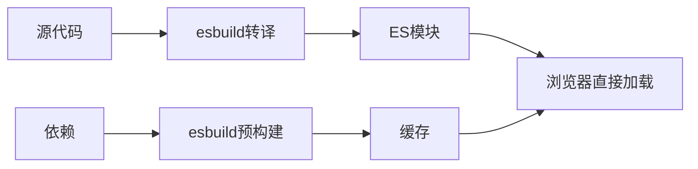

# Vite

## 什么是Vite

Vite（法语意为"快速的"）是一个现代化的前端构建工具，由Vue.js作者尤雨溪开发。它利用现代浏览器的ES模块特性和高效的构建工具，为开发者提供极速的开发体验和优化的生产构建。

### 设计理念

- **原生ES模块**：充分利用浏览器原生ES模块支持
- **按需编译**：只编译当前需要的模块
- **现代化工具链**：使用esbuild和Rollup等现代工具
- **开发体验优先**：专注于提升开发效率

### 核心组成

Vite主要由两部分组成：

1. **开发服务器**：基于原生ES模块提供极速的开发体验
2. **构建命令**：使用Rollup进行生产环境的优化打包

## 核心特性

### 1. 极速冷启动

传统打包工具需要处理整个应用才能启动开发服务器，而Vite采用了全新的方式：

```bash
# 传统方式（如Webpack）
Bundle based dev server: 
Entry → Bundle → Server Ready (需要打包整个应用)

# Vite方式
Native ESM based dev server:
Entry → Server Ready (服务器立即启动)
```

### 2. 即时模块热更新(HMR)

Vite的HMR基于原生ES模块：

```javascript
// 传统HMR：需要重新构建模块图
// Vite HMR：直接替换已修改的模块

if (import.meta.hot) {
  import.meta.hot.accept('./component.vue', (newModule) => {
    // 热更新逻辑
  })
}
```

### 3. 丰富的功能支持

- **TypeScript**：原生支持，无需配置
- **JSX**：内置React和Vue JSX支持
- **CSS预处理器**：支持Sass、Less、Stylus
- **PostCSS**：自动处理CSS前缀
- **静态资源**：智能资源处理和优化

## 双引擎架构

Vite采用了独特的双引擎架构，在不同环境使用不同的构建工具：


### 开发环境：esbuild + Native ESM



**esbuild的作用**：
- 依赖预构建（CommonJS → ES模块）
- TypeScript/JSX转译
- 极速编译（比传统工具快10-100倍）

### 生产环境：Rollup


**Rollup的优势**：
- 优秀的Tree Shaking
- 代码分割
- 成熟的插件生态
- 更小的bundle体积

## 依赖预构建

### 为什么需要预构建？

1. **模块格式转换**：将CommonJS/UMD转换为ES模块
2. **性能优化**：减少HTTP请求数量
3. **兼容性处理**：处理不规范的依赖包

### 预构建过程

```javascript
// vite.config.js
export default {
  optimizeDeps: {
    include: ['lodash-es', 'axios'],
    exclude: ['your-custom-package'],
    esbuildOptions: {
      target: 'es2020'
    }
  }
}
```

### 预构建示例

```bash
# 预构建前
node_modules/
├── lodash/          # CommonJS格式
├── react/           # 多个子模块
└── vue/             # 复杂的依赖结构

# 预构建后
node_modules/.vite/deps/
├── lodash.js        # 单个ES模块
├── react.js         # 合并的模块
└── vue.js           # 优化的依赖
```

## 基础使用

### 项目创建

```bash
# 使用create-vite创建项目
npm create vite@latest my-project

# 选择模板
✔ Project name: my-project
✔ Select a framework: › React
✔ Select a variant: › TypeScript

# 进入项目并安装依赖
cd my-project
npm install
npm run dev
```

### 支持的模板

```bash
# JavaScript框架
npm create vite@latest my-vue-app -- --template vue
npm create vite@latest my-react-app -- --template react
npm create vite@latest my-preact-app -- --template preact
npm create vite@latest my-lit-app -- --template lit
npm create vite@latest my-svelte-app -- --template svelte

# TypeScript版本
npm create vite@latest my-vue-ts-app -- --template vue-ts
npm create vite@latest my-react-ts-app -- --template react-ts

# 其他
npm create vite@latest my-vanilla-app -- --template vanilla
```

## 配置详解

### 基础配置

```javascript
// vite.config.js
import { defineConfig } from 'vite'
import vue from '@vitejs/plugin-vue'

export default defineConfig({
  plugins: [vue()],
  server: {
    port: 3000,
    open: true,
    cors: true
  },
  build: {
    outDir: 'dist',
    sourcemap: true,
    minify: 'esbuild'
  }
})
```

### 路径解析

```javascript
import { defineConfig } from 'vite'
import { resolve } from 'path'

export default defineConfig({
  resolve: {
    alias: {
      '@': resolve(__dirname, 'src'),
      'components': resolve(__dirname, 'src/components'),
      'utils': resolve(__dirname, 'src/utils')
    },
    extensions: ['.js', '.ts', '.jsx', '.tsx', '.json', '.vue']
  }
})
```

### 环境变量

```javascript
// .env.development
VITE_API_URL=http://localhost:3001
VITE_APP_TITLE=开发环境

// .env.production  
VITE_API_URL=https://api.example.com
VITE_APP_TITLE=生产环境

// 在代码中使用
console.log(import.meta.env.VITE_API_URL)
console.log(import.meta.env.MODE) // development 或 production
```

### CSS配置

```javascript
export default defineConfig({
  css: {
    // CSS预处理器配置
    preprocessorOptions: {
      scss: {
        additionalData: `@import "@/styles/variables.scss";`
      },
      less: {
        modifyVars: {
          '@primary-color': '#1890ff'
        }
      }
    },
    // CSS模块化
    modules: {
      localsConvention: 'camelCase'
    },
    // PostCSS配置
    postcss: {
      plugins: [
        require('autoprefixer'),
        require('cssnano')
      ]
    }
  }
})
```

## 插件系统

### 官方插件

#### @vitejs/plugin-react

```javascript
import { defineConfig } from 'vite'
import react from '@vitejs/plugin-react'

export default defineConfig({
  plugins: [
    react({
      // 启用React Fast Refresh
      fastRefresh: true,
      // JSX运行时
      jsxRuntime: 'automatic'
    })
  ]
})
```

#### @vitejs/plugin-vue

```javascript
import { defineConfig } from 'vite'
import vue from '@vitejs/plugin-vue'

export default defineConfig({
  plugins: [
    vue({
      // 自定义块支持
      customElement: true,
      // 模板编译选项
      template: {
        compilerOptions: {
          isCustomElement: tag => tag.startsWith('my-')
        }
      }
    })
  ]
})
```

#### @vitejs/plugin-legacy

```javascript
import { defineConfig } from 'vite'
import legacy from '@vitejs/plugin-legacy'

export default defineConfig({
  plugins: [
    legacy({
      targets: ['defaults', 'not IE 11']
    })
  ]
})
```

### 社区插件

#### vite-plugin-mock

```javascript
import { defineConfig } from 'vite'
import { viteMockServe } from 'vite-plugin-mock'

export default defineConfig({
  plugins: [
    viteMockServe({
      mockPath: 'mock',
      localEnabled: true
    })
  ]
})
```

#### vite-plugin-eslint

```javascript
import { defineConfig } from 'vite'
import eslint from 'vite-plugin-eslint'

export default defineConfig({
  plugins: [
    eslint({
      cache: false,
      include: ['src/**/*.ts', 'src/**/*.tsx', 'src/**/*.vue']
    })
  ]
})
```

#### vite-plugin-windicss

```javascript
import { defineConfig } from 'vite'
import WindiCSS from 'vite-plugin-windicss'

export default defineConfig({
  plugins: [
    WindiCSS()
  ]
})
```

## 静态资源处理

### 资源导入

```javascript
// 显式URL导入
import imgUrl from './img.png'
document.getElementById('hero-img').src = imgUrl

// 动态导入
const imgUrl = new URL('./img.png', import.meta.url).href

// 作为字符串导入
import imgUrl from './img.png?url'

// 内联为base64
import imgDataUri from './img.png?inline'
```

### 静态资源配置

```javascript
export default defineConfig({
  // 静态资源基础路径
  base: '/my-app/',
  
  // 构建配置
  build: {
    // 静态资源处理
    assetsDir: 'assets',
    assetsInlineLimit: 4096,
    
    // Rollup配置
    rollupOptions: {
      output: {
        assetFileNames: 'assets/[name].[hash].[ext]'
      }
    }
  }
})
```

### 静态目录

```bash
public/
├── favicon.ico
├── robots.txt
└── images/
    └── logo.png

# 访问方式

```

## 开发服务器

### 基本配置

```javascript
export default defineConfig({
  server: {
    host: '0.0.0.0', // 监听所有地址
    port: 3000,
    open: true, // 自动打开浏览器
    cors: true, // 启用CORS
    
    // 代理配置
    proxy: {
      '/api': {
        target: 'http://localhost:3001',
        changeOrigin: true,
        rewrite: (path) => path.replace(/^\/api/, '')
      }
    }
  }
})
```

### 中间件

```javascript
export default defineConfig({
  server: {
    middlewareMode: false,
    
    // 自定义中间件
    configureServer(server) {
      server.middlewares.use('/custom', (req, res, next) => {
        if (req.url === '/custom/test') {
          res.end('Custom middleware response')
        } else {
          next()
        }
      })
    }
  }
})
```

## 生产构建

### 构建配置

```javascript
export default defineConfig({
  build: {
    // 输出目录
    outDir: 'dist',
    
    // 生成sourcemap
    sourcemap: true,
    
    // 压缩方式
    minify: 'esbuild', // 'terser' | 'esbuild' | false
    
    // 启用/禁用CSS代码分割
    cssCodeSplit: true,
    
    // 自定义底层的Rollup打包配置
    rollupOptions: {
      input: {
        main: resolve(__dirname, 'index.html'),
        nested: resolve(__dirname, 'nested/index.html')
      },
      output: {
        manualChunks: {
          'react-vendor': ['react', 'react-dom'],
          'lodash': ['lodash-es']
        }
      }
    },
    
    // 构建后是否生成报告
    reportCompressedSize: false,
    
    // chunk大小警告限制
    chunkSizeWarningLimit: 1000
  }
})
```

### 多页面应用

```javascript
// vite.config.js
import { defineConfig } from 'vite'
import { resolve } from 'path'

export default defineConfig({
  build: {
    rollupOptions: {
      input: {
        main: resolve(__dirname, 'index.html'),
        admin: resolve(__dirname, 'admin/index.html'),
        mobile: resolve(__dirname, 'mobile/index.html')
      }
    }
  }
})
```

### 库模式构建

```javascript
// vite.config.js for library
import { defineConfig } from 'vite'

export default defineConfig({
  build: {
    lib: {
      entry: resolve(__dirname, 'lib/main.js'),
      name: 'MyLib',
      fileName: (format) => `my-lib.${format}.js`
    },
    rollupOptions: {
      // 确保外部化处理那些你不想打包进库的依赖
      external: ['vue', 'react'],
      output: {
        globals: {
          vue: 'Vue',
          react: 'React'
        }
      }
    }
  }
})
```

## 与其他工具对比

### Vite vs Webpack

| 特性 | Vite | Webpack |
|------|------|---------|
| **开发启动速度** | 极快（<1s） | 慢（10s+） |
| **热更新速度** | 极快 | 较慢 |
| **配置复杂度** | 简单 | 复杂 |
| **生态系统** | 快速发展 | 成熟丰富 |
| **学习成本** | 低 | 高 |
| **浏览器兼容** | 现代浏览器 | 全面兼容 |
| **生产构建** | Rollup | Webpack |
| **代码分割** | 优秀 | 强大 |
| **插件数量** | 中等 | 丰富 |

### 开发体验对比

```bash
# Webpack开发流程
源代码 → 解析依赖 → 打包所有模块 → 启动服务器 → 浏览器加载

# Vite开发流程  
启动服务器 → 浏览器请求 → 按需编译 → 返回ES模块
```

### 选择建议

#### 选择Vite的场景

- **新项目**：现代化的新项目
- **现代浏览器**：主要面向现代浏览器
- **开发体验**：追求极致的开发体验
- **Vue/React项目**：主流框架的项目
- **TypeScript项目**：大量使用TypeScript

#### 选择Webpack的场景

- **遗留项目**：已有的复杂Webpack配置
- **浏览器兼容**：需要支持旧浏览器
- **复杂需求**：特殊的构建需求
- **成熟生态**：依赖特定的Webpack插件
- **大型团队**：需要稳定的工具链

## 性能优化

### 开发环境优化

#### 1. 依赖预构建优化

```javascript
export default defineConfig({
  optimizeDeps: {
    // 强制预构建
    include: [
      'lodash-es',
      'axios',
      'element-plus'
    ],
    
    // 排除预构建
    exclude: [
      'your-custom-lib'
    ],
    
    // esbuild配置
    esbuildOptions: {
      target: 'es2020'
    }
  }
})
```

#### 2. 减少文件监听

```javascript
export default defineConfig({
  server: {
    watch: {
      ignored: [
        '**/node_modules/**',
        '**/.git/**',
        '**/dist/**'
      ]
    }
  }
})
```

### 生产环境优化

#### 1. 代码分割

```javascript
export default defineConfig({
  build: {
    rollupOptions: {
      output: {
        manualChunks: {
          // 将React相关库打包成一个chunk
          'react-vendor': ['react', 'react-dom', 'react-router-dom'],
          
          // 将UI库单独打包
          'ui-vendor': ['antd', '@ant-design/icons'],
          
          // 将工具库单独打包
          'utils-vendor': ['lodash-es', 'dayjs', 'axios']
        }
      }
    }
  }
})
```

#### 2. 压缩优化

```javascript
export default defineConfig({
  build: {
    minify: 'esbuild',
    
    rollupOptions: {
      plugins: [
        // 使用terser进行更aggressive的压缩
        process.env.NODE_ENV === 'production' && terser({
          compress: {
            drop_console: true,
            drop_debugger: true
          }
        })
      ].filter(Boolean)
    }
  }
})
```

#### 3. 资源优化

```javascript
export default defineConfig({
  build: {
    assetsInlineLimit: 4096, // 4kb以下内联为base64
    
    rollupOptions: {
      output: {
        // 静态资源分类
        assetFileNames: (assetInfo) => {
          const info = assetInfo.name.split('.')
          const ext = info[info.length - 1]
          if (/\.(mp4|webm|ogg|mp3|wav|flac|aac)$/.test(assetInfo.name)) {
            return `media/[name]-[hash].${ext}`
          }
          if (/\.(png|jpe?g|gif|svg)$/.test(assetInfo.name)) {
            return `images/[name]-[hash].${ext}`
          }
          if (/\.(woff2?|eot|ttf|otf)$/.test(assetInfo.name)) {
            return `fonts/[name]-[hash].${ext}`
          }
          return `assets/[name]-[hash].${ext}`
        }
      }
    }
  }
})
```

## 实际项目配置

### Vue 3项目完整配置

```javascript
// vite.config.js
import { defineConfig } from 'vite'
import vue from '@vitejs/plugin-vue'
import { resolve } from 'path'
import AutoImport from 'unplugin-auto-import/vite'
import Components from 'unplugin-vue-components/vite'
import { ElementPlusResolver } from 'unplugin-vue-components/resolvers'

export default defineConfig({
  plugins: [
    vue(),
    
    // 自动导入
    AutoImport({
      imports: ['vue', 'vue-router'],
      resolvers: [ElementPlusResolver()],
      dts: true
    }),
    
    // 组件自动导入
    Components({
      resolvers: [ElementPlusResolver()],
      dts: true
    })
  ],
  
  resolve: {
    alias: {
      '@': resolve(__dirname, 'src'),
      'components': resolve(__dirname, 'src/components'),
      'views': resolve(__dirname, 'src/views'),
      'utils': resolve(__dirname, 'src/utils'),
      'api': resolve(__dirname, 'src/api'),
      'assets': resolve(__dirname, 'src/assets')
    }
  },
  
  css: {
    preprocessorOptions: {
      scss: {
        additionalData: `@import "@/styles/variables.scss";`
      }
    }
  },
  
  server: {
    port: 3000,
    open: true,
    proxy: {
      '/api': {
        target: 'http://localhost:8080',
        changeOrigin: true,
        rewrite: (path) => path.replace(/^\/api/, '')
      }
    }
  },
  
  build: {
    outDir: 'dist',
    sourcemap: false,
    
    rollupOptions: {
      output: {
        manualChunks: {
          'vue-vendor': ['vue', 'vue-router', 'pinia'],
          'element-plus': ['element-plus'],
          'utils': ['lodash-es', 'dayjs']
        }
      }
    }
  }
})
```

### React项目完整配置

```javascript
// vite.config.js
import { defineConfig } from 'vite'
import react from '@vitejs/plugin-react'
import { resolve } from 'path'

export default defineConfig({
  plugins: [react()],
  
  resolve: {
    alias: {
      '@': resolve(__dirname, 'src'),
      'components': resolve(__dirname, 'src/components'),
      'pages': resolve(__dirname, 'src/pages'),
      'hooks': resolve(__dirname, 'src/hooks'),
      'utils': resolve(__dirname, 'src/utils'),
      'services': resolve(__dirname, 'src/services')
    }
  },
  
  server: {
    port: 3000,
    open: true,
    proxy: {
      '/api': {
        target: 'http://localhost:8080',
        changeOrigin: true
      }
    }
  },
  
  build: {
    rollupOptions: {
      output: {
        manualChunks: {
          'react-vendor': ['react', 'react-dom', 'react-router-dom'],
          'antd': ['antd', '@ant-design/icons'],
          'charts': ['echarts', 'recharts']
        }
      }
    }
  }
})
```

### TypeScript项目配置

```javascript
// vite.config.ts
import { defineConfig } from 'vite'
import react from '@vitejs/plugin-react'
import { resolve } from 'path'

export default defineConfig({
  plugins: [react()],
  
  resolve: {
    alias: {
      '@': resolve(__dirname, 'src'),
      '@types': resolve(__dirname, 'src/types')
    }
  },
  
  esbuild: {
    // 移除生产环境console
    drop: ['console', 'debugger']
  },
  
  build: {
    target: 'es2015',
    
    rollupOptions: {
      output: {
        manualChunks: (id) => {
          if (id.includes('node_modules')) {
            if (id.includes('react')) {
              return 'react-vendor'
            }
            if (id.includes('antd')) {
              return 'antd'
            }
            return 'vendor'
          }
        }
      }
    }
  }
})
```

## 迁移指南

### 从Webpack迁移

#### 1. 项目结构调整

```bash
# Webpack项目结构
src/
├── index.js
├── components/
public/
├── index.html
webpack.config.js

# Vite项目结构
src/
├── main.js  # 入口文件重命名
├── components/
public/
├── index.html  # 移到根目录
vite.config.js
```

#### 2. 入口文件调整

```html
<!-- public/index.html -->
<!DOCTYPE html>
<html>
<head>
  <title>My App</title>
</head>
<body>
  <div id="app"></div>
  <!-- Vite需要显式引入入口文件 -->
  <script type="module" src="/src/main.js"></script>
</body>
</html>
```

#### 3. 环境变量迁移

```javascript
// Webpack
process.env.REACT_APP_API_URL

// Vite
import.meta.env.VITE_API_URL
```

#### 4. 静态资源处理

```javascript
// Webpack
import logo from './logo.png'

// Vite (相同)
import logo from './logo.png'

// Webpack require
const logo = require('./logo.png')

// Vite动态导入
const logo = new URL('./logo.png', import.meta.url).href
```

### 常见问题解决

#### 1. CommonJS模块处理

```javascript
// vite.config.js
export default defineConfig({
  optimizeDeps: {
    include: ['legacy-package'] // 强制预构建CommonJS包
  },
  
  define: {
    global: 'globalThis' // 解决global undefined
  }
})
```

#### 2. Node.js polyfills

```javascript
// vite.config.js
import { defineConfig } from 'vite'
import { NodeGlobalsPolyfillPlugin } from '@esbuild-plugins/node-globals-polyfill'

export default defineConfig({
  optimizeDeps: {
    esbuildOptions: {
      plugins: [
        NodeGlobalsPolyfillPlugin({
          buffer: true,
          process: true
        })
      ]
    }
  }
})
```

## 最佳实践

### 1. 项目结构

```bash
my-vite-project/
├── public/
│   ├── favicon.ico
│   └── index.html
├── src/
│   ├── assets/          # 静态资源
│   ├── components/      # 公共组件
│   ├── hooks/          # 自定义hooks
│   ├── pages/          # 页面组件
│   ├── services/       # API服务
│   ├── stores/         # 状态管理
│   ├── styles/         # 样式文件
│   ├── utils/          # 工具函数
│   ├── types/          # TypeScript类型
│   ├── App.tsx
│   └── main.tsx
├── vite.config.ts
├── tsconfig.json
└── package.json
```

### 2. 开发规范

```javascript
// 统一的vite配置模板
import { defineConfig, loadEnv } from 'vite'

export default defineConfig(({ command, mode }) => {
  const env = loadEnv(mode, process.cwd(), '')
  
  return {
    plugins: [
      // 插件配置
    ],
    
    resolve: {
      alias: {
        '@': resolve(__dirname, 'src')
      }
    },
    
    server: {
      port: Number(env.VITE_PORT) || 3000,
      proxy: {
        '/api': env.VITE_API_BASE_URL
      }
    },
    
    build: {
      target: 'es2015',
      reportCompressedSize: false,
      
      rollupOptions: {
        output: {
          manualChunks: {
            'react-vendor': ['react', 'react-dom'],
            'router': ['react-router-dom'],
            'ui': ['antd']
          }
        }
      }
    }
  }
})
```

### 3. 性能监控

```javascript
// vite.config.js
import { defineConfig } from 'vite'
import { visualizer } from 'rollup-plugin-visualizer'

export default defineConfig({
  plugins: [
    // 生产环境分析包大小
    process.env.ANALYZE && visualizer({
      filename: 'dist/stats.html',
      open: true
    })
  ].filter(Boolean)
})
```

### 4. 环境配置

```bash
# .env.development
VITE_APP_TITLE=开发环境
VITE_API_BASE_URL=http://localhost:8080
VITE_ENABLE_MOCK=true

# .env.production
VITE_APP_TITLE=生产环境  
VITE_API_BASE_URL=https://api.example.com
VITE_ENABLE_MOCK=false

# .env.staging
VITE_APP_TITLE=测试环境
VITE_API_BASE_URL=https://staging-api.example.com
VITE_ENABLE_MOCK=false
```

## 常见问题

### 1. 为什么Vite在开发和生产环境使用不同的工具？

**开发环境使用esbuild**：
- 极速的编译速度
- 原生ES模块支持
- 适合快速迭代开发

**生产环境使用Rollup**：
- 更好的Tree Shaking
- 成熟的代码分割
- 更小的bundle体积
- 丰富的插件生态

### 2. Vite如何处理CSS？

```javascript
// CSS模块化
import styles from './component.module.css'

// CSS预处理器
import './styles.scss'

// PostCSS自动处理
// 自动添加浏览器前缀、压缩等

// CSS代码分割
// 自动将CSS提取到单独文件
```

### 3. 如何处理旧浏览器兼容？

```javascript
// 安装legacy插件
npm install @vitejs/plugin-legacy

// vite.config.js
import legacy from '@vitejs/plugin-legacy'

export default defineConfig({
  plugins: [
    legacy({
      targets: ['defaults', 'not IE 11']
    })
  ]
})
```

### 4. 开发环境首屏加载慢怎么办？

```javascript
// 优化依赖预构建
export default defineConfig({
  optimizeDeps: {
    include: [
      // 手动指定需要预构建的依赖
      'react',
      'react-dom',
      'antd',
      'lodash-es'
    ]
  }
})
```

## 总结

### 优势

- **极速开发体验**：冷启动快，热更新即时
- **现代化架构**：充分利用现代浏览器特性
- **简单配置**：开箱即用，配置简洁
- **优秀的生产构建**：基于Rollup的高质量打包
- **丰富的功能**：内置TypeScript、JSX、CSS预处理器支持
- **活跃的生态**：快速发展的插件生态

### 劣势

- **浏览器兼容性**：主要面向现代浏览器
- **生态相对较新**：某些特殊需求可能缺少插件
- **学习成本**：需要了解ES模块和新的开发模式
- **调试复杂**：开发和生产环境不一致可能带来问题

### 使用建议

#### 推荐使用Vite的情况

- **新项目**：现代化的新项目首选
- **Vue/React项目**：官方支持良好
- **TypeScript项目**：原生支持，体验优秀
- **追求开发体验**：需要快速开发迭代
- **现代浏览器**：主要面向现代浏览器用户

#### 谨慎使用Vite的情况

- **遗留项目**：复杂的Webpack配置迁移成本高
- **旧浏览器支持**：需要广泛的浏览器兼容性
- **特殊需求**：依赖特定的Webpack插件
- **大型团队**：需要稳定成熟的工具链

Vite代表了前端构建工具的发展方向，通过利用现代浏览器特性和高效的构建工具，为开发者提供了前所未有的开发体验。虽然还在快速发展中，但已经成为现代前端开发的重要选择。

## 参考资源

- [Vite官方文档](https://vitejs.dev/)
- [Vite GitHub仓库](https://github.com/vitejs/vite)
- [Awesome Vite](https://github.com/vitejs/awesome-vite)
- [Vite插件开发指南](https://vitejs.dev/guide/api-plugin.html)
- [从Webpack迁移到Vite指南](https://vitejs.dev/guide/migration.html)
