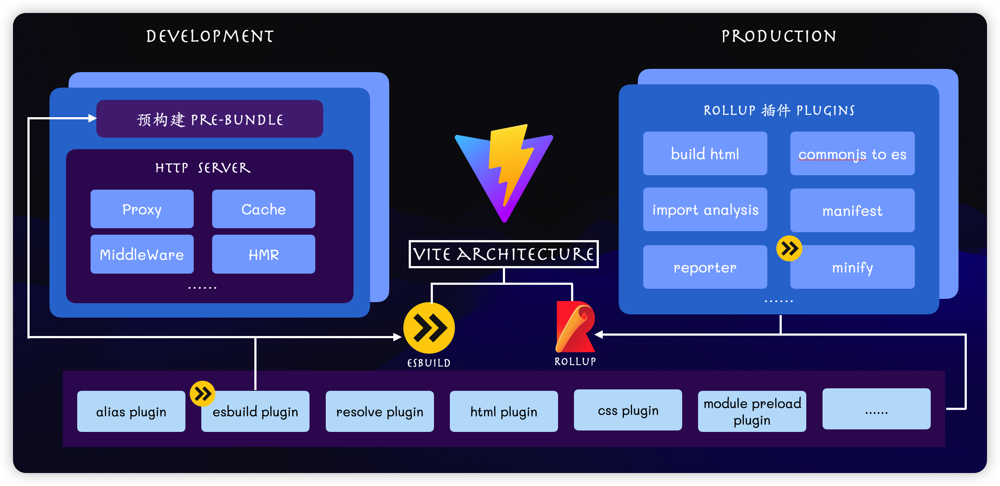

# Vite

## 概述

Vite 是一种新型前端构建工具，能够显著提升前端开发体验，vite 旨在为现代 web 开发提供极快的开发服务器启动速度和高效的构建性能，主要由两部分组成：

1、一个开发服务器，基于`原生ES模块`提供了丰富的内建功能，如速度快到惊人的模块热更新 HMR

2、一套构建指令，它使用 rollup 打包代码，并且是预配置的，可输出用于生产环境的高度优化过的静态资源

通过`利用现代浏览器的特性和高效的构建策略`，vite 大大提升了前端开发和构建的效率，被广泛认为的下一代前端开发工具

### 特点

1、快速的开发服务器启动

2、即时的模块热替换 HMR

3、优化的生产构建：生产环境使用 Rollup，支持代码拆分和 tree-shaking 等优化技术

4、丰富的插件生态：兼容 rollup 的插件系统

5、框架无关性

6、开箱即用

7、专门为现代开发环境涉及

### 缺点

1、开发环境下首屏加载变慢：由于 unbundle 机制， Vite 首屏期间需要额外做其它工作。不过首屏性能差只发生在 dev server 启动以后第一次加载页面时发生。之后再 reload 页面时，首屏性能会好很多。原因是 dev server 会将之前已经完成转换的内容缓存起来。

2、开发环境和生产环境构建方式不同

> 开发模式：通过 esbuild 转换代码和预构建
>
> 生产环境：rollup

3、rollup 限制：某些 webpack 中常用的功能和插件可能不直接支持，或者需要特定的配置才能实现

### nobundle 模式

`nobundle`是 vite 的一种工作模式，也被称为无打包模式，主要应用于开发阶段，在这种模式下，vite 不会像传统的打包工具（如 Webpack）那样对所有模块进行捆绑打包，而是直接使用浏览器原生的 ES 模块功能来加载和处理 JavaScript 文件

主要用于提升开发环境中的速度和灵活性，通过直接利用浏览器的 ES 模块支持，而不需要进行预打包

## 与 webpack 对比

### 定位不同

- vite 定位更轻量、快速，专注于开发体验和现代 web 应用的需求

- webpack 目标是成为一个功能强大、灵活的模块打包器，适合处理复杂的前端构建需求。具有高度的可配置性和扩展性，可以满足各种项目需求，因此更适合大型、复杂的项目

### 预设场景不同

- webpack 只针对打包功能，不预设使用场景，涉及的极其灵活

- vite 缩窄预设场景来降低复杂度，只预设了 web 的场景

### 开发模式的启动方式

- vite

> - 无打包模式：请求时按需加载模块，大大减少初次启动时间
>
> - 依赖预构建
>
> - 极快的启动时间

- webpack

> - 捆绑打包模式
>
> - 较慢的启动速度：启动时解析并打包整个项目的模块

### 构建生产环境

- vite

> - rollup 打包

- webpack

> - 集成化打包

### 配置复杂度

- vite

> 零配置上手

- webpack

> 配置灵活但复杂

### 模块热替换

- vite

> 即使模块热替换

- webpack

> 更新时需要重新打包，不如 vite 快

### 编译速度

- vite

> esbuild 编译器：速度快

- webpack

> 不如 vite 快

### 生态系统

#### webpack

#### vite

### 浏览器兼容性

Vite 在现代浏览器上的性能更优，而 Webpack 则在兼容性方面更加全面

- Vite 通过提供官方插件@vitejs/plugin-legacy 来支持旧版浏览器。这个插件会自动为不支持 ES 模块的浏览器注入必要的 polyfills，并且会生成两个版本的代码：一个用于现代浏览器，另一个用于旧版浏览器。这样，Vite 能够在不牺牲现代浏览器性能的同时，也为旧版浏览器提供支持。

- Webpack 通过配置 babel-loader 和@babel/preset-env 来实现代码的兼容性转换。开发者可以指定需要支持的浏览器版本，Webpack 会根据这些信息来决定是否需要转译代码。此外，Webpack 还可以通过配置 polyfill 来为旧浏览器提供缺失的 API 实现。

### 使用场景

#### vite

1、快速原型开发

2、单页面应用

3、现代框架支持

4、typescript 项目

#### webpack

1、复杂应用构建

2、多页面应用

3、丰富的插件系统

4、遗留的系统维护

### 框架支持

#### vite

1、原生支持 ES 模块

2、内置的框架支持

- vue：内置了对 Vue 的支持（通过插件），包括单文件组件（SFC）的处理等，几乎不需要额外配置即可使用

- react：内置了对 React 的支持，允许使用 JSX 和 TypeScript，并通过 esbuild 快速转换 React 代码

- 其他框架：大部分情况下，只需安装对应的插件即可

3、零配置或简单配置

#### webpack

1、通过 Loader 和插件支持

2、高度灵活但配置复杂

- vue：通过 vue-loader 来处理 vue 单文件组件 SFC，需要在配置文件配置 loader，并引入相应的插件来处理模板编译和热替换等

- react：通常与 babel 一起使用，通过 babel-loader 将 JSX 转换为 JavaScript，为了支持 react，需要安装多个 Babel 插件，并进行相应配置

- 其他框架：也需要相应的 loader 和插件支持，配置文件根据需求进行调整

## 双引擎架构

指的是在构建工具中同时使用 esbuild 和 rollup 两个现代构建引擎。这种架构使得 Vite 在开发阶段能够提供极快的热重载（HMR）和冷启动速度，同时在生产环境下生成优化的静态资源。

### 开发构建

1、插件处理

2、依赖预构建

3、浏览器请求

esbuild 任务：

1、快速解析并转换代码

2、直接利用浏览器的 ES 模块支持，避免模块打包和转译的开销

### 生产构建

1、rollup 构建和优化

2、代码分割和动态导入

3、资源处理

rollup 的任务：

1、插件机制

2、rollup 打包：tree-shaking，减少无用代码、打包成更少的文件，减低浏览器请求次数

3、代码拆分：支持按需加载，可以根据路由或者页面模块进行动态加载，优化首屏加载速度和整体性能

4、静态资源处理：自动优化，压缩静态资源

### 优势

1、极快的冷启动

2、模块热更新更高效

3、按需编译

4、生产环境高效打包

## 使用

## 参考

[https://guide.duanhl.com/advanced/vite/](https://guide.duanhl.com/advanced/vite/)
