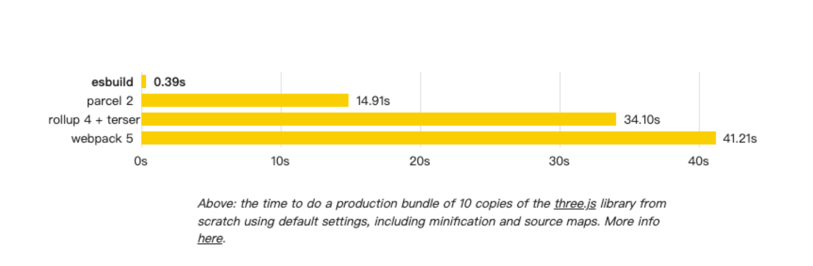

# Esbuild

## 什么是esbuild

esbuild是一个极速的JavaScript和TypeScript构建工具，由Figma创始人Evan Wallace用Go语言开发。它的核心目标是创建一个快速、现代且易用的构建工具，重新定义前端构建工具的性能标准。

### 设计理念

- **极致性能**：比传统工具快10-100倍
- **开箱即用**：零配置即可使用
- **现代标准**：原生支持ES6+、TypeScript、JSX
- **简单易用**：API设计简洁明了

## 核心特性

### 1. 极速构建

esbuild的构建速度是其最大亮点：



**性能对比**（构建three.js库）：
- Esbuild: 0.37s
- Rollup: 1.61s  
- Webpack: 13.71s
- Parcel: 15.98s

### 2. 内置功能

- **TypeScript转译**：无需额外配置
- **JSX转换**：支持React/Preact等
- **代码分割**：动态导入支持
- **Tree Shaking**：移除未使用代码
- **代码压缩**：内置压缩优化
- **Source Maps**：调试信息生成

### 3. 多种输出格式

- **IIFE**：浏览器直接使用
- **CommonJS**：Node.js环境
- **ES Modules**：现代模块系统

## 为什么这么快？

### 1. Go语言实现

```go
// esbuild核心用Go语言编写
// 具备天然的并发优势和高效内存管理
func main() {
    // 并行处理多个文件
    var wg sync.WaitGroup
    for _, file := range files {
        wg.Add(1)
        go func(f string) {
            defer wg.Done()
            processFile(f)
        }(file)
    }
    wg.Wait()
}
```

### 2. 多核并行处理

- **文件级并行**：同时处理多个文件
- **任务级并行**：解析、转换、优化并行执行
- **CPU密集优化**：充分利用多核CPU

### 3. 内存优化

- **最小化I/O**：减少磁盘读写操作
- **内存缓存**：尽可能保存在内存中
- **零拷贝**：避免不必要的数据复制

### 4. 高效架构

- **单一二进制**：无需Node.js运行时
- **直接源码处理**：无中间转换步骤
- **优化的AST解析**：高性能语法分析

## 基础使用

### 安装

```bash
# npm安装
npm install --save-dev Esbuild

# 全局安装
npm install -g Esbuild

# 使用npx
npx Esbuild --version
```

### 命令行使用

#### 基本构建

```bash
# 构建单个文件
Esbuild app.js --bundle --outfile=out.js

# 指定输出格式
Esbuild app.js --bundle --outfile=out.js --format=esm

# 开发模式构建
Esbuild app.js --bundle --outfile=out.js --sourcemap --watch

# 生产模式构建
Esbuild app.js --bundle --outfile=out.js --minify
```

#### 常用选项

```bash
# TypeScript支持
Esbuild app.ts --bundle --outfile=out.js

# JSX支持
Esbuild app.jsx --bundle --outfile=out.js --jsx=automatic

# 多入口构建
Esbuild src/home.js src/about.js --bundle --outdir=dist

# 外部依赖
Esbuild app.js --bundle --outfile=out.js --external:react

# 目标环境
Esbuild app.js --bundle --outfile=out.js --target=es2020

# 开发服务器
Esbuild app.js --bundle --outfile=out.js --servedir=public --serve=8000
```

## API使用

### Node.js API

#### 基础构建

```javascript
const Esbuild = require('Esbuild');

// 基本构建
Esbuild.build({
  entryPoints: ['src/app.js'],
  bundle: true,
  outfile: 'dist/out.js',
  format: 'esm',
  target: 'es2020'
}).then(result => {
  console.log('构建完成');
}).catch(err => {
  console.error('构建失败:', err);
});
```

#### 高级配置

```javascript
const Esbuild = require('Esbuild');

async function build() {
  try {
    const result = await Esbuild.build({
      entryPoints: ['src/index.ts'],
      bundle: true,
      outfile: 'dist/bundle.js',
      format: 'esm',
      target: ['es2020', 'chrome58', 'firefox57', 'safari11'],
      minify: true,
      sourcemap: true,
      splitting: true,
      outdir: 'dist',
      external: ['react', 'react-dom'],
      define: {
        'process.env.NODE_ENV': '"production"',
        '__VERSION__': '"1.0.0"'
      },
      loader: {
        '.png': 'dataurl',
        '.svg': 'text'
      },
      resolveExtensions: ['.tsx', '.ts', '.jsx', '.js'],
      tsconfig: './tsconfig.json'
    });
    
    console.log('构建成功:', result);
  } catch (error) {
    console.error('构建失败:', error);
    process.exit(1);
  }
}

build();
```

#### 监听模式

```javascript
const Esbuild = require('Esbuild');

async function watchBuild() {
  const ctx = await Esbuild.context({
    entryPoints: ['src/app.js'],
    bundle: true,
    outfile: 'dist/out.js',
    format: 'esm'
  });

  // 监听文件变化
  await ctx.watch();
  console.log('监听模式已启动...');

  // 启动开发服务器
  const { host, port } = await ctx.serve({
    servedir: 'public',
    port: 3000
  });
  console.log(`开发服务器运行在 http://${host}:${port}`);
}

watchBuild();
```

### Transform API

```javascript
const Esbuild = require('Esbuild');

// 转换单个文件内容
const result = Esbuild.transformSync(`
  let message: string = "Hello, TypeScript!";
  console.log(message);
`, {
  loader: 'ts',
  target: 'es2015'
});

console.log(result.code);
// 输出: let message = "Hello, TypeScript!"; console.log(message);
```

## 配置选项详解

### 输入输出配置

```javascript
{
  // 入口文件
  entryPoints: ['src/index.js'],
  
  // 或者多入口
  entryPoints: {
    home: 'src/home.js',
    about: 'src/about.js'
  },
  
  // 输出文件
  outfile: 'dist/bundle.js',
  
  // 或者输出目录
  outdir: 'dist',
  
  // 输出格式
  format: 'esm', // 'iife' | 'cjs' | 'esm'
  
  // 全局变量名（IIFE格式）
  globalName: 'MyLibrary'
}
```

### 构建选项

```javascript
{
  // 启用打包
  bundle: true,
  
  // 代码分割
  splitting: true,
  
  // 代码压缩
  minify: true,
  
  // 生成sourcemap
  sourcemap: true, // true | 'inline' | 'external'
  
  // 目标环境
  target: ['es2020', 'chrome80', 'firefox75'],
  
  // 平台
  platform: 'browser', // 'browser' | 'node' | 'neutral'
  
  // 外部依赖
  external: ['react', 'lodash']
}
```

### 文件处理

```javascript
{
  // 文件加载器
  loader: {
    '.png': 'file',
    '.svg': 'dataurl',
    '.txt': 'text',
    '.css': 'css'
  },
  
  // 解析扩展名
  resolveExtensions: ['.tsx', '.ts', '.jsx', '.js', '.json'],
  
  // 路径别名
  alias: {
    '@': path.resolve(__dirname, 'src'),
    'utils': path.resolve(__dirname, 'src/utils')
  }
}
```

### 环境变量和宏定义

```javascript
{
  define: {
    'process.env.NODE_ENV': '"production"',
    '__DEV__': 'false',
    '__VERSION__': '"1.0.0"',
    'DEBUG': 'console.log'
  }
}
```

## 插件系统

### 内置插件功能

esbuild没有传统意义上的插件系统，但提供了一些内置的转换能力：

```javascript
{
  // JSX配置
  jsx: 'automatic', // 'transform' | 'preserve' | 'automatic'
  jsxFactory: 'React.createElement',
  jsxFragment: 'React.Fragment',
  
  // TypeScript配置
  tsconfig: './tsconfig.json',
  
  // CSS配置
  cssTarget: 'chrome80'
}
```

### 社区插件

虽然esbuild原生插件较少，但有一些社区解决方案：

```javascript
// Esbuild-plugin-postcss
const postcss = require('Esbuild-plugin-postcss');

Esbuild.build({
  entryPoints: ['src/app.js'],
  bundle: true,
  outfile: 'dist/out.js',
  plugins: [
    postcss({
      plugins: [
        require('autoprefixer'),
        require('cssnano')
      ]
    })
  ]
});
```

## 实际项目配置

### React项目配置

```javascript
// build.js
const Esbuild = require('Esbuild');
const path = require('path');

const isProduction = process.env.NODE_ENV === 'production';

async function build() {
  const ctx = await Esbuild.context({
    entryPoints: ['src/index.tsx'],
    bundle: true,
    outdir: 'dist',
    format: 'esm',
    target: ['es2020', 'chrome80', 'firefox75', 'safari13'],
    minify: isProduction,
    sourcemap: !isProduction,
    splitting: true,
    jsx: 'automatic',
    define: {
      'process.env.NODE_ENV': JSON.stringify(process.env.NODE_ENV)
    },
    loader: {
      '.png': 'file',
      '.jpg': 'file',
      '.svg': 'dataurl',
      '.css': 'css'
    },
    external: isProduction ? [] : ['react', 'react-dom'],
    alias: {
      '@': path.resolve(__dirname, 'src')
    },
    publicPath: '/assets/'
  });

  if (isProduction) {
    await ctx.rebuild();
    console.log('构建完成');
    process.exit(0);
  } else {
    await ctx.watch();
    
    const { host, port } = await ctx.serve({
      servedir: 'public',
      port: 3000,
      fallback: 'public/index.html'
    });
    
    console.log(`开发服务器启动: http://${host}:${port}`);
  }
}

build().catch(err => {
  console.error(err);
  process.exit(1);
});
```

### TypeScript库配置

```javascript
// build-lib.js
const Esbuild = require('Esbuild');

async function buildLibrary() {
  // ES模块版本
  await Esbuild.build({
    entryPoints: ['src/index.ts'],
    bundle: true,
    outfile: 'dist/index.esm.js',
    format: 'esm',
    target: 'es2020',
    external: ['react', 'react-dom'],
    sourcemap: true
  });

  // CommonJS版本
  await Esbuild.build({
    entryPoints: ['src/index.ts'],
    bundle: true,
    outfile: 'dist/index.cjs.js',
    format: 'cjs',
    target: 'es2015',
    external: ['react', 'react-dom'],
    sourcemap: true
  });

  // UMD版本（浏览器使用）
  await Esbuild.build({
    entryPoints: ['src/index.ts'],
    bundle: true,
    outfile: 'dist/index.umd.js',
    format: 'iife',
    globalName: 'MyLibrary',
    target: 'es2015',
    minify: true,
    external: ['react', 'react-dom'],
    define: {
      'process.env.NODE_ENV': '"production"'
    }
  });

  console.log('库构建完成');
}

buildLibrary();
```

### Node.js项目配置

```javascript
// build-node.js
const Esbuild = require('Esbuild');

Esbuild.build({
  entryPoints: ['src/server.ts'],
  bundle: true,
  outfile: 'dist/server.js',
  format: 'cjs',
  platform: 'node',
  target: 'node16',
  external: [
    // 排除Node.js内置模块
    'fs', 'path', 'http', 'https', 'crypto',
    // 排除生产依赖
    'express', 'mongoose'
  ],
  sourcemap: true,
  minify: false // Node.js通常不需要压缩
}).then(() => {
  console.log('Node.js应用构建完成');
});
```

## 与其他工具对比

### 性能对比

| 工具 | 构建时间 | 包大小 | 内存使用 |
|------|----------|--------|----------|
| **Esbuild** | 0.37s | 142KB | 8MB |
| Rollup | 1.61s | 139KB | 105MB |
| Webpack | 13.71s | 142KB | 215MB |
| Parcel | 15.98s | 183KB | 157MB |

### 功能对比

| 特性 | Esbuild | Webpack | Rollup | Vite |
|------|---------|---------|--------|------|
| **构建速度** | 极快 | 慢 | 快 | 快 |
| **配置复杂度** | 简单 | 复杂 | 中等 | 简单 |
| **插件生态** | 少 | 丰富 | 中等 | 中等 |
| **Tree Shaking** | 基础 | 强大 | 强大 | 强大 |
| **代码分割** | 基础 | 强大 | 中等 | 强大 |
| **热更新** | 基础 | 强大 | 需插件 | 强大 |
| **生产就绪** | 部分 | 是 | 是 | 是 |

## 在Vite中的应用

Vite在多个关键环节使用了esbuild：

### 1. 依赖预构建

```javascript
// vite.config.js
export default {
  optimizeDeps: {
    // Vite使用esbuild预构建依赖
    include: ['lodash-es', 'vue'],
    esbuildOptions: {
      target: 'es2020'
    }
  }
}
```

### 2. TypeScript转译

```typescript
// Vite使用esbuild转译TypeScript
// 比tsc快20-30倍，但不进行类型检查
const message: string = 'Hello, World!';
console.log(message);
```

### 3. 生产构建

```javascript
// vite.config.js
export default {
  build: {
    // 可以选择使用esbuild进行压缩
    minify: 'Esbuild',
    target: 'es2015'
  }
}
```

## 限制和注意事项

### 1. 不支持的功能

- **ES5降级**：无法输出ES5代码
- **装饰器**：不支持TypeScript装饰器
- **复杂宏**：不支持复杂的编译时宏
- **类型检查**：不进行TypeScript类型检查

### 2. 生态限制

- **插件少**：相比Webpack插件生态较少
- **自定义loader**：缺少复杂的文件处理能力
- **Vue SFC**：不原生支持Vue单文件组件

### 3. 解决方案

```bash
# TypeScript类型检查
npm run type-check  # tsc --noEmit

# 使用Vite获得更好的开发体验
npm create vite@latest my-project

# 大型项目考虑Webpack
npm install webpack webpack-cli
```

## 最佳实践

### 1. 开发环境优化

```javascript
// dev-server.js
const Esbuild = require('Esbuild');

async function startDevServer() {
  const ctx = await Esbuild.context({
    entryPoints: ['src/index.tsx'],
    bundle: true,
    outdir: 'dist',
    format: 'esm',
    sourcemap: true,
    define: {
      'process.env.NODE_ENV': '"development"'
    }
  });

  await ctx.watch();
  
  const server = await ctx.serve({
    servedir: 'public',
    port: 3000,
    fallback: 'public/index.html'
  });

  console.log(`Server: http://localhost:${server.port}`);
}
```

### 2. 多环境配置

```javascript
// config/Esbuild.config.js
const path = require('path');

const createConfig = (env) => ({
  entryPoints: ['src/index.ts'],
  bundle: true,
  outdir: 'dist',
  format: 'esm',
  target: 'es2020',
  sourcemap: env !== 'production',
  minify: env === 'production',
  define: {
    'process.env.NODE_ENV': JSON.stringify(env),
    '__DEV__': env !== 'production'
  },
  external: env === 'development' ? ['react', 'react-dom'] : [],
  alias: {
    '@': path.resolve(__dirname, '../src')
  }
});

module.exports = { createConfig };
```

### 3. 构建脚本

```json
// package.json
{
  "scripts": {
    "dev": "node scripts/dev.js",
    "build": "node scripts/build.js",
    "build:watch": "node scripts/build.js --watch",
    "preview": "node scripts/preview.js",
    "type-check": "tsc --noEmit"
  }
}
```

## 使用场景

### 适合的场景

1. **现代Web应用**
   - 主要使用ES6+语法
   - TypeScript项目
   - React/Vue3项目

2. **JavaScript库开发**
   - npm包构建
   - 工具库打包
   - 组件库构建

3. **快速原型**
   - 快速验证想法
   - 小型项目
   - 学习项目

4. **构建工具的底层**
   - Vite的依赖预构建
   - 其他工具的加速器

### 不适合的场景

1. **需要ES5支持的项目**
   - 老旧浏览器兼容
   - IE支持需求

2. **复杂的构建需求**
   - 复杂的资源处理
   - 需要大量插件的项目

3. **大型企业级应用**
   - 需要丰富的工具链
   - 复杂的代码分割需求

## 总结

### 优势

- **极速构建**：比传统工具快10-100倍
- **零配置**：开箱即用，配置简单
- **现代标准**：原生支持ES6+、TypeScript、JSX
- **内存高效**：资源消耗低
- **并行处理**：充分利用多核CPU

### 劣势

- **生态有限**：插件和工具较少
- **功能限制**：不支持ES5、装饰器等
- **类型检查**：需要额外工具进行TypeScript类型检查
- **复杂需求**：难以满足复杂的构建需求

### 使用建议

- **现代项目首选**：对于新项目，特别是TypeScript项目
- **与其他工具结合**：可以作为Vite等工具的底层引擎
- **渐进式采用**：可以在现有项目的特定部分使用
- **开发环境优化**：即使生产环境使用其他工具，开发环境也可以考虑esbuild

esbuild代表了前端构建工具的未来趋势，虽然目前还有一些限制，但其出色的性能和简洁的设计使其在现代前端开发中越来越重要。

## 参考资源

- [esbuild官方文档](https://Esbuild.github.io/)
- [Esbuild GitHub仓库](https://github.com/evanw/Esbuild)
- [Vite官方文档](https://vitejs.dev/)
- [esbuild性能基准测试](https://Esbuild.github.io/faq/#benchmark-details)
