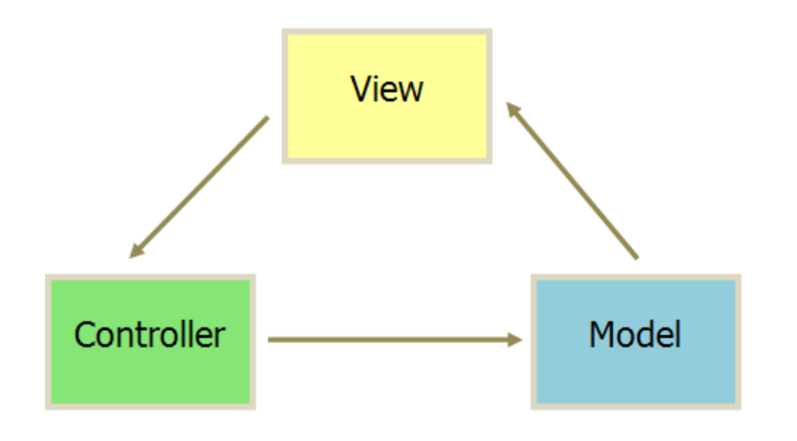
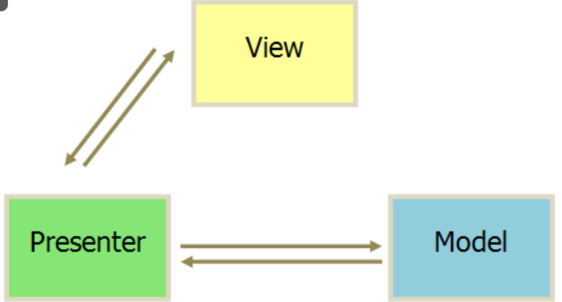
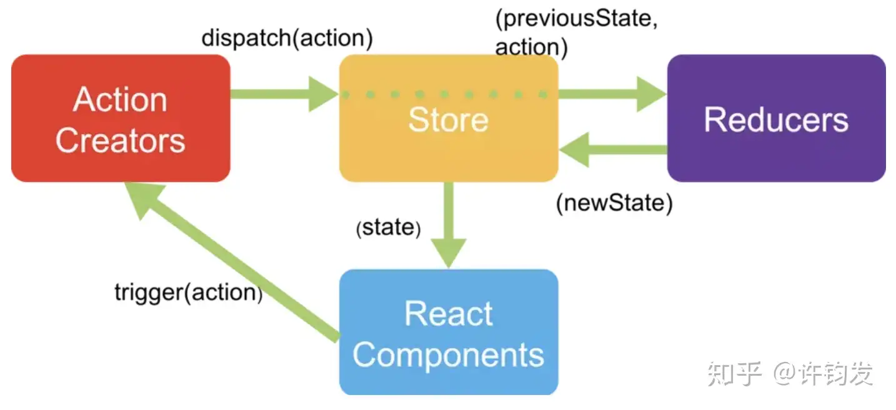
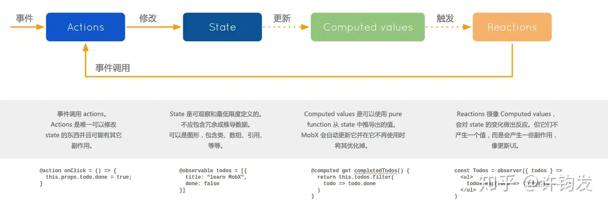

# 架构

## 架构 --- MVC/MVP/MVVM

### MVC

Model-View-Controller 是最常见的软件架构之一

MVC 模式的意思是软件可以分为三个部门

- View 视图：用户界面

- Controller 控制器：业务逻辑

- Model 模型：数据保存



各部分通信都是单向的：

1、View 传送指令到 Controller

2、Controller 完成业务逻辑后，要求 Model 改变状态

3、Model 将新的数据发送到 View，用户得到反馈

#### MVC 互动模式

接收用户指令时，MVC 可以分成两种方式，一种是通过 View 接受指令，传递给 Controller


另一种是直接通过 controller 接受指令


#### 实际项目更加灵活：Backbone


1、用户可以向 View 发送指令（DOM 事件），再由 View 直接要求 Model 改变状态

2、用户也可以直接向 Controller 发送指令（改变 URL 触发 hashChange 事件），再由 Controller 发送给 View

3、`Controller非常薄，只起到路由的作用，而View非常厚，业务逻辑都部署在View。所以，Backbone 索性取消了 Controller，只保留一个 Router（路由器）`

### MVP

MVP 是将 Controller 改为 Presenter，同时改变了通信方向



1、各部分之间的通信，都是双向的

2、View 与 Model 不发生联系，都通过 Presenter 传递

3、View 非常薄，不部署任何业务逻辑，称为"被动视图"（Passive View），即没有任何主动性，而 Presenter 非常厚，所有逻辑都部署在那里

### MVVM

MVVM 模式将 Presenter 改为 ViewModel，基本上与 MVP 一致


唯一的区别是，采用双向绑定 data-binding：View 的变动，自动反映在 ViewModel，反之亦然

### Flux 架构

Flux 是一种架构思想，专门解决软件的结构问题，它跟 MVC 架构是同一类东西，但是更加简洁清晰

**Vuex 和 Redux 都是从 Flux 中衍生出来**

Flux 将一个应用分为四个部分

- View：视图层

- Action（动作）：视图层发出的消息

- Dispatcher（派发器）：用来接收 actions、执行回调函数

- Store（数据层）：用来存放应用的状态，一旦发生变动，就提醒 Views 要更新页面


最大的特点是数据的“单向流动”

1、用户访问 View

2、View 发出用户的 Action

3、Dispatcher 收到 Action，要求 Store 进行相应的更新

4、Store 更新后，发出一个“change”事件

5、View 收到“change”事件后，更新页面

> Flux 单向数据流，在单向数据流下，状态的变化是可预测的：如果 store 中的数据发生了变化，那么一定是由 Dispatcher 派生的 Action 触发的，这样的关系非常有助于 debug 以及避免混乱的数据关系

### Redux

- Store：存储应用 state 以及用于触发 state 更新的 dispatch 方法等，整个应用仅有单一的 store。store 提供几个 API：

> - store.getState()：获取当前 state
>
> - store.dispatch(action)：用于 View 发出 Action
>
> - store.subscribe(listener)：设置监听函数，一旦 state 变化则执行该函数，若把视图更新函数作为 listener 传入，则可触发视图自动渲染

- Action：同 Flux，action 是用于更新 state 的消息对象，由 view 发出

- Reducer：是一个用于改变 state 的纯函数（对于相同的参数返回相同的返回结果，不修改参数，不依赖外部变量），即通过应用状态与 action 推导出新的 state：`(previousState, action)=>newState`，Reducer 返回一个新的 state。



特点：

- 单向数据流

- 单一数据源

- state 是制度的，每次状态更新之后只能返回一个新的 state

- 没有 dispatcher，而是在 store 中继承了 dispatch 方法，`store.dispatch()`是 view 发出 action 的唯一途径

#### Middleware

即中间件，在 Redux 中应用于异步数据流

Redux 的 middleware 是对 store.dispatch()进行了封装之后的方法，可以使 dispatch 传递 action 以外的函数或者 promise，通过 applyMiddleware 方法应用中间件（middleware 链中的最后一个 middleware 开始 dispatch action 时，这个 action 必须是一个普通对象）

```js
const store = createStore(
  reducer,
  // 依次执行
  applyMiddleware(thunk, promise, logger)
);
```

### Vuex

Vuex 是一个 vue.js 的状态管理模式

- Store：采用单一状态树，每个应用仅有一个 store 实例，在该实例下包含了 state，actions，mutations，getters，modules

- State：Vuex 为单一数据源

- Getter：Getter 的作用与 filters 有一些相似，可以将 state 进行过滤后输出

- Mutation：Mutation 是 vuex 中改变 State 的唯一途径（严格模式下），并且只能是同步操作。Vuex 中通过 store.commit()调用 Mutation

- Action：一些对 state 的异步操作可以放在 action 中，并通过在 action 提交 mutation 变更状态

- Module：当 Store 对象过于庞大时，可根据具体的业务需求分为多个 Module ，每个 Module 都具有自己的 state 、mutation 、action 、getter


### Mobx

MobX 背后的哲学是:

任何源自应用状态的东西都应该自动地获得

意思就是，当状态改变时，所有应用到状态的地方都会自动更新。

- State: 驱动应用的数据

- Computed values: 计算值。如果你想创建一个基于当前状态的值时，请使用 computed

- Reactions: 反应，当状态改变时自动发生

- Actions: 动作，用于改变 State

- 依赖收集（autoRun）: MobX 中的数据以来基于观察者模式，通过 autoRun 方法添加观察者


