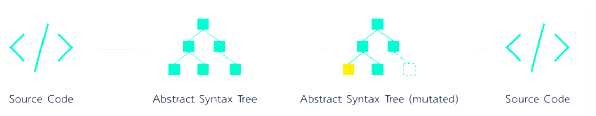
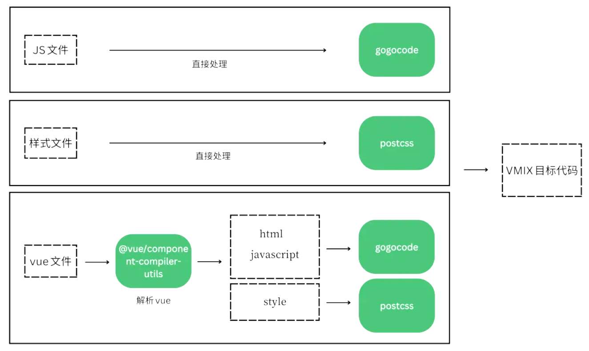

# 代码迁移

## 问题背景

项目研发过程中，经常遇到技术架构迭代更新的需求，通过技术的迭代更新，让项目从新的技术特性中受益。如 Vue2 迁移至 Vue3、Webpack4 升级 Webpack5、构建工具迁移至 Vite 等。

但很多新的技术迭代版本并不能完全向下兼容，包含了很多非兼容性的改变（Breaking Changes），并不是简单升个版本就行了，通常还需要投入不少的人力和学习成本。例如 Vue 3 只能兼容 80%的 Vue 2 代码，对于一些新特性、新语法糖，开发者只能参考官方提供的迁移文档，手动完成迁移。

虽然对于小型项目只需要动几行代码即可，但当项目规模足够大，或者有大量项目都需要类似代码迁移时，工作量会变得巨大，并且很难规避手动迁移带来的风险

所以，一般针对大规模的项目迁移，最好的方式还是写个脚手架工具，协助完成自动化迁移，既能提高效率，又能降低人工迁移的风险

## 代码迁移思路

> 对原代码做静态代码分析，并按照一定规则替换为新代码，最直观的方法是利用正则表达式来匹配和替换代码

### 思路一：利用正则表达式匹配规则和替换代码

例子：

```js
import { toast } from '@vivo/v-jsbridge'
<!-- 替换为 -->
import { toast } from '@webf/webf-vue-render'
```

则可使用：

```js
const regx = /\@vivo\/v\-jsbridge/gi const target = '@webf/webf-vue-render' sourceCode.replace(regx, target)
```

但是在实际操作中，正则表达式太局限，有几个核心问题：

- 正则表达式完全基于字符串匹配，对原代码格式的统一性要求很高。空格、换行、单双引号等格式差异都可能引起匹配错误。

- 面对复杂的匹配场景，正则表达式很难写、很晦涩、容易误匹配、误处理

- 处理样式文件时，需要兼容 CSS/Less/SCSS/Sass 等语法错误，工作量倍增

所以，用简单的正则匹配规则无法帮助我们完成大规模的代码迁移和重构，需要更好的方法：基于 AST 的代码迁移

### 思路二：基于 AST（抽象语法树）的代码迁移

Babel 的编译过程：

- 解析：将源代码解析为 AST

- 变换：对 AST 进行变换

- 再建：根据变换后的 AST 重新构建生成新的代码



基于 AST 代码迁移与正则表达式匹配的好处：

- 比字符串匹配更灵活、涵盖更多复杂场景

- 通常 AST 代码迁移工具都提供了方便的解析、查询、匹配、替换的 API，能轻易写出高效的代码转换规则

- 方便统一转换后的代码风格

#### 代码迁移流程设计

至少包括以下几种内容（脚本、样式、HTML）：

- 单独的 JS 文件

- 单独的样式文件：CSS/Less/SCSS/Sass

- Vue 文件：包含 Template、Script、Style 三部分

需要分别找到各类文件内容对应的解析和处理工具：

1、JS 文件的解析处理工具

> 市面上比较流行的 JS AST 工具有很多种选择，例如最常见的 Babel，jscodeshift 以及 Esprima、Recast、Acorn、estraverse 等，但这些工具都有一些共通的缺陷：
>
> - 上手难度大，有较大的学习成本，要求开发者充分了解 AST 的语法规范；
>
> - 语法复杂，代码量大；
>
> - 代码可读性差，不利于维护；

> 一个更简洁、更高效的 AST 工具：GoGoCode，是一款阿里开源的 AST 工具，封装了类似 jQuery 的语法，简单易用。

2、单独 CSS 样式文件解析工具

> 直接使用通用的 PostCSS 来解析和处理样式即可

3、Vue 文件的解析工具

> Vue 文件由 Template、Script、Style 三部分组成，因此需要更复杂的工具进行组合处理。

> GoGoCode 还封装了对 Vue 文件中的 Template 和 Script 部分的处理能力，因此 Vue 中除了样式部分，也可以交由 GoGoCode 来处理。

那 Style 样式部分该如何处理呢？

> vue-loader 源码中使用的是 @vue/component-compiler-utils 来解析 Vue 的 SFC 文件，它可以将文件中的 Style 样式内容单独抽离出来。因此利用 @vue/component-compiler-utils 将 Vue 文件中的 Style 样式内容抽离出来，再交由 PostCSS 来处理即可。

#### 工具总结

> - GoGoCode：阿里开源的一款抽象语法树处理工具，可用于解析 JS / HTML / Vue 文件并生成抽象语法树（AST），进行代码的规则替换、重构等。封装了类似 jQuery 的语法，简单易用。

> - PostCSS：大家熟悉的开源 CSS 代码迁移工具，可用于解析 Less / CSS / SCSS / Sass 等样式文件并生成语法树（AST），进行代码的规则替换、重构等。

> - @vue/component-compiler-utils：Vue 的开源工具库，可用于解析 Vue 的 SFC 文件，我用它将 SFC 中的 Style 内容单独抽出，并配合 PostCSS 来处理样式代码的规则替换、重构。

处理思路：

> - JS 文件：交给 GoGoCode 处理。
>
> - CSS / Less / SCSS / Sass 文件：交给 PostCSS 处理。
>
> - Vue 文件:
>   Template / Script 部分：交给 GoGoCode 处理。
>
> Style 部分：先用 @vue/component-compiler-utils 解析出 Style 部分，再交给 PostCSS 处理。



## 代码迁移流程详解

### 1 遍历和读取文件内容

遍历项目文件内容，根据文件类型交由不同的 transform 函数来处理

> - transformVue：处理 Vue 文件

> - transformScript：处理 JS 文件

> - transformStyle：处理 CSS 等样式文件

```js
const path = require('path')
const fs = require('fs')
const transformFiles = path => {
    const traverse = path => {
        try {
            fs.readdir(path, (err, files) => {
                files.forEach(file => {
                    const filePath = `${path}/${file}`
                    fs.stat(filePath, async function (err, stats) {
                        if (err) {
                            console.error(chalk.red(`  \n🚀 ~ ${o} Transform File Error:${err}`))
                        } else { // 如果是文件则开始执行替换规则                            
                            if (stats.isFile()) {
                                const language = file.split('.').pop()
                                if (language === 'vue') { // 处理vue文件内容                                    
                                    await transformVue(file, filePath, language)
                                } else if (jsSuffix.includes(language)) { // 处理JS文件内容                                    
                                    await transformScript(file, filePath, language)
                                } else if (styleSuffix.includes(language)) {
                                    // 处理样式文件内容    
                                    await transformStyle(file, filePath, language)
                                }
                            } else {
                                // 如果是目录，则继续遍历  
                                traverse(`${path}/${file}`)
                            }
                        }
                    })
                })
            })
        } catch (err) {
            console.error(err)
            reject(err)
        }
    }
    traverse(path)
}
```

### 2 vue文件的代码迁移
由于单独的 JS、样式文件处理流程和 Vue 文件相似，唯一的差别在于 Vue 文件多了一层解析。
```js
const $ = require('gogocode') 
const path = require('path') 
const fs = require('fs') 
// 处理vue文件
const transformVue = async (file, path, language = 'vue') => {
    return new Promise((resolve, reject) => {
        fs.readFile(path, function read(err, code) {
            const sourceCode = code.toString()
            // 1. 利用gogocode提供的$方法，将源码转换为ast语法树           
            const ast = $(sourceCode, {
                parseOptions: {
                    language: 'vue'
                }
            })
            // 2. 处理script           
            transformScript(ast)
            // 3. 处理template            
            transformTemplate(ast) 
            // 4. 处理styles 
            transformStyles(ast)
            // 5. 对处理过的ast重新生成代码 
            const outputCode = ast.root().generate() // 6. 重新写入文件           
            fs.writeFile(path, outputCode, function (err) {
                if (err) {
                    reject(err) 
                    throw err
                }
                resolve()
            })
        })
    })
}
```

主要流程：

1、生成AST语法树

2、处理JavaScript

> 主要是依赖 GoGoCode 提供的一些语法进行代码迁移

3、处理template

> 主要依赖 GoGoCode 提供的 API

4、处理Styles

> 由于 GoGoCode 暂时没有提供针对 Style 样式的处理方法，所以需要借助`@vue/component-compiler-utils：解析样式代码，转成 AST `、`PostCSS：按规则处理样式，转换成目标代码`

5、对处理过的AST重新生成代码

6、重新写入文件


## 参考

[https://mp.weixin.qq.com/s/uSrvz6PpJ2znT_VVnNax0g](https://mp.weixin.qq.com/s/uSrvz6PpJ2znT_VVnNax0g)
