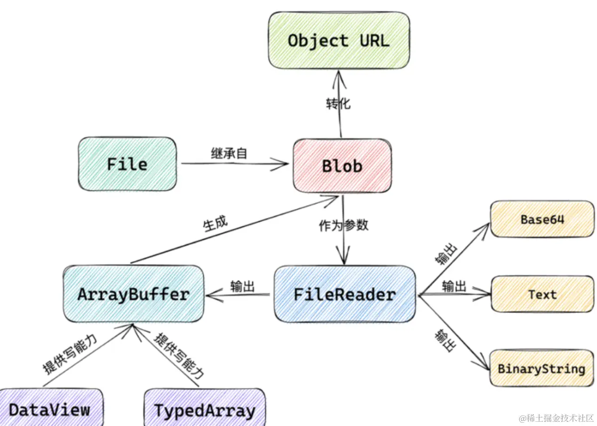
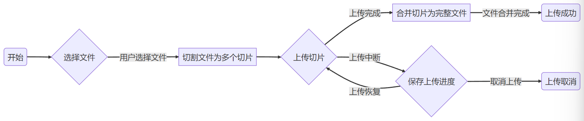
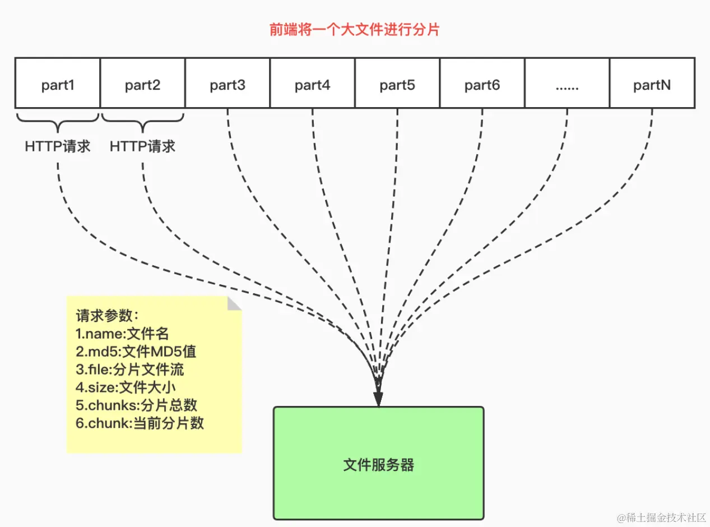

# 大文件上传



## 前端文件流操作

> 文件流操作指的是通过数据流的方式处理文件，对文件进行读取、写入和展示等操作

### 数据流和文件处理

数据流指的是连续的数据序列，可以从一个源传输到另一个目的地

前端开发中，文件流可以看作数据流的一种形式，通过数据流的方式进行处理

文件处理涉及读取和写入文件的操作，包括`读取文件的内容、写入数据到文件`，以及对文件进行`删除、重命名`等操作


### Blob对象和ArrayBuffer：处理二进制数据

`Blob`（Binary Large Object）对象是用来表示二进制数据的一个接口，可以存储大量的二进制数据。Blob对象可以通过构造函数进行创建，也可以通过其他API生成（例如通过FormData对象）

ArrayBuffer是JavaScript的一个对象类型，用于表示一个通用的、固定长度的二进制`缓冲区`，可以通过ArrayBuffer来操作和处理文件中的二进制数据

### FileReader进行文件读取

FileReader是浏览器提供的一个API，用于读取文件内容

通过FileReader可以异步读取文件，并将文件内容转换为可用的数据形式

### 文件流展示在页面中

成功读取文件内容之后，可以将文件流展示在前端页面上，具体展示方式取决于文件的类型，文本文件，可以直接将内容显示在文本框或区域中；图片文件可以通过``展示图片；音视频文件，通过`<video>或<audio>`来播放

## 文件切片下载



### 传统文件下载

当用户请求下载一个大文件时，服务器需要将整个文件发送给客户端，会导致：

1、较长的等待时间

2、网络阻塞

3、断点续传困难：过程中失败需要重新下载整个文件

### 利用文件切片提升下载速率

文件切片下载，通过将大文件分割成多个小片段（切片），并使用多个并发请求同时下载这些切片，从而加快整体下载速度




好处：

1、快速启动

2、并发下载

3、断点续传

```js
const [selectedFile, setSelectedFile] = useState(null); 
const [progress, setProgress] = useState(0);
 // 处理文件选择事件
 function handleFileChange(event) {
   setSelectedFile(event.target.files[0]);
 }

 // 处理文件上传事件
 function handleFileUpload() {
   if (selectedFile) {
     // 计算切片数量和每个切片的大小
     const fileSize = selectedFile.size;
     const chunkSize = 1024 * 1024; // 设置切片大小为1MB
     const totalChunks = Math.ceil(fileSize / chunkSize);

     // 创建FormData对象，并添加文件信息
     const formData = new FormData();
     formData.append('file', selectedFile);
     formData.append('totalChunks', totalChunks);

     // 循环上传切片
     for (let chunkNumber = 0; chunkNumber < totalChunks; chunkNumber++) {
       const start = chunkNumber * chunkSize;
       const end = Math.min(start + chunkSize, fileSize);
       const chunk = selectedFile.slice(start, end);
       formData.append(`chunk-${chunkNumber}`, chunk, selectedFile.name);
     }

     // 发起文件上传请求
     axios.post('/upload', formData, {
       onUploadProgress: progressEvent => {
         const progress = Math.round((progressEvent.loaded / progressEvent.total) * 100);
         setProgress(progress);
       }
     })
       .then(response => {
         console.log('文件上传成功:', response.data);
       })
       .catch(error => {
         console.error('文件上传失败:', error);
       });
   }
 }
```

### 客户端切片下载

1、服务器将大文件切割成多个切片，并生成唯一的标识符

2、客户端发送请求获取切片列表，同时开始下载第一个切片

3、客户端在下载过程中，根据切片列表发起并发请求下载其他切片，并逐渐拼接合成下载的数据

4、当所有的切片都下载完成后，客户端将下载的数据合并成完整的文件

```js
function downloadFile() {
  // 发起文件下载请求
  fetch('/download', {
    method: 'GET',
    headers: {
      'Content-Type': 'application/json',
    },
  })
    .then(response => response.json())
    .then(data => {
      const totalSize = data.totalSize;
      const totalChunks = data.totalChunks;

      let downloadedChunks = 0;
      let chunks = [];

      // 下载每个切片
      for (let chunkNumber = 0; chunkNumber < totalChunks; chunkNumber++) {
        fetch(`/download/${chunkNumber}`, {
          method: 'GET',
        })
          .then(response => response.blob())
          .then(chunk => {
            downloadedChunks++;
            chunks.push(chunk);

            // 当所有切片都下载完成时
            if (downloadedChunks === totalChunks) {
              // 合并切片
              const mergedBlob = new Blob(chunks);

              // 创建对象 URL，生成下载链接
              const downloadUrl = window.URL.createObjectURL(mergedBlob);

              // 创建 <a> 元素并设置属性
              const link = document.createElement('a');
              link.href = downloadUrl;
              link.setAttribute('download', 'file.txt');

              // 模拟点击下载
              link.click();

              // 释放资源
              window.URL.revokeObjectURL(downloadUrl);
            }
          });
      }
    })
    .catch(error => {
      console.error('文件下载失败:', error);
    });
}

```

### 显示下载进度和完成状态

1、进度条：通过监听每个切片的下载进度来计算整体下载进度，并实时更新进度条的显示

2、完成状态：所有切片都下载完成后，可以显示完成状态
```js
  // 处理文件下载事件
  function handleFileDownload() {
    axios.get('/download', {
      responseType: 'blob',
      onDownloadProgress: progressEvent => {
        const progress = Math.round((progressEvent.loaded / progressEvent.total) * 100);
        setProgress(progress);
      }
    })
      .then(response => {
        // 创建一个临时的URL对象用于下载
        const url = window.URL.createObjectURL(new Blob([response.data]));
        const link = document.createElement('a');
        link.href = url;
        link.setAttribute('download', 'file.txt');
        document.body.appendChild(link);
        link.click();
        document.body.removeChild(link);
      })
      .catch(error => {
        console.error('文件下载失败:', error);
      });
  }
  
  
  <button onClick={handleFileDownload}>下载文件</button>
  <div>进度：{progress}%</div>
```

## 大文件上传

### 切片上传

优势：

1、大文件分割成更小的文件切片，分多次上传，提高上传效率和稳定性

2、提供上传进度的监控和展示，提高用户体验

3、充分利用浏览器的并发上传功能，减轻服务器负担

4、实现断点续传功能，避免重复上传已上传的部分

### 实现切片上传

JavaScript的File API获取文件对象，并使用Blob.prototype.slice()方法将文件切割为多个切片

使用formData对象将切片数据通过Ajax或fetch api发送到服务器

后端服务器接受切片并保存到临时存储中，等待后续合并

客户端监听上传进度，显示进度条

```js
const [file, setFile] = useState(null);  //用来存放我本地上传的文件

const chunkSize = 1024 * 1024; // 1MB 切片大小

  const upload = () => {
    if (!file) {
      alert("请选择要上传的文件！");
      return;
    }

    const chunkSize = 1024 * 1024; // 1MB

    let start = 0;
    let end = Math.min(chunkSize, file.size);

    while (start < file.size) {
      const chunk = file.slice(start, end);
      
      // 创建FormData对象
      const formData = new FormData();
      formData.append('file', chunk);

      // 发送切片到服务器
      fetch('上传接口xxxx', {
        method: 'POST',
        body: formData
      })
      .then(response => response.json())
      .then(data => {
        console.log(data);
        // 处理响应结果
      })
      .catch(error => {
        console.error(error);
        // 处理错误
      });

      start = end;
      end = Math.min(start + chunkSize, file.size);
    }
  };
  
 return (
    <div>
      <input type="file" onChange={handleFileChange} />
      <button onClick={upload}>上传</button>
    </div>
  );
}
```

### 断点续传：记录和恢复上传状态

可利用localStorage或sessionStorage来存储已上传的切片信息，包含已上传的切片索引、切片大小等

每次上传前，检查本地存储中是否存在已上传的切片信息，若存在，则从断点处继续上传

后端可以使用一个临时文件夹或数据库来记录已接收到的切片信息，包括已上传的切片索引、切片大小等。

上传完成前，保存上传状态，以便在上传中断后能够恢复上传进度

```js
import React, { useState, useRef, useEffect } from 'react';

function Upload() {
  const [file, setFile] = useState(null);
  const [uploadedChunks, setUploadedChunks] = useState([]);
  const [uploading, setUploading] = useState(false);
  const uploadRequestRef = useRef();

  const handleFileChange = (event) => {
    const selectedFile = event.target.files[0];
    setFile(selectedFile);
  };

  const uploadChunk = (chunk) => {
    // 创建FormData对象
    const formData = new FormData();
    formData.append('file', chunk);

    // 发送切片到服务器
    return fetch('your-upload-url', {
      method: 'POST',
      body: formData
    })
    .then(response => response.json())
    .then(data => {
      console.log(data);
      // 处理响应结果
      return data;
    });
  };

  const upload = async () => {
    if (!file) {
      alert("请选择要上传的文件！");
      return;
    }

    const chunkSize = 1024 * 1024; // 1MB
    const totalChunks = Math.ceil(file.size / chunkSize);

    let start = 0;
    let end = Math.min(chunkSize, file.size);

    setUploading(true);

    for (let i = 0; i < totalChunks; i++) {
      const chunk = file.slice(start, end);
      const uploadedChunkIndex = uploadedChunks.indexOf(i);

      if (uploadedChunkIndex === -1) {
        try {
          const response = await uploadChunk(chunk);
          setUploadedChunks((prevChunks) => [...prevChunks, i]);

          // 保存已上传的切片信息到本地存储
          localStorage.setItem('uploadedChunks', JSON.stringify(uploadedChunks));
        } catch (error) {
          console.error(error);
          // 处理错误
        }
      }

      start = end;
      end = Math.min(start + chunkSize, file.size);
    }

    setUploading(false);

    // 上传完毕，清除本地存储的切片信息
    localStorage.removeItem('uploadedChunks');
  };

  useEffect(() => {
    const storedUploadedChunks = localStorage.getItem('uploadedChunks');

    if (storedUploadedChunks) {
      setUploadedChunks(JSON.parse(storedUploadedChunks));
    }
  }, []);

  return (
    <div>
      <input type="file" onChange={handleFileChange} />
      <button onClick={upload} disabled={uploading}>
        {uploading ? '上传中...' : '上传'}
      </button>
    </div>
  );
}
```

## 切片下载和上传的应用场景

1、后台管理系统的文件下载和上传

2、图片/视频上传和预览

3、云储存和云盘中的文件操作

## Blob

Blob对象标识一个不可变、原始数据的类文件对象，它的数据可以按文本或二进制的格式进行读取，也可以转换成ReadableStream来用于数据操作。

> Blob可以用来存储文件、图片、音频、视频、甚至是纯文本等各种类型的数据。Blob提供了一种高效的方式来操作数据文件，而不需要将数据全部加载到内存中，这在处理大型文件或二进制数据时非常有效。

Blob表示的不一定是JavaScript原生格式的数据，File接口基于Blob，继承了Blob功能并将其扩展以支持用户系统上的文件

- 构造函数：Blob()

- 实例属性（只读）：Blob.size、Blob.type

- 实例方法

> - Blob.arrayBuffer()：返回一个Promise，会兑现一个包含Blob所有内容的二进制格式的ArrayBuffer

> - Blob.bytes()：返回Promise

> - Blob.slice()：返回一个新的Blob对象

> - Blob.stream()：将Blob的数据作为一个ReadableStream返回，允许以流的方式处理数据，适合处理大文件

> - Blob.text()：返回一个 promise，其会兑现一个包含 Blob 所有内容的 UTF-8 格式的字符串

> - arrayBuffer()：将Blob的内容读取为ArrayBuffer对象，适合处理二进制数据。返回一个Promise，解析为ArrayBuffer数据。

### 使用场景

在Web应用中处理文件、图片或视频等二进制数据时非常有用

#### 生成文件下载
通过Blob创建文件并生成下载链接供用户下载文件

```js
const blob = new Blob(["This is a test file."], { type: "text/plain" });
const url = URL.createObjectURL(blob); // 创建一个 Blob URL
const a = document.createElement("a");
a.href = url;
a.download = "test.txt";
a.click();
URL.revokeObjectURL(url); // 释放 URL 对象
```

#### 上传文件
可以通过FormData对象将Blob作为文件上传到服务器

```js
const formData = new FormData();
formData.append("file", blob, "example.txt");

fetch("/upload", {
  method: "POST",
  body: formData,
}).then((response) => {
  console.log("File uploaded successfully");
});
```

#### 读取图片或其他文件
通过 FileReader API 可以将 Blob 对象读取为不同的数据格式。

#### Blob和Base64
有你可能需要将 Blob 转换为 Base64 编码的数据（例如用于图像的内联显示或传输）。可以通过 FileReader 来实现

```js
const reader = new FileReader();
reader.onloadend = function () {
  const base64data = reader.result;
  console.log(base64data); // 输出 base64 编码的数据
};

reader.readAsDataURL(blob); // 将 Blob 读取为 base64
```

## File

File 是 JavaScript 中代表文件的数据结构，它继承自 Blob 对象，包含文件的元数据（如文件名、文件大小、类型等）。File 对象通常由用户通过 `<input type="file">` 选择文件时创建，也可以使用 JavaScript 构造函数手动创建。

File 对象继承了 Blob 对象的方法，因此可以使用一些 Blob 对象的方法来处理文件数据

## 参考
[https://juejin.cn/post/7255189826226602045](https://juejin.cn/post/7255189826226602045)

[https://developer.mozilla.org/zh-CN/docs/Web/API/Blob](https://developer.mozilla.org/zh-CN/docs/Web/API/Blob)