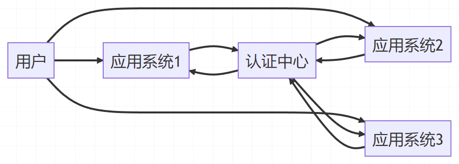
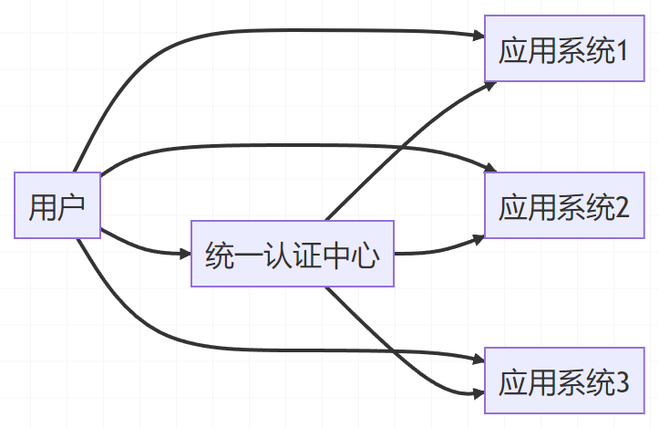
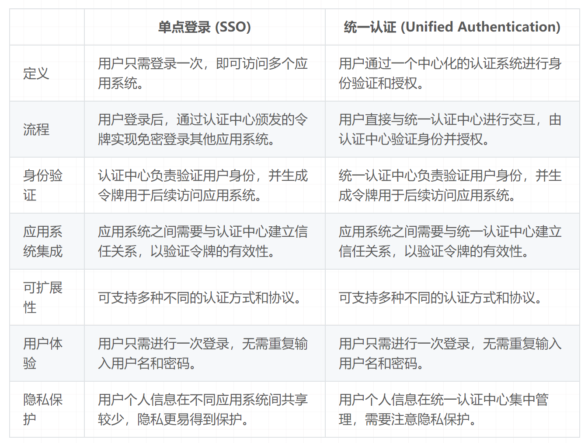

# 统一身份认证

## 问题背景

各个网站和应用上需要不同的账号和密码进行身份认证

## 系统架构设计

统一身份认证系统的架构设计需要考虑到系统的可扩展性、高性能和安全性

常见的架构设计模式包括单点登录（Single Sign-On ,SSO）、多因素认证（Multi-Factor Authentication，MFA）

### SSO

SSO 架构通过`集中管理用户身份和权限信息`，实现在不同应用之间无缝切换

允许用户只需一次登录，便能够访问多个相关系统或应用，而无需重复输入用户名和密码

原理：

1、用户访问主应用：尝试登录

2、主应用认证：主应用接收到用户的登录请求后，验证。认证成功，则返回一个用于标识用户身份的特定凭证或令牌

3、凭证颁发：主应用将生成的凭证或令牌发送给用户浏览器，通常以 cookie 或 token 的形式进行存储

4、子应用访问：当用户尝试访问其他子系统时，子应用会检测用户是否已登录，如果用户未登录，则重定向至主应用的登录页面

5、`单点登录验证：在重定向至主应用的登录页面后，子应用将用户重定向 URL 添加一个参数，包含子应用的标识信息。用户浏览器携带凭证或令牌访问主应用。`

6、凭证验证：主应用接收到带有凭证或令牌的请求后，会解析验证凭证的有效性和合法性。主应用可能会使用加密算法验证凭证的完整性和真实性，确保凭证有效。

7、用户身份确认：一旦主应用确认凭证有效，则将用户视为已登录，并生成一个会话或认证令牌。该令牌将作为响应返回给用户浏览器。

8、子应用授权：用户浏览器将获取到的会话或认证令牌发送给子应用。子应用接收到令牌后，可以向主应用验证其有效性。主应用确认令牌有效后，子应用即可通过该令牌完成用户身份确认，并授权用户访问其资源。

### MFA

MFA 架构`通过多种身份验证方式`，提供更高的安全性

## 前端单点登录和统一认证

### 单点登录

### 统一认证 Unified Authentication

统一认证是一种`集成多个子系统的用户身份验证和授权过程`的机制，以实现用户在不同系统中的一致登录和权限管理

原理：

1、用户访问应用系统：用户在客户端通过浏览器或移动应用程序访问某个应用系统，尝试登录

2、应用系统认证：应用系统接收到用户的登录请求后，验证用户提供和用户名和密码是否正确。正确则生成一个用于标识用户身份的特定凭证或令牌

3、统一认证中心：在统一认证环境中，存在一个专门负责用户身份验证和授权的统一认证中心。`应用系统将用户的认证请求转发至统一认证中心进行处理。`

4、用户身份认证：统一认证中心接收到应用系统的认证请求后，对用户提供的用户名和密码进行认证。通过与用户存储的身份信息进行比对来验证用户身份的真实性

5、状态维护：一旦用户身份认证成功，统一认证中心会为用户生成一个会话或认证令牌，并记录用户的登录状态。可以使用 Cookie、Token 或其他方式将会话或认证令牌发送给用户浏览器。

6、令牌传递：经过认证后，统一认证中心会将用户的会话或认证令牌返回给应用系统。这个令牌是应用系统与统一认证中心之间进行交互的凭证，也是应用系统验证用户身份的依据。

7、子系统授权：应用系统接收到统一认证中心返回的会话或认证令牌后，可以向统一认证中心验证令牌的有效性和合法性。一旦验证通过，应用系统即可确认用户身份，并为用户授予相应的权限。

### 两者的区别

要实现单点登录，通常会使用统一认证作为基础，将用户的登录状态在不同系统间进行共享。因此，在某些情况下，可以将统一认证看作是实现单点登录的一种方式。

## 身份认证

### 基于 session 的

用户登录，服务器认证并创建会话（session），服务器保存会话 ID，会话 ID 返回给前端（通常是设置 cookie，被发送到用户的浏览器，并在后续的请求中自动发送回服务器），后续发送请求自动包含 cookie，服务器识别 session 实现身份验证

核心是 `浏览器` 和 `服务器` 进行处理

优点：简单易用，兼容性好

缺点：扩展性差（分布式系统中，多个服务器共享会话存储，增加复杂性）、必须配合 HTTPS（防止 cookie 被窃取）

### 基于 JWT 的

服务器返回 token 表示用户身份令牌，在请求中，把 token 添加到请求头中，验证用户身份信息

原理：用户登录服务器生成 JWT 并返回给前端，前端存储在客户端（localStorage 或 cookie），后续用户进行 API 调用时，前端将 JWT 附加到请求中的 Authorization 头部发送给服务器，服务器验证，合法就返回结果

优点：无状态，JWT 自包含，不需要服务器存储会话信息；跨域支持

缺点：安全性取决于密钥的保护和有效期的管理

### 基于 SSO 的

SSO 身份验证多用在“成套”的应用程序中，通过登录中心的方式，实现一次登录，多个应用均可获取身份

原理：用户访问应用会重定向到身份提供者（Indetity Provide，Idp，登陆中心），用户输入凭据登录（如果是已经登录的，可以跳过这一步），SSO Idp 生成 SSO 令牌（如 OAuth 令牌或 SAML 断言），并将用户重定向到原应用，同时附带令牌，原应用接受到令牌后，将其发送到 SSO 身份提供者进行验证，SSO 身份提供者返回用户信息；访问其他应用，会重定向到相同的登录中心进行验证，已登录会自动验证并重定向到目标应用

优点：简化用户体验，集中管理，提高安全性

缺点：单点故障，复杂性（SSO 的部署和维护都复杂）

#### SSO 实现技术

1、SAML（Security Assertion Markup Language）

2、OAuth2.0 和 OpenID Connect

3、CAS（Central Authentication Service）

## 参考

[https://blog.csdn.net/qq_33665793/article/details/136052992](https://blog.csdn.net/qq_33665793/article/details/136052992)

[https://juejin.cn/post/7257814347462950967?searchId=20240906152552EA600A227A14FBA6EB5A](https://juejin.cn/post/7257814347462950967?searchId=20240906152552EA600A227A14FBA6EB5A)

[https://juejin.cn/post/7399986979736322063?searchId=20240906152552EA600A227A14FBA6EB5A](https://juejin.cn/post/7399986979736322063?searchId=20240906152552EA600A227A14FBA6EB5A)
